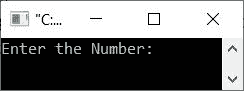
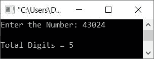

# C++ 程序：计算一个数的总位数

> 原文：<https://codescracker.com/cpp/program/cpp-count-digits-in-number.htm>

本文提供了一些用 C++ 编写的程序，用于计算用户在程序运行时输入的数字的总位数。这篇文章涉及:

*   在循环时使用**计算数字的位数**
*   使用**为**循环计算数字的位数
*   使用用户定义的函数计算数字的位数

例如，如果用户输入一个数字，比如说 **13204** ，那么输出将是 **5** 。因为 给出的数字中有 5 位可用。

## 使用`while`循环计算数字的总位数

问题是，*编写一个 C++ 程序，从用户那里接收一个数字，计算并打印出这个给定数字在 中的总位数。*下面是这个问题的答案:

```
#include<iostream>

using namespace std;
int main()
{
   int num, tot=0;
   cout<<"Enter the Number: ";
   cin>>num;
   while(num>0)
   {
      tot++;
      num = num/10;
   }
   cout<<"\nTotal Digits = "<<tot;
   cout<<endl;
   return 0;
}
```

下面是上面的 C++ 程序在运行时计算用户给定数字的总位数时产生的初始输出:



现在输入一个数字，比如说 **43024** ，然后按`ENTER`键查看输出，如下图所示:



用户输入 **43024** 的上述程序的试运行如下:

*   当用户输入数字时，它被存储在 **num** 变量中。所以 **num=43024**
*   收到用户的号码后，开始执行 **while** 循环
*   也就是说，条件 **num > 0** 或 **43024 > 0** 评估为真
*   因此程序流进入循环内部
*   **tot** 的值增加。因为 **tot** 的初始值是 0。因此现在 **tot=1**
*   并且语句`num = num/10;`被执行
*   因此 **num/10** 或 **43024/10** 或 **4302** 被初始化为 **num** 。所以 **num=4302**
*   再次评估循环时**的条件**
*   也就是说，条件 **num > 0** 或 **4302 > 0** 评估为真
*   因此，程序流再次进入循环
*   **tot** 的值再次增加。所以现在 **tot=2**
*   并且 **num/10** 或 **4302/10** 或 **430** 被初始化为 **num** 。因此现在 **num=430**
*   再次第三次，当循环被评估时**的条件**
*   这个过程继续，直到条件评估为假
*   这样，在退出循环之后，或者当条件评估为假时。变量 **tot** 保存的 值等于数字中可用的总位数
*   因此，只需打印出 **tot** 的值作为输出

## 使用`for`循环计算数字中的位数

这个程序做的工作和前一个程序一样。唯一的区别是它的方法。也就是说，该程序是使用循环的**而不是**创建的，而**与前一个程序一样。**

```
#include<iostream>

using namespace std;
int main()
{
   int num, tot;
   cout<<"Enter the Number: ";
   cin>>num;
   for(tot=0; num>0; tot++)
      num = num/10;
   cout<<"\nTotal Digits = "<<tot;
   cout<<endl;
   return 0;
}
```

这个程序产生与前一个程序相同的输出。

## 使用函数计算数字中的位数

这是计算用户输入的数字的总位数的最后一个程序，使用用户定义的函数，如下面给出的程序所示:

```
#include<iostream>

using namespace std;

int myfun(int);
int main()
{
   int num, tot;
   cout<<"Enter the Number: ";
   cin>>num;
   tot = myfun(num);
   cout<<"\nTotal Digits = "<<tot;
   cout<<endl;
   return 0;
}
int myfun(int n)
{
   int t;
   for(t=0; n>0; t++)
      n /= 10;
   return t;
}
```

[C++ 在线测试](/exam/showtest.php?subid=3)

* * *

* * *