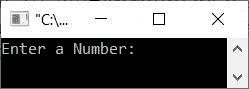
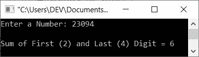
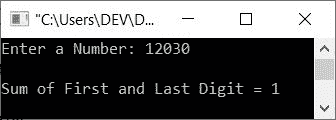

# C++ 程序：求一个数的第一位和最后一位之和

> 原文：<https://codescracker.com/cpp/program/cpp-find-sum-of-first-last-digit.htm>

创建这篇文章是为了提供一些 C++ 程序来查找和打印一个给定数字的第一位和最后一位的和。该程序通过以下方式创建:

*   使用 **while** 循环
*   使用**进行**循环
*   使用用户定义的函数

## 使用`while`循环查找第一个和最后一个数字的和

问题是，*用 C++ 写一个程序，从用户那里接收一个数字作为输入，并打印出给定数字 的第一个和最后一个数字的和作为输出。*下面是它的回答:

```
#include<iostream>

using namespace std;
int main()
{
   int num, temp=0, last, rem, sum=0;
   cout<<"Enter a Number: ";
   cin>>num;
   while(num!=0)
   {
      if(temp==0)
      {
         last = num%10;
         temp++;
      }
      rem = num%10;
      num = num/10;
   }
   sum = rem + last;
   cout<<"\nSum of First ("<<rem<<") and Last ("<<last<<") Digit = "<<sum;
   cout<<endl;
   return 0;
}
```

下面给出的快照显示了上述 C++ 程序在查找给定数字的第一个和最后一个数字的和时产生的初始输出:



现在输入一个数字，比如说 **23094** ，按`ENTER`键查找并打印这个数字的第一位(即 **2** ) 和最后一位(即 **4** )的和，如下图所示:



在上面的程序中，试运行下面的代码块:

```
   while(num!=0)
   {
      if(temp==0)
      {
         last = num%10;
         temp++;
      }
      rem = num%10;
      num = num/10;
   }
```

随着 **num=23094** ， **temp=0** ， **sum=0** 的进行:

*   条件 **num！=0** 或 **23094！=0** 评估为真
*   因此，程序流进入循环，并且如果得到评估，则**的条件**
*   也就是说，条件**温度==0** 或 **0==0** 评估为真
*   因此，如果和 **num%10** 或 **23094%10** 或 **4** 被初始化为 **最后一个**，则程序流程进入**的主体**
*   并且**温度**的值增加。所以**温度=1** 。因为从现在起**温度**的值为 1，所以从现在起 **if** 的 条件总是被评估为假
*   这意味着，变量 **last** 保存 **4** 作为其最终值。那是给定数字的最后一位数
*   现在从**退出后，如果**、 **num%10** 或 **23094%10** 或 **4** 被初始化为 **rem** 。创建该语句 是为了获取最后的余数，即最后一次执行时的 **2**
*   并且循环的最后一条语句被执行，即 **num/10** 或 **23094/10** 或 **2309** 被初始化为 **num**。因此现在 **num=2309**
*   由于在执行循环时，所有语句在**的主体中都可用，因此程序流再次评估其条件**
*   也就是条件 **num！=0** 或者 **2309！=0** 再次评估为真。因此程序流再次进入 循环
*   这个过程继续，直到条件评估为假
*   这样，退出循环后，我们会有 **last=4** 和 **rem=2**
*   因此，只需将它们相加，并打印出给定数字的第一位和最后一位的相加结果。好了

## 使用`for`循环查找第一个和最后一个数字的和

因为循环的**还包含初始化和更新语句以及条件检查。因此，只需将任何初始化语句 如 **temp=0** 或 **sum=0** 以及更新语句如 **num = num/10** 所示，如下所示:**

```
#include<iostream>

using namespace std;
int main()
{
   int num, temp, last, rem, sum=0;
   cout<<"Enter a Number: ";
   cin>>num;
   for(temp=0; num!=0; num=num/10)
   {
      if(temp==0)
      {
         last = num%10;
         temp++;
      }
      rem = num%10;
   }
   sum = rem + last;
   cout<<"\nSum of First ("<<rem<<") and Last ("<<last<<") Digit = "<<sum;
   cout<<endl;
   return 0;
}
```

这个程序产生与前一个程序完全相同的输出。

## 使用函数求第一个和最后一个数字的和

这是本文的最后一个程序，使用一个名为 **sumfun()** 的用户定义函数创建，该函数将给定的数字作为 的参数，并返回其参数的第一个和最后一个数字之和。

```
#include<iostream>
using namespace std;

int sumfun(int);
int main()
{
   int num, sum;
   cout<<"Enter a Number: ";
   cin>>num;
   sum = sumfun(num);
   cout<<"\nSum of First and Last Digit = "<<sum;
   cout<<endl;
   return 0;
}
int sumfun(int n)
{
   int t=0, l, r, s=0;
   while(n!=0)
   {
      if(t==0)
      {
         l = n%10;
         t++;
      }
      r = n%10;
      n = n/10;
   }
   s = r + l;
   return s;
}
```

下面是用户输入 **12030** 的运行示例:



[C++ 在线测试](/exam/showtest.php?subid=3)

* * *

* * *