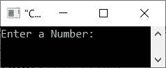

# C++ 程序：求一个数的数字平方和

> 原文：<https://codescracker.com/cpp/program/cpp-sum-of-squares-of-digits-of-number.htm>

本文提供了一些用 C++ 编写的程序，这些程序可以查找并打印给定数字的平方和。该程序通过以下方式创建:

*   使用 **while** 循环
*   使用**进行**循环

例如，如果给定的数字是 **32041** ，那么结果将被计算为:

```
32041 = 32 + 22 + 02 + 42 + 12
      = 9 + 4 + 1 + 16 + 1
      = 31
```

## 使用 while 循环计算数字的平方和

问题是，*编写一个 C++ 程序，从用户那里接收一个数字，找出并打印出其数字的平方之和。*下面给出的 计划就是它的答案:

```
#include<iostream>

using namespace std;
int main()
{
   int num, rem, sq, sum=0;
   cout<<"Enter a Number: ";
   cin>>num;
   while(num>0)
   {
      rem = num%10;
      if(rem==0)
         sq = 1;
      else
         sq = rem*rem;
      sum = sum + sq;
      num = num/10;
   }
   cout<<"\nSum of squares of all digits = "<<sum;
   cout<<endl;
   return 0;
}
```

上面的 C++ 程序在查找并打印用户输入的数字的平方和时产生的初始输出显示在下面给出的快照中:



现在输入一个数字，比如说 **32041** ，按`ENTER`键查找并打印 **32041** 的所有数字的平方和，如下图所示:


## 用 for 循环求数字的平方和

这是最后一个程序，使用 **for** 循环创建，执行与前一个程序相同的工作。此外，这个程序产生的 与前一个程序的输出完全相同。

```
#include<iostream>

using namespace std;
int main()
{
   int num, rem, sq, sum;
   cout<<"Enter a Number: ";
   cin>>num;
   for(sum=0; num>0; num=num/10)
   {
      rem = num%10;
      if(rem==0)
         sq = 1;
      else
         sq = rem*rem;
      sum = sum + sq;
   }
   cout<<"\nSum of squares of all digits = "<<sum;
   cout<<endl;
   return 0;
}
```

[C++ 在线测试](/exam/showtest.php?subid=3)

* * *

* * *