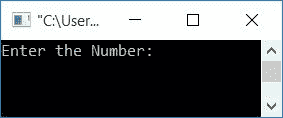
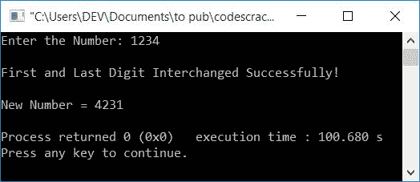
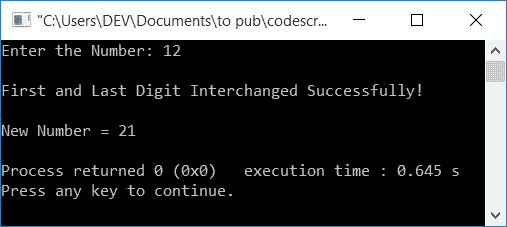
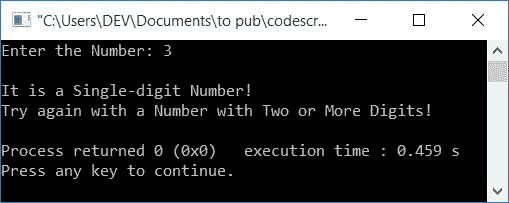
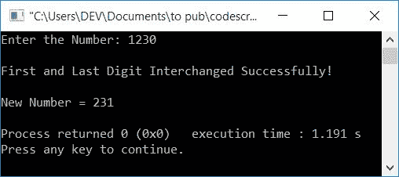
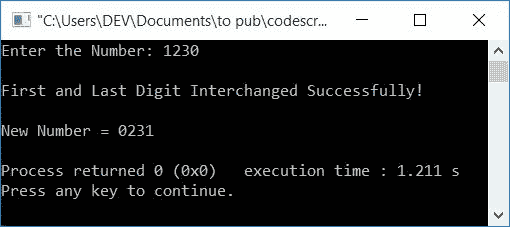
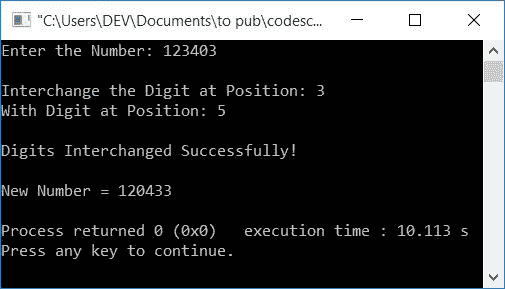

# C++ 程序：交换数字

> 原文：<https://codescracker.com/cpp/program/cpp-program-interchange-numbers.htm>

在本文中，您将学习并获得在 C++中交换用户在运行时输入的数字的代码。下面是本文中可用的程序列表:

*   交换数字的第一位和最后一位
*   使用数组交换数字的第一位和最后一位
*   互换一个数的任意两位数

## 交换数字的第一位和最后一位

在 [C++](/cpp/index.htm) 编程中，要交换一个数字的第一位和最后一位，你必须让用户的 输入这个数字。然后交换它的第一个和最后一个数字，如下面给出的程序所示:

问题是，**用 C++写一个程序，把一个数**的第一位和最后一位互换。以下是其 的回答:

```
#include<iostream>
using namespace std;
int main()
{
    int num, rem, temp, rev=0, noOfDigit=0;
    int noOfDigitTemp, revNum, remTemp;
    cout<<"Enter the Number: ";
    cin>>num;
    temp = num;
    while(temp>0)
    {
        temp = temp/10;
        noOfDigit++;
    }
    if(noOfDigit<2)
    {
        cout<<"\nIt is a Single-digit Number!";
        cout<<"\nTry again with a Number with Two or More Digits!";
    }
    else if(noOfDigit==2)
    {
        temp = num;
        while(temp>0)
        {
            rem = temp%10;
            rev = (rev*10)+rem;
            temp = temp/10;
        }
        cout<<"\nFirst and Last Digit Interchanged Successfully!";
        cout<<"\n\nNew Number = "<<rev;
    }
    else
    {
        temp = num;
        while(temp>0)
        {
            rem = temp%10;
            rev = (rev*10)+rem;
            temp = temp/10;
        }
        revNum = rev;
        rev = 0;
        temp = num;
        noOfDigitTemp = noOfDigit;
        while(temp>0)
        {
            remTemp = revNum%10;
            if(noOfDigitTemp==noOfDigit)
            {
                rem = temp%10;
                rev = (rev*10)+rem;
            }
            else if(noOfDigitTemp==1)
            {
                rem = temp%10;
                rev = (rev*10)+rem;
            }
            else
            {
                rev = (rev*10)+remTemp;
            }
            temp = temp/10;
            revNum = revNum/10;
            noOfDigitTemp--;
        }
        cout<<"\nFirst and Last Digit Interchanged Successfully!";
        cout<<"\n\nNew Number = "<<rev;
    }
    cout<<endl;
    return 0;
}
```

这个程序是在 *Code::Blocks* IDE 下构建和运行的。下面是它的运行示例:



现在提供任意一个数字，比如说 **1234** 并按`ENTER`交换这个数字的第一(1)和最后(4) 位。交换第一个和最后一个数字后，打印新的数字，如下面给出的样品运行的 快照所示:



下面是另一个运行示例，用户输入了一个两位数的数字 **12** :



下面是用户输入 **3** 的另一个运行示例，这是一个一位数:



**注意-** 如果用户输入一个以 0 结尾的数字会怎样。或者用户输入一个以 0 作为最后一位数的数字。 在这种情况下，上面的程序产生以下输出:



为了解决这个问题，我们为你准备了另一个节目。这个程序做同样的工作，但是使用一个数组。让我们看看下面给出的程序。

### 使用数组交换第一个和最后一个数字

这个程序做同样的工作，也就是交换用户给定的数字的第一位和最后一位，使用数组。

```
#include<iostream>
using namespace std;
int main()
{
    int num, rem, temp, rev=0, noOfDigit=0, arr[10], i;
    cout<<"Enter the Number: ";
    cin>>num;
    temp = num;
    while(temp>0)
    {
        temp = temp/10;
        noOfDigit++;
    }
    temp = num;
    while(temp>0)
    {
        rem = temp%10;
        rev = (rev*10)+rem;
        temp = temp/10;
    }
    for(i=0; i<noOfDigit; i++)
    {
        rem = rev%10;
        arr[i] = rem;
        rev = rev/10;
    }
    if(noOfDigit==1)
    {
        cout<<"\nIt is a Single-digit Number!";
        cout<<"\nTry again with a Number with Two or More Digits!";
    }
    else if(noOfDigit==2)
    {
        temp = arr[0];
        arr[0] = arr[1];
        arr[1] = temp;
        cout<<"\nFirst and Last Digit Interchanged Successfully!";
        cout<<"\n\nNew Number = "<<arr[0]<<arr[1];
    }
    else
    {
        i=0;
        temp = arr[i];
        arr[i] = arr[noOfDigit-1];
        arr[noOfDigit-1] = temp;
        cout<<"\nFirst and Last Digit Interchanged Successfully!";
        cout<<"\n\nNew Number = ";
        for(i=0; i<noOfDigit; i++)
            cout<<arr[i];
    }
    cout<<endl;
    return 0;
}
```

下面是用户输入的示例运行， **1230** :



## 互换一个数的任意两位数

这个程序是用来交换任意两位数的。任意两位数字表示，您可以自由交换位置为 **2** 的数字和位置为 **5** 的数字:

例如，如果用户输入一个数字作为 **23706** ，并且想要将第二个位置(3) 的数字与第五个位置(6)的数字互换。然后，在交换所需的数字后，新的号码将是 **26703**

```
#include<iostream>
using namespace std;
int main()
{
    int num, posFirst, posSecond;
    int rem, temp, rev=0, noOfDigit=0, arr[10], i;
    cout<<"Enter the Number: ";
    cin>>num;
    temp = num;
    while(temp>0)
    {
        temp = temp/10;
        noOfDigit++;
    }
    if(noOfDigit==1)
    {
        cout<<"\nIt is a Single-digit Number!";
        cout<<"\nTry again with a Number with Two or More Digits!";
    }
    else
    {
        cout<<"\nInterchange the Digit at Position: ";
        cin>>posFirst;
        cout<<"With Digit at Position: ";
        cin>>posSecond;
    }
    if(posFirst>noOfDigit || posSecond>noOfDigit)
        cout<<"\nInvalid Position!";
    else
    {
        temp = num;
        while(temp>0)
        {
            rem = temp%10;
            rev = (rev*10)+rem;
            temp = temp/10;
        }
        for(i=0; i<noOfDigit; i++)
        {
            rem = rev%10;
            arr[i] = rem;
            rev = rev/10;
        }
        i=0;
        temp = arr[posFirst-1];
        arr[posFirst-1] = arr[posSecond-1];
        arr[posSecond-1] = temp;
        cout<<"\nDigits Interchanged Successfully!";
        cout<<"\n\nNew Number = ";
        for(i=0; i<noOfDigit; i++)
            cout<<arr[i];
    }
    cout<<endl;
    return 0;
}
```

以下是用户输入的运行示例， **123403** 作为数字， **3** 和 **5** 作为数字位置到 交换:



#### 其他语言的相同程序

*   [C 互换两个数](/c/program/c-program-interchange-numbers.htm)
*   [Java 互换两个数](/java/program/java-program-interchange-numbers.htm)

[C++在线测试](/exam/showtest.php?subid=3)

* * *

* * *