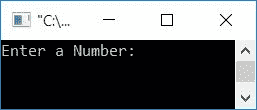
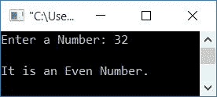
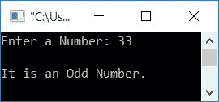
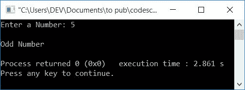

# C++ 程序：检查奇偶

> 原文：<https://codescracker.com/cpp/program/cpp-program-check-even-odd.htm>

在本文中，您将学习并获得代码，以检查 C++中给定的数字是偶数还是奇数。该程序通过以下两种方式创建:

*   使用 <u>if-else</u> 语句检查偶数或奇数
*   使用<u>三元</u>运算符检查偶数或奇数

## 使用 if-else 检查偶数或奇数

在 [C++](/cpp/index.htm) 编程中，要检查给定的数字(用户在运行时给出的)是偶数还是奇数，你必须要求用户先输入一个数字。如果 T2 能被 2 整除(不留余数)，那么它就是一个偶数。否则就是奇数。

```
#include<iostream>
using namespace std;
int main()
{
    int num;
    cout<<"Enter a Number: ";
    cin>>num;
    if(num%2==0)
        cout<<"\nIt is an Even Number.";
    else
        cout<<"\nIt is an Odd Number.";
    cout<<endl;
    return 0;
}
```

这个程序是在 *Code::Blocks* IDE 下构建和运行的。下面是它的运行示例:



现在输入任意一个数字，检查它是偶数还是奇数，如下图所示，用户输入为 **32** :



下面是另一个用户输入为 **33** 的运行示例:



具有用户输入 **32** 。因为 **32%2** 给出 0。因此条件 **num%2==0** 或**32% 2 = = 0**T14】或 **0==0** 评估为真，因此程序流进入 *if* 主体内部，并执行打印消息的语句 ，**是偶数**。

并且具有用户输入 **33** 。因为 **33%2** 给出 2。所以条件 **num%2==0** 或 **33%2==0** 或 **1==0** 评估为假，因此在这种情况下，程序流转到 else 的主体并执行在 **else** 的主体中可用的语句 ，该语句打印一条消息，**它是一个奇数**。

## 使用三元运算符检查偶数/奇数

现在让我们使用三元运算符创建一个相同用途的程序。

```
#include<iostream>
using namespace std;
int main()
{
    int num;
    cout<<"Enter a Number: ";
    cin>>num;
    (num%2==0)?(cout<<"\nEven Number"):(cout<<"\nOdd Number");
    cout<<endl;
    return 0;
}
```

下面是用户输入为 **5** 的运行示例:



条件 **num%2==0** 评估为真。因此，执行第一条语句(`cout<<"\nEven Number"` ) ，否则执行第二条语句(`cout<<"\nOdd Number"`)。

在三元运算符语句中，
`<condition> ? <true_case> : <false_case>;`
表示，如果条件求值为真，则 *true_case* 被求值/执行，否则 *false_case* 被求值。

以前的程序也可以替换为:

```
#include<iostream>
using namespace std;
int main()
{
    int num;
    char ch;
    cout<<"Enter a Number: ";
    cin>>num;
    ch = num%2==0?'e':'o';
    if(ch=='e')
        cout<<"\nEven Number";
    else
        cout<<"\nOdd Number";
    cout<<endl;
    return 0;
}
```

你可以再次看到，如果条件 **num%2==0** 评估为真，那么**‘e’**被初始化为 **ch** 。否则**‘o’**被初始化为 **ch** 。现在检查 ch 的值，即它是否等于 **e** 或 **o** 。如果保存值 **e** ，则打印为偶数， 否则打印为奇数。您也可以用这个程序替换以前的程序:

```
#include<iostream>
using namespace std;
int main()
{
    int num, val;
    cout<<"Enter a Number: ";
    cin>>num;
    val = (num%2==0)?1:0;
    if(val==1)
        cout<<"\nEven Number";
    else
        cout<<"\nOdd Number";
    cout<<endl;
    return 0;
}
```

#### 其他语言的相同程序

*   [C 检查偶数或奇数](/c/program/c-program-check-even-odd.htm)
*   [Java 奇偶校验](/java/program/java-program-check-even-odd.htm)
*   [Python 检查奇偶](/python/program/python-program-check-even-odd.htm)

[C++在线测试](/exam/showtest.php?subid=3)

* * *

* * *