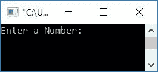
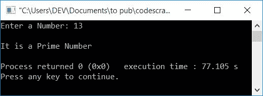
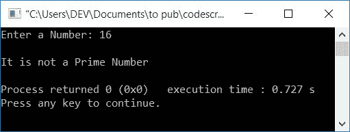

# C++程序检查是否质数

> 原文：<https://codescracker.com/cpp/program/cpp-program-check-prime.htm>

在本文中，您将学习并获得在 C++中检查用户在运行时给定的数字是否为质数的代码。该程序通过以下方式创建:

*   不使用函数和类检查质数
*   使用用户定义的函数
*   使用类和对象

### 什么是质数？

质数是只能被 1 和数本身整除的数。也就是说，如果一个数除了 1 和它本身之外没有任何因子，那么它就叫做素数。例如， **13，7，17，19，23** 等。

## 检查质数

在 [C++](/cpp/index.htm) 编程中，要检查一个数是否是质数，你必须 让用户先输入一个数，然后检查并打印出来，如下图程序所示:

如果一个数， **n** 能被从 2 到比数(n-1)小 1 的任何数整除，那么它不是素数， 否则它是素数。

```
#include<iostream>
using namespace std;
int main()
{
    int num, i, chk=0;
    cout<<"Enter a Number: ";
    cin>>num;
    for(i=2; i<num; i++)
    {
        if(num%i==0)
        {
            chk++;
            break;
        }
    }
    if(chk==0)
        cout<<"\nIt is a Prime Number";
    else
        cout<<"\nIt is not a Prime Number";
    cout<<endl;
    return 0;
}
```

这个程序是在 *Code::Blocks* IDE 下构建和运行的。下面是它的运行示例:



现在输入任意一个数字，比如说 **13** ，按`ENTER`键检查是否是质数 ，如下图所示:



上述程序的试运行(用户输入 **13** )如下:

*   最初 **chk=0** 。和 **num=13** (用户输入的 13)
*   在循环的*中，初始化部分首先执行，并且只执行一次。因此 **i=2***
*   检查条件，即 **i** 的值是否小于 **num** 的值
*   条件评估为真，因为 2(*I*的值)小于 13(*num*、 的值)，因此程序流程进入循环内部
*   在循环内部，有一个 **if** 语句，检查 **num** 的值是否能被 **i** 的当前值 整除
*   **注-** 如果任何时候， **i** 的值除以 **num** ，那么只需增加 T6】count 的值，并使用 **break** 关键字退出循环
*   因为 13 不能被 2 整除，所以条件评估为假，因此程序流不会进入 **if** 的主体
*   现在程序流程转到更新循环的部分**，并增加 **i** 的值。现在 **I = 3**。再次检查条件，是否 **i < num** 或 **3 < 13** 评估为真或假**
*   条件再次评估为真，因此程序流再次进入循环
*   这样，每次进入循环时，检查 **num** 的值是否能被 **i** 的值 整除。
*   继续该过程，直到循环的**条件评估为假**
*   退出循环后，检查 **chk** 的值并打印消息
*   也就是说，如果 **chk** 保持它的初始值(0)，那么给定的数是素数，否则它 不是素数

## 使用函数检查质数

现在让我们使用一个用户定义的函数 **checkPrimeNumber()** 创建一个相同目的的程序。它将用户输入的数字 作为参数，并返回一个值。将它的返回值初始化为一个变量，比如 **chk** ， ，因此检查它的值并相应地打印消息。要了解更多关于 C++ 中的 [函数，可以关注它的单独教程。](/cpp/cpp-functions.htm)

```
#include<iostream>
using namespace std;
int checkPrimeNumber(int);
int main()
{
    int num, chk;
    cout<<"Enter a Number: ";
    cin>>num;
    chk = checkPrimeNumber(num);
    if(chk==0)
        cout<<"\nIt is a Prime Number";
    else
        cout<<"\nIt is not a Prime Number";
    cout<<endl;
    return 0;
}
int checkPrimeNumber(int num)
{
    int i, chk=0;
    for(i=2; i<num; i++)
    {
        if(num%i==0)
        {
            chk++;
            return chk;
        }
    }
    return chk;
}
```

它将产生与前一个程序相同的输出。下面是用户输入为 **16** 的运行示例:



您也可以选择下面给出的程序，目的与上一个程序相同。在这个程序中，这个程序不是将值返回给 **main()** 函数，而是直接从函数内部检查并打印:

```
#include<iostream>
using namespace std;
void checkPrimeNumber(int);
int main()
{
    int num;
    cout<<"Enter a Number: ";
    cin>>num;
    checkPrimeNumber(num);
    cout<<endl;
    return 0;
}
void checkPrimeNumber(int num)
{
    int i, chk=0;
    for(i=2; i<num; i++)
    {
        if(num%i==0)
        {
            chk++;
            break;
        }
    }
    if(chk==0)
        cout<<"\nIt is a Prime Number";
    else
        cout<<"\nIt is not a Prime Number";
}
```

## 使用类检查质数

这是最后一个使用[类和对象](/cpp/cpp-classes-objects.htm)来检查质数的程序。问题是，**用 C++写一个 程序，用类来检查一个输入的数是否是质数。**下面是它的回答:

```
#include<iostream>
using namespace std;
class CodesCracker
{
    private:
        int num, i, chk;
    public:
        int getData();
        int checkPrimeNumber(int);
};
int CodesCracker::getData()
{
    cout<<"Enter a Number: ";
    cin>>num;
    return num;
}
int CodesCracker::checkPrimeNumber(int num)
{
    int i, chk=0;
    for(i=2; i<num; i++)
    {
        if(num%i==0)
        {
            chk++;
            return chk;
        }
    }
    return chk;
}
int main()
{
    CodesCracker c;
    int num, chk=0;
    num = c.getData();
    chk = c.checkPrimeNumber(num);
    if(chk==0)
        cout<<"\nIt is a Prime Number";
    else
        cout<<"\nIt is not a Prime Number";
    cout<<endl;
    return 0;
}
```

上述代码的简要解释是:

*   一个对象 **c** 被创建为 **CodesCracker** (类)类型
*   使用这个对象，我们调用了类 **CodesCracker** 的函数 **getData()**
*   并且它的返回值在 **main()** 函数中被初始化为 **num**
*   因为 getdata()函数从用户那里接收一个值并返回它，所以用户输入的数字基本上被初始化为 **num**
*   现在我们已经将 **num** 传递给了 **checkPrimeNumber()** 函数。该函数检查它是否是一个 素数。它返回 0(如果 **num** 是质数)或 1(如果 **num** 是合数)， 它的返回值在 **main()** 函数内被初始化为 **chk**
*   最后，我们检查了 **chk** 的值，并打印了消息

#### 其他语言的相同程序

*   [C 检查是否灌注](/c/program/c-program-check-prime.htm)
*   [Java 检查是否质数](/java/program/java-program-check-prime.htm)
*   [Python 检查质数与否](/python/program/python-program-check-prime-number.htm)

[C++在线测试](/exam/showtest.php?subid=3)

* * *

* * *