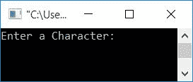
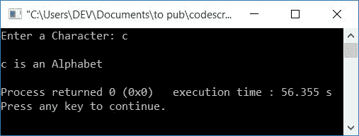
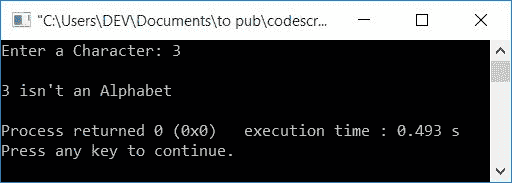
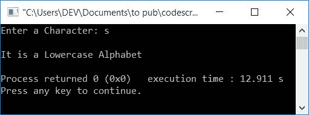
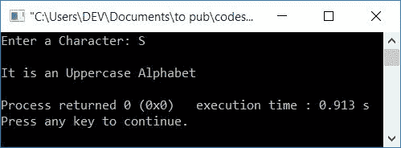

# C++ 程序：是否检查字母表

> 原文：<https://codescracker.com/cpp/program/cpp-program-check-alphabet.htm>

在这里，您将学习并获得在 C++中检查用户在运行时给定的字符是否是字母的代码。该程序通过以下两种方式创建:

*   检查字母或不使用字符本身
*   检查字母或不使用其 ASCII 值

## C++中是否检查字母表

在 [C++](/cpp/index.htm) 编程中，要检查输入的字符是否是字母，你 必须要求用户输入一个字符并开始检查字母。

该程序使用 [if-else](/cpp/cpp-selection-statements.htm) 语句检查 字符的值是否大于等于 **a** 且小于等于 **z** 。如果该条件评估 为真，则将其打印为字母表。

否则检查大写字母。即检查 character 的值是否大于等于 **A** (大写)且小于等于 **Z** (大写)。如果评估为真，则将其打印为一个 字母。否则，如果两个条件都为假，则将其打印为非字母表。

下面的 C++程序要求用户输入一个字符来检查它是否是一个字母:

```
#include<iostream>
using namespace std;
int main()
{
    char ch;
    cout<<"Enter a Character: ";
    cin>>ch;
    if((ch>='a' && ch<='z') || (ch>='A' && ch<='Z'))
        cout<<endl<<ch<<" is an Alphabet";
    else
        cout<<endl<<ch<<" isn't an Alphabet";
    cout<<endl;
    return 0;
}
```

这个程序是在 *Code::Blocks* IDE 下构建和运行的。下面是它的运行示例:



现在提供任何输入，比如说 **c** 并按`ENTER`键检查 **c** 是否是一个字母或者 是否不在下面给出的输出中显示:



因为 **c** 是一个字母表，所以你看到了上面的输出。让我们尝试另一个输入，即 一个数字，比如 **3** 。这是这种情况下的输出:



因为 3 是一个数字，而不是一个字母，所以程序产生的输出如上面给出的快照所示。

**注-** 如果 **if** 语句的条件评估为真，则如果的主体则程序流程转到**，否则程序流程转到**的主体**。**

### 使用 ASCII 值

现在让我们创建一个相同的程序，即使用它的 ASCII 值来检查给定或输入的字符是否是一个字母。但是在开始这个程序之前，如果你不知道字母表的 ASCII 值，那么下面是给你的表格:

| 大写字母 | ASCII 值 |
| A | Sixty-five |
| B | Sixty-six |
| C | Sixty-seven |
| ... | ... |
| Z | Ninety |
| 小写字母 | ASCII 值 |
| a | Ninety-seven |
| b | Ninety-eight |
| c | Ninety-nine |
| ... | ... |
| z | One hundred and twenty-two |

现在让我们继续，并在一个程序中实现它，以检查字母或没有。问题是，**用 C++写一个程序， 接收一个字符作为输入，打印它是否是字母表。**这个问题的答案是下面给出的 :

使用字符的 ASCII 值检查字母表。如果字符的 ASCII 值在 65 到 90 或 97 到 122 之间，它就是一个字母表。否则，它就不是字母表。

```
#include<iostream>
using namespace std;
int main()
{
    char ch;
    int ascii;
    cout<<"Enter a Character: ";
    cin>>ch;
    ascii = ch;
    cout<<endl;
    if(ascii>=65 && ascii<=90)
        cout<<"It is an Uppercase Alphabet";
    else if(ascii>=97 && ascii<=122)
        cout<<"It is a Lowercase Alphabet";
    else
        cout<<"It is not an Alphabet";
    cout<<endl;
    return 0;
}
```

下面是用户输入为 **s** 的示例运行



这里是另一个用户输入为 **S** 的运行示例



**注-** 语句，`ascii = ch;`初始化 **ch** 到 **ascii** 中字符的 ASCII 值。

#### 其他语言的相同程序

*   [C 检查字母是否正确](/c/program/c-program-check-alphabet.htm)
*   [Java 是否检查字母表](/java/program/java-program-check-alphabet.htm)
*   [Python 是否检查字母表](/python/program/python-program-check-alphabet.htm)

[C++在线测试](/exam/showtest.php?subid=3)

* * *

* * *