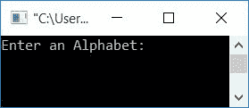
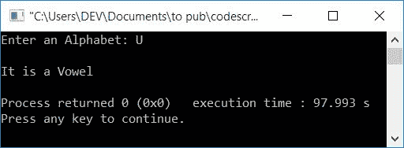
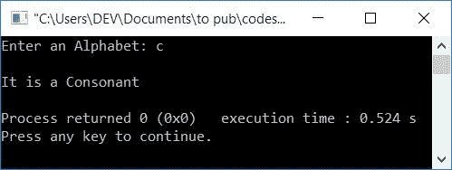
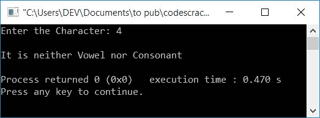
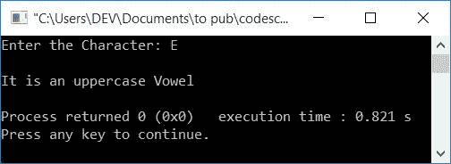

# 检查元音或辅音的 C++程序

> 原文：<https://codescracker.com/cpp/program/cpp-program-check-vowel.htm>

在本文中，您将学习并获得在 C++中检查给定字母是元音还是辅音的代码。该程序通过以下方式创建:

*   使用 if-else 检查元音或辅音
*   处理输入，而不是元音或辅音
*   使用开关检查元音或辅音

**重要**——如果一个字的<u>发音是由人类产生的，当气息通过 口<u>流出而不被牙齿、嘴唇或舌头</u>阻挡时。那么这个字就叫做元音。</u>

### 元音列表

元音共有 5 个，分别是 **a，E，I，O，u** 或 **A，E，I，O，U** 。在这 5 个元音的基础上，我们 编写了程序，在运行时检查用户输入的字符是否是元音。

**注-** 有时， **y** 也可称为元音。

正如已经提到的，我们将只处理上面列出的 5 个元音。我们不会深入讨论元音，因为我们只需要在元音上创建程序。让我们继续这个项目。

## 使用 if-else 检查元音或辅音

在 [C++](/cpp/index.htm) 编程中， 要检查输入的字母是否为元音(辅音),你必须要求用户首先输入一个字母，检查并打印如下 程序所示的信息:

如果输入字母等于以下 10 个字符中的任何一个(5 个小写元音和 5 个大写元音):

*   A，A，E，E，I，I，O，O，U，U

它被称为元音。否则字母表就是辅音。程序如下:

```
#include<iostream>
using namespace std;
int main()
{
    char ch;
    cout<<"Enter an Alphabet: ";
    cin>>ch;
    if(ch=='a' || ch=='e' || ch=='i' || ch=='o' || ch=='u')
        cout<<"\nIt is a Vowel";
    else if(ch=='A' || ch=='E' || ch=='I' || ch=='O' || ch=='U')
        cout<<"\nIt is a Vowel";
    else
        cout<<"\nIt is a Consonant";
    cout<<endl;
    return 0;
}
```

这个程序是在 *Code::Blocks* IDE 下构建和运行的。下面是它的运行示例:



现在提供任意字母，比如说 **U** 并按`ENTER`键查看以下输出:



下面是另一个运行示例，用户输入为 **c** :



这个程序有一个限制，如果用户输入 **4** ，那么上面程序产生的输出是，**它是 的一个辅音**。但是 4 不是辅音，而是一个数字。因此，我们有另一个程序来处理这种 类型的输入。

### 如果用户既不输入元音也不输入辅音会怎样？

下面给出的程序是对既不是元音也不是辅音的用户输入的解决方案:

```
#include<iostream>
using namespace std;
int main()
{
    char ch;
    cout<<"Enter the Character: ";
    cin>>ch;
    if((ch>='a' && ch<='z') || (ch>='A' && ch<='Z'))
    {
        int lowerVowel, upperVowel;
        lowerVowel = (ch=='a' || ch=='e' || ch=='i' || ch=='o' || ch=='u');
        upperVowel = (ch=='A' || ch=='E' || ch=='I' || ch=='O' || ch=='U');
        if(lowerVowel)
            cout<<"\nIt is a lowercase Vowel";
        else if(upperVowel)
            cout<<"\nIt is an uppercase Vowel";
        else
            cout<<"\nIt is a Consonant";
    }
    else
        cout<<"\nIt is neither Vowel nor Consonant";
    cout<<endl;
    return 0;
}
```

下面是用户输入为 **4** 的运行示例:



下面是另一个用户输入为 **E** 的运行示例:



声明，

```
lowerVowel = (ch=='a' || ch=='e' || ch=='i' || ch=='o' || ch=='u');
```

如果 **ch** 的值与任意字符 **a，e， i，o，u** 匹配，则将 **1** 初始化为**低元音**。因为 **1** 作为**的条件，如果**块视为真条件，因此程序流 进入 **if** 体，如果**lower 元音**保持其值为 **1** 。否则，以类似的方式，执行 **if-else** 块。如果**下元音**和**上元音**的值都不为 **1** ，那么 **else** 的体被执行，打印出一条信息，**是一个辅音**

## 使用开关检查元音

这是最后一个使用**开关**大小写检查并打印输入字符是元音还是 辅音的程序:

```
#include<iostream>
using namespace std;
int main()
{
    char ch;
    cout<<"Enter an Alphabet: ";
    cin>>ch;
    switch(ch)
    {
        case 'a':
        case 'A':
        case 'e':
        case 'E':
        case 'i':
        case 'I':
        case 'o':
        case 'O':
        case 'u':
        case 'U':
            cout<<"\nIt is a Vowel";
            break;
        default:
            cout<<"\nIt is a Consonant";
            break;
    }
    cout<<endl;
    return 0;
}
```

它将产生与本文中第一个程序相同的输出。

#### 其他语言的相同程序

您可能喜欢用其他编程语言编写相同的程序:

*   [C 检查元音与否](/c/program/c-program-check-vowel.htm)
*   [Java 检查元音与否](/java/program/java-program-check-vowel.htm)
*   [Python 检查元音与否](/python/program/python-program-check-vowel.htm)

[C++在线测试](/exam/showtest.php?subid=3)

* * *

* * *