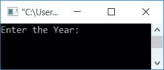
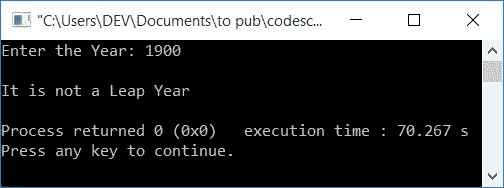
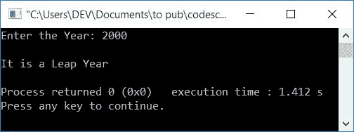

# C++ 程序：检查闰年与否

> 原文：<https://codescracker.com/cpp/program/cpp-program-check-leap-year.htm>

在本文中，您将学习并获得在 C++编程中检查用户在运行时给出的年份是否是闰年的代码。闰年计划通过以下三种方法创建:

*   不用函数和类检查闰年与否
*   使用用户定义的函数
*   使用类和对象

在浏览这个程序之前，如果你不知道闰年背后的逻辑，那么我必须推荐你访问一次[闰年逻辑](/nonprog/leap-year.htm)。在那里，你会得到关于闰年 的一切。但简而言之，以下是检查闰年的规则:

*   如果一年被 4 除，而不是被 100 除，那么它就是闰年。
*   如果一年除以 400，那么它就是闰年。
*   在所有其他情况下，这不是闰年。

## 在 C++中检查闰年

在 [C++](/cpp/index.htm) 编程中，要检查输入的年份是否是闰年，你必须 要求用户首先输入年份，然后应用逻辑并打印如下 给出的程序所示的信息:

所以问题是，**用 C++写一个程序，检查一年是不是闰年**。 这个问题的答案如下:

```
#include<iostream>
using namespace std;
int main()
{
    int yr;
    cout<<"Enter the Year: ";
    cin>>yr;
    if((yr%4==0) && (yr%100!=0))
        cout<<"\nIt is a Leap Year";
    else if(yr%400==0)
        cout<<"\nIt is a Leap Year";
    else
        cout<<"\nIt is not a Leap Year";
    cout<<endl;
    return 0;
}
```

这个程序是在 *Code::Blocks* IDE 下构建和运行的。下面是它的运行示例:



现在提供输入，即输入任意年份来打印是否是闰年，如下图所示，用户输入为 **1900** :



下面是另一个运行示例，用户输入为 **2000** :



**注-** 要做闰年，如果一年能被 4 整除，那么一定不能被 100 整除。

## 使用类检查闰年

现在让我们使用[类和对象](/cpp/cpp-classes-objects.htm)创建一个相同目的的程序。要了解 ，你可以跟随它的单独教程。

```
#include<iostream>
using namespace std;
class CodesCracker
{
    private:
        int yr;
    public:
        int getData();
        void checkLeapYear(int);
};
int CodesCracker::getData()
{
    cout<<"Enter the Year: ";
    cin>>yr;
    return yr;
}
void CodesCracker::checkLeapYear(int yr)
{
    if((yr%4==0) && (yr%100!=0))
        cout<<"\nIt is a Leap Year";
    else if(yr%400==0)
        cout<<"\nIt is a Leap Year";
    else
        cout<<"\nIt is not a Leap Year";
}
int main()
{
    CodesCracker c;
    int y;
    y = c.getData();
    c.checkLeapYear(y);
    cout<<endl;
    return 0;
}
```

这将产生与第一个程序相同的输出。以下是对上述计划的简要说明:

*   在 **main()** 函数中，创建了一个 **CodesCracker** 类的对象 **c**
*   使用这个对象，我们已经调用了该类的函数 **getData()** 并将 的返回值初始化为 **y**
*   也就是说，在 **getData()** 函数中，year 的值被(用户在运行时)接收到 **yr** 中。 并且返回 **yr** 的值。因此，现在 **yr** 的值在 **main()** 函数中被初始化为 **y**
*   现在在 **main()** 函数中，我们已经使用其对象 **c** 调用了 同一个类的 **checkLeapYear()** 函数
*   我们已经把 y 作为它的参数。因此，在 **checkLeapYear()** 函数中，使用给定的 年值(由用户指定)，我们检查并打印消息，无论它是否是闰年

## 使用函数的闰年程序

这是本文的最后一个程序。这个程序使用用户自定义函数， **checkLeap()** 到 检查一年是否是闰年。

```
#include<iostream>
using namespace std;
int checkLeap(int);
int main()
{
    int yr, val;
    cout<<"Enter the Year: ";
    cin>>yr;
    val = checkLeap(yr);
    if(val==1)
        cout<<"\nIt is a Leap Year";
    else
        cout<<"\nIt is not a Leap Year";
    cout<<endl;
    return 0;
}
int checkLeap(int yr)
{
    if((yr%4==0) && (yr%100!=0))
        return 1;
    else if(yr%400==0)
        return 1;
    else
        return 0;
}
```

您也可以用下面给出的另一种方式创建相同用途的程序。这个程序中的函数不是根据条件返回值，而是直接从函数内部打印消息，不返回值。也可以参考 C++ 中的[函数对其进行深入学习。](/cpp/cpp-functions.htm)

```
#include<iostream>
using namespace std;
void checkLeap(int);
int main()
{
    int yr, val;
    cout<<"Enter the Year: ";
    cin>>yr;
    checkLeap(yr);
    cout<<endl;
    return 0;
}
void checkLeap(int yr)
{
    if((yr%4==0) && (yr%100!=0))
        cout<<"\nIt is a Leap Year";
    else if(yr%400==0)
        cout<<"\nIt is a Leap Year";
    else
        cout<<"\nIt is not a Leap Year";
}
```

#### 其他语言的相同程序

*   [C 检查闰年与否](/c/program/c-program-check-leap-year.htm)
*   [Java 检查闰年与否](/java/program/java-program-check-leap-year.htm)
*   [Python 检查闰年与否](/python/program/python-program-check-leap-year.htm)

[C++在线测试](/exam/showtest.php?subid=3)

* * *

* * *