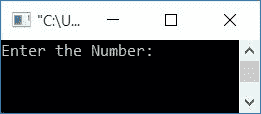
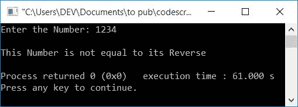
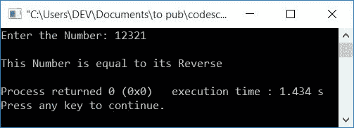

# C++ 程序：检查数字是否于它的倒数

> 原文：<https://codescracker.com/cpp/program/cpp-program-check-reverse-equal-original.htm>

在这里，您将学习并获得在 C++ 中检查输入数是否等于其倒数的代码。

在 [C++](/cpp/index.htm) 编程中，要检查原来的数字是否等于它的倒数，必须要求用户先输入数字。然后将其值(用户输入的数字) 初始化为一个变量，比如 **orig** ，然后反转该数字(用户输入的)。最后将其反转与**原点**进行比较，以检查反转是否 等于原点，如以下程序所示:

```
#include<iostream>
using namespace std;
int main()
{
    int num, orig, rev=0, rem;
    cout<<"Enter the Number: ";
    cin>>num;
    orig = num;
    while(num>0)
    {
        rem = num%10;
        rev = (rev*10)+rem;
        num = num/10;
    }
    if(orig==rev)
        cout<<"\nThis Number is equal to its Reverse";
    else
        cout<<"\nThis Number is not equal to its Reverse";
    cout<<endl;
    return 0;
}
```

这个程序是在 *Code::Blocks* IDE 下构建和运行的。下面是它的运行示例:



现在提供任何输入作为输入，比如说 **1234** 来检查它的倒数是否等于数字本身 ，如下面给出的输出所示:



下面是另一个用户输入为 **12321** 的运行示例:



**注意-** 在反转数值之前，确保将输入值初始化为变量，如 **orig** 。

从上面的程序中可以看出，我们已经用[反转了数字](/cpp/program/cpp-program-reverse-numbers.htm) ，然后将其与原始值(存储在 **orig** 中的值)进行比较。

#### 其他语言的相同程序

*   [C 的检查数等于其倒数](/c/program/c-program-check-reverse-equal-original.htm)
*   [Java 校验数等于其倒数](/java/program/java-program-check-reverse-equal-original.htm)
*   [Python 校验数等于其倒数](/python/program/python-program-check-reverse-equal-original.htm)

[C++ 在线测试](/exam/showtest.php?subid=3)

* * *

* * *