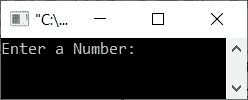
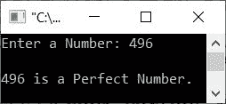

# C++ 程序：检查完全数

> 原文：<https://codescracker.com/cpp/program/cpp-check-perfect-number.htm>

创建这个页面是为了给你提供一些 C++程序，用来检查用户输入的数字是否是一个完美的数字。但在经历所有这些项目之前:

*   使用循环的**检查完全数**
*   使用 **while** 循环
*   使用用户定义的函数

我们先来了解一下，什么是完全数。

#### 哪个数可以称之为完全数？

如果一个数等于它的正约数之和(不包括这个数本身)，那么这个数可以称为完全数。例如，28 是一个完美的数字，因为在这种情况下，28 的约数是 1，2，4，7，14。所有这些数字的总和就是这个数字本身。那就是:

```
28 = 1+2+4+7+14
   = 14+14
   = 28
```

因此 **28** 是一个完全数。其他一些完全数是 6，496，8128 等。现在让我们继续下面给出的程序。

## 使用 for 循环检查完全数

问题是，*用 C++写一个程序，检查一个数是否是完全数。该号码必须由 用户在程序运行时输入。*这个问题的答案是:

```
#include<iostream>

using namespace std;
int main()
{
   int num, i, sum=0;
   cout<<"Enter a Number: ";
   cin>>num;
   for(i=1; i<num; i++)
   {
      if(num%i==0)
         sum = sum+i;
   }
   if(num==sum)
      cout<<endl<<num<<" is a Perfect Number.";
   else
      cout<<endl<<num<<" is not a Perfect Number.";
   cout<<endl;
   return 0;
}
```

下面是它的初始输出:



现在输入一个数字作为输入，比如说 **496** ，按`ENTER`键检查它是否是一个完全数，如下图所示 :



用户输入 **6** 的上述程序的试运行如下:

*   当用户输入一个数字时，它被存储在 **num** 变量中。因此 **num=6**
*   现在开始执行循环的**，从 **i** 的值为 1 开始**
*   当 **i=1** 时，条件 **i < num** 或 **1 < 6** 评估为真，因此程序流程进入循环内部
*   条件(of **if** ) **num%i==0** 或 **6%1==0** 或 **0==0** 评估为真，因此程序流程进入 **if** 块内的 或 **if** 块内的
*   并且 **sum+i** 或 **0+1** 或 **1** 被初始化为 **sum** 。因此 **sum=1**
*   现在 **i** 的值使用 **i++** 语句递增。因此**我现在=2**
*   再次，条件 **i < num** 或 **2 < 6** 评估为真，因此程序流再次进入循环
*   在循环内部，条件(如果为**)、**数量% I = = 0**或**6% 2 = = 0**或**0 = = 0**再次评估为真**
*   因此 **sum+i** 或 **1+2** 或 **3** 被初始化为 **sum** 。现在**总和=3**
*   现在， **i** 的值再次使用 **i++** 递增。现在 **i=3**
*   并且利用新的值 **i** ，条件 **i < num** 再次被评估
*   这个过程继续，直到循环的条件评估为假
*   这样，退出循环后， **sum** 变量保存该数所有约数的和。
*   因此，我比较了**和**与数字本身。如果相等，那么就是完全数。否则不会

## 使用 while 循环检查完全数

要更改上述程序并使用 **while** 循环创建一个新程序，请遵循以下步骤:

*   在声明时用 1 初始化 **i**
*   将条件 **i < num** 放入 **while** 循环中
*   在循环体中增加 **i** 的值，如下面给出的程序所示

这是一个使用 **while** 循环代替的**来完成与前一个程序相同工作的程序。**

```
#include<iostream>

using namespace std;
int main()
{
   int num, i=1, sum=0;
   cout<<"Enter a Number: ";
   cin>>num;
   while(i<num)
   {
      if(num%i==0)
         sum = sum+i;
      i++;
   }
   if(num==sum)
      cout<<endl<<num<<" is a Perfect Number.";
   else
      cout<<endl<<num<<" is not a Perfect Number.";
   cout<<endl;
   return 0;
}
```

这个程序产生与前一个程序相同的输出。

## 使用函数检查完全数

这是本文的最后一个程序，使用名为 **check_per()** 的用户定义函数创建。如果 数是一个完全数，这个函数返回 1，否则返回 0。

```
#include<iostream>

using namespace std;

int check_per(int);
int main()
{
   int num, res;
   cout<<"Enter a Number: ";
   cin>>num;
   res = check_per(num);
   if(res==1)
      cout<<endl<<num<<" is a Perfect Number.";
   else
      cout<<endl<<num<<" is not a Perfect Number.";
   cout<<endl;
   return 0;
}
int check_per(int n)
{
   int i, s=0;
   for(i=1; i<n; i++)
   {
      if(n%i==0)
        s = s+i;
   }
   if(n==s)
        return 1;
   else
        return 0;
}
```

这个程序再次做与前一个程序相同的工作，并产生相同的输出。

[C++在线测试](/exam/showtest.php?subid=3)

* * *

* * *