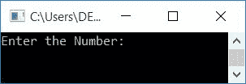
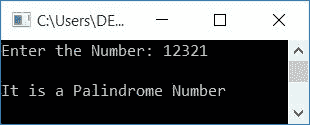
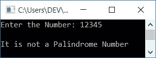
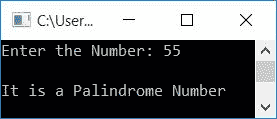

# C++ 程序：检查回文数

> 原文：<https://codescracker.com/cpp/program/cpp-program-palindrome-number.htm>

在这篇文章中，你将学习并获得在 C++中检查用户(在运行时)输入的数字是否是回文数字的代码。下面是检查回文数的程序列表:

*   不使用函数检查回文数
*   使用用户定义的函数

### 什么是回文数？

如果一个数的倒数等于该数本身，则称它为回文数。例如 **121** 、 **15751** 等。

## 是否检查回文号

在 C++中，要检查用户给定的数字是否是回文数字，首先接收该数字，将其值初始化为一个变量，比如说 **temp** ，并反转 **temp** 的值。换向后，检查 原始数字是否等于**温度**。

也就是说，如果原始数等于 **rev** 的值(原始数的反相或 **temp** 的反相)，则打印一条消息 like， **it is a 回文数**，否则打印一条消息 like， **it is not a 回文数** as 如下面给出的程序所示:

```
#include<iostream>
using namespace std;
int main()
{
    int num, rev=0, rem, temp;
    cout<<"Enter the Number: ";
    cin>>num;
    temp = num;
    while(temp>0)
    {
        rem = temp%10;
        rev = (rev*10)+rem;
        temp = temp/10;
    }
    if(rev==num)
        cout<<"\nIt is a Palindrome Number";
    else
        cout<<"\nIt is not a Palindrome Number";
    cout<<endl;
    return 0;
}
```

这个程序是在 *Code::Blocks* IDE 下构建和运行的。下面是它的运行示例:



现在输入如 **12321** ，按`ENTER`键检查并打印是否是一个 回文号，如下图所示:



下面是另一个使用用户输入运行的示例， **12345** :



在上面的程序中，我们已经将存储在 **num** 中的原始数字初始化为 **temp** 。然后 **温度**的值反转。最后与反转值( **rev** 的值)和原始数值 (**num**的值)进行比较。如果发现相等，则作为回文数打印，否则作为非 回文数打印。

要了解一个数的反转，请参考 [C++程序到 反转一个数](/cpp/program/cpp-program-reverse-numbers.htm)的文章，以获得关于该主题的所有必需的东西。

## 使用函数检查回文数

问题是，**用 C++写一个程序，检查回文数是否使用用户自定义函数。** 下面是它的回答:

```
#include<iostream>
using namespace std;
int checkPalindrome(int);
int main()
{
    int num, val;
    cout<<"Enter the Number: ";
    cin>>num;
    val = checkPalindrome(num);
    if(val==0)
        cout<<"\nIt is a Palindrome Number";
    else
        cout<<"\nIt is not a Palindrome Number";
    cout<<endl;
    return 0;
}
int checkPalindrome(int n)
{
    int temp, rem, rev=0;
    temp = n;
    while(temp>0)
    {
        rem = temp%10;
        rev = (rev*10)+rem;
        temp = temp/10;
    }
    if(rev==n)
        return 0;
    else
        return 1;
}
```

下面是用户输入的示例运行， **55** :



#### 其他语言的相同程序

*   [C 检查回文号](/c/program/c-program-palindrome-number.htm)
*   [Java 检查回文号](/java/program/java-program-check-palindrome.htm)
*   [Python 检查回文号](/python/program/python-program-check-palindrome.htm)

[C++在线测试](/exam/showtest.php?subid=3)

* * *

* * *