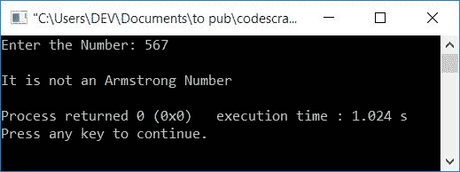

# 检查阿姆斯特朗数的 C++程序

> 原文：<https://codescracker.com/cpp/program/cpp-program-find-armstrong-number.htm>

在本文中，您将学习并获得在 C++中检查输入数字是否是阿姆斯特朗数字的代码。程序是通过以下方式创建的:

*   当循环时，使用*检查阿姆斯特朗编号*
*   使用回路的*检查阿姆斯特朗号*

但是在开始这些节目之前，我们先来了解一下阿姆斯特朗数。

### 什么是阿姆斯特朗数？

一种数，它等于它自己的位数之和，其中每个位数都是位数的幂。例如，1634 是一个阿姆斯特朗数字，因为:

```
1634 = 14 + 64 + 34 + 44
     = 1 + 1296 + 81 + 256
     = 1297 + 337
     = 1634
```

结果等于数字本身。所以这是一个阿姆斯特朗数字。

**注**——因为 **1634** 中的数字总数是 4，所以它的每个数字都是 4 的幂。

## 使用 while 循环检查阿姆斯特朗数

这是本文的第一个程序。它要求用户输入一个数字，并检查它是否是一个阿姆斯特朗号码。

问题是，**用 C++写一个程序，在运行时检查用户给定的数字是否是阿姆斯壮 数字。**下面是它的回答:

```
#include<iostream>
using namespace std;
int main()
{
    intnum, temp, noOfDigit=0, res=0, rem, pow, i;
    cout<<"Enter the Number: ";
    cin>>num;
    temp = num;
    while(num>0)
    {
        num = num/10;
        noOfDigit++;
    }
    num = temp;
    while(num>0)
    {
        rem = num%10;
        pow = 1;
        i = 0;
        while(i<noOfDigit)
        {
            pow = pow*rem;
            i++;
        }
        res = res + pow;
        num = num/10;
    }
    if(res==temp)
        cout<<"\nIt is an Armstrong Number";
    else
        cout<<"\nIt is not an Armstrong Number";
    cout<<endl;
    return 0;
}
```

这个程序是在 *Code::Blocks* IDE 下构建和运行的。下面是它的运行示例:


现在提供任意一个数字，比如说 **1634** ，按`ENTER`键检查是否是阿姆斯壮 的数字，如下图所示:


这是另一个运行示例，有用户输入， **153** :


**注-** 因为 **153** 是一个 3 位数，所以每个数字都是 3 的幂

以下代码块:

```
while(num>0)
{
    num = num/10;
    noOfDigit++;
}
```

用于计算给定数字中可用的总位数。

用户输入的上述程序的试运行， **153** 如下所示:

*   初始值， **noOfDigit=0** ， **res=0**
*   在运行时输入数字后，说出 **153** 。它被存储在 **num** 中。所以 **num=153**
*   使用`temp=num;`，**数量**的值被初始化为**温度**。所以**温度=153**
*   现在，while 循环的条件得到评估
*   也就是说，条件 **num > 0** 或 **153 > 0** 评估为真，因此程序流程进入循环内 并且 **num/10** 或 **153/10** 或 **15** 被初始化为 **num** 。所以 **num=15**
*   **noOfDigit** 的值增加。所以 **noOfDigit=1** (因为它的初始值是 0)
*   程序流程返回并评估*的条件，同时再次循环*
*   该过程继续，直到其条件评估为假。在其条件被评估为假之前， **num** 和 **noOfDigit** 的值将为 0 和 3。所以 **noOfDigit=3**
*   现在，语句`num = temp;`将**温度**的值初始化为**数量**。所以 **num=153**
*   第二个 *while 循环*的条件得到评估。也就是说，条件 **num > 0** 或 T4】153>0 评估为真，因此程序流程进入循环内部
*   在那里 **num%10** 或 **153%10** 或 **3** 被初始化为 **rem** 。所以 **rem=3**
*   并且 **pow=1** ， **i=0**
*   现在，第三个 while 循环的条件得到评估。也就是说，条件 **i < noOfDigit** 或 T4】0<3 评估为真，因此程序流程进入循环内部
*   并且 **pow*rem** 或 **1*3** 或 **3** 被初始化为 **pow**
*   **i** 的值增加。所以 **i=1**
*   程序流程返回并评估条件，再次执行**I<noufdigit**
*   该过程继续，直到其条件评估为假
*   在其条件被评估为假之前， **pow** 的值将为 **27** 。那就是 的结果**3<sup>3</sup>T7】**
*   所以语句中，`res = res + pow;`将 **res + pow** (或 **0+27** 或 T5】27)的值初始化为 **res** 。所以 **res=27**
*   最后 **num/10** 或 **153/10** 或 **15** 被初始化为 **num** 。所以 **num=15**
*   程序流程再次返回并评估条件， **num > 0** (属于*，同时再次循环*
*   该过程继续，直到其条件评估为假
*   在其条件被评估为假之后， **res** 的值将为 **153**
*   退出循环后，将 **res** 与用户输入的原始值进行比较
*   如果两者相等，则它是阿姆斯特朗数，否则它不是阿姆斯特朗数

## 使用 for 循环检查阿姆斯特朗数

现在让我们创建与上一个相同的程序，使用*作为循环*。也就是说，该程序执行与前一程序相同的 工作。唯一不同的是，在这里我们用*代替了 *while 循环*，用于循环*:

```
#include<iostream>
using namespace std;
int main()
{
    intnum, temp, noOfDigit=0, res=0, rem, pow, i;
    cout<<"Enter the Number: ";
    cin>>num;
    for(temp=num; temp>0; temp=temp/10)
        noOfDigit++;
    for(temp=num; temp>0; temp=temp/10)
    {
        rem = temp%10;
        pow = 1;
        for(i=0; i<noOfDigit; i++)
            pow = pow*rem;
        res = res + pow;
    }
    if(res==num)
        cout<<"\nIt is an Armstrong Number";
    else
        cout<<"\nIt is not an Armstrong Number";
    cout<<endl;
    return 0;
}
```

这个程序产生与前一个程序完全相同的输出。下面是用户输入的示例运行， **371** :


这是最后一次样本运行，有用户输入， **567** :



#### 其他语言的相同程序

*   [C 检查阿姆斯特朗与否](/c/program/c-program-find-armstrong-number.htm)
*   [Java 检查阿姆斯特朗与否](/java/program/java-program-find-armstrong-number.htm)
*   [Python 检查阿姆斯特朗与否](/python/program/python-program-check-armstrong.htm)

[C++在线测试](/exam/showtest.php?subid=3)

* * *

* * *