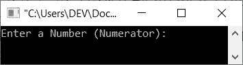
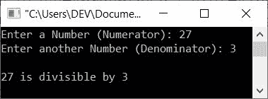
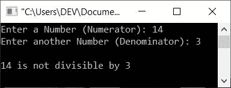
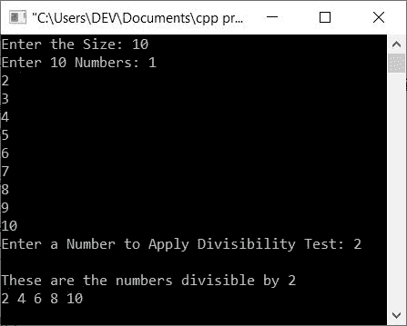

# C++ 程序：检查一个数是否能被另一个数整除

> 原文：<https://codescracker.com/cpp/program/cpp-check-number-divisible-by-another-number.htm>

本文提供了一些 C++程序，用于检查一个数(由用户输入)是否能被另一个数(也由用户输入)整除。这些计划包括:

*   使用 **if-else** 可以将支票号码除以另一个号码
*   使用用户定义的函数
*   使用类
*   整除测试程序，用户在运行时输入给定范围内的多个数字

## 使用 if-else，支票号码可以被另一个号码整除

问题是，*写一个 C++程序，接收两个数作为输入，检查第二个数是否先除尽，而 没有留下任何余数。*这个问题的答案，是下面这个程序给出的:

```
#include<iostream>

using namespace std;
int main()
{
   int numerator, denominator;
   cout<<"Enter a Number (Numerator): ";
   cin>>numerator;
   cout<<"Enter another Number (Denominator): ";
   cin>>denominator;
   if(numerator%denominator==0)
      cout<<endl<<numerator<<" is divisible by "<<denominator;
   else
      cout<<endl<<numerator<<" is not divisible by "<<denominator;
   cout<<endl;
   return 0;
}
```

下面给出的快照显示了上述 C++程序在检查一个数字(由用户输入)是否能被另一个数字(也由用户输入)整除时产生的初始输出:



现在输入任意两个数作为分子和分母，检查分母是否完全除尽分子(不留余数，或留 0 为余数)。例如，下面是它的示例运行，用户输入 **27** 作为分子， 3 作为分母:



**注-****%**(模)运算符给出余数。例如， **10%3** 给出 1， **20%10** 给出 0， **20%7** 给出 6。

因此，如果**分子%分母**为 0，意味着**分母**除以**分子**而不留 余数。

### 使用用户定义的函数

这是与前一个节目相同的节目。也就是说，这个程序做同样的工作，检查第一个数字是否除以第二个数字。这两个数字都必须由用户在程序运行时输入:

```
#include<iostream>

using namespace std;

int check_div(int, int);
int main()
{
   int numerator, denominator, res;
   cout<<"Enter a Number (Numerator): ";
   cin>>numerator;
   cout<<"Enter another Number (Denominator): ";
   cin>>denominator;

   res = check_div(numerator, denominator);
   if(res==1)
      cout<<endl<<numerator<<" is divisible by "<<denominator;
   else
      cout<<endl<<numerator<<" is not divisible by "<<denominator;
   cout<<endl;
   return 0;
}
int check_div(int a, int b)
{
   if(a%b==0)
      return 1;
   else
      return 0;
}
```

下面是它的示例运行，用户输入 **14** 作为分子， **4** 作为分母:



在上面的程序中，如果 **a%b** 或**分子%分母**给出 0，函数 **check_div()** 返回 1。否则，它 返回 0。根据返回值，执行 print 语句，如上面的程序所示。

### 使用类

这是另一个程序，也做与前两个程序相同的工作，但是使用不同的方法。也就是这个程序使用了 C++面向对象的特性 class and object。

```
#include<iostream>

using namespace std;

class CodesCracker
{
   public:
      int check_div(int, int);
};
int CodesCracker::check_div(int a, int b)
{
   if(a%b==0)
      return 1;
   else
      return 0;
}
int main()
{
   CodesCracker ob;
   int numerator, denominator, res;
   cout<<"Enter a Number (Numerator): ";
   cin>>numerator;
   cout<<"Enter another Number (Denominator): ";
   cin>>denominator;

   res = ob.check_div(numerator, denominator);
   if(res==1)
      cout<<endl<<numerator<<" is divisible by "<<denominator;
   else
      cout<<endl<<numerator<<" is not divisible by "<<denominator;
   cout<<endl;
   return 0;
}
```

这个程序产生与前一个程序相同的输出。

## 一个范围内多个数的整除性检验

问题是，*用 C++写一个程序，查找并打印给定范围(由用户输入)内的所有数字能被一个 数(由用户输入)整除。*下面给出的程序是这个问题的答案:

```
#include<iostream>

using namespace std;
int main()
{
   int tot, i, arr[100], num, j, arr_div[100];
   cout<<"Enter the Size: ";
   cin>>tot;
   cout<<"Enter "<<tot<<" Numbers: ";
   for(i=0; i<tot; i++)
      cin>>arr[i];
   cout<<"Enter a Number to Apply Divisibility Test: ";
   cin>>num;
   for(i=0, j=0; i<tot; i++)
   {
      if(arr[i]%num==0)
      {
         arr_div[j] = arr[i];
         j++;
      }
   }
   if(j==0)
      cout<<"\nAll the numbers are not divisible by "<<num;
   else
   {
      cout<<"\nThese are the numbers divisible by "<<num<<endl;
      for(i=0; i<j; i++)
         cout<<arr_div[i]<<" ";

   }
   cout<<endl;
   return 0;
}
```

以下是用户输入的运行示例， **10** 作为大小， **1、2、3、4、5、6、7、8、9、10** 作为 10 个数字， **2** 作为数字对 应用整除测试，如下图所示:



[C++在线测试](/exam/showtest.php?subid=3)

* * *

* * *