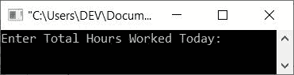
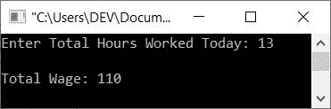
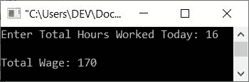

# 基于一天工作时间计算劳动工资的 C++程序

> 原文：<https://codescracker.com/cpp/program/cpp-calculate-wage-of-labor.htm>

本文提供了一个用 C++编写的程序，可以根据一天的工作时间来计算和打印工资。这一计划在劳动者以不同的速度工作时数的情况下起着至关重要的作用。

例如，程序(如下所示)是以这样一种方式创建的，即劳动力的工资必须根据以下比率计算:

| 工作时间 | 速度 |
| 前 8 小时 | Fifty |
| 接下来的 4 小时 | 10/小时 |
| 接下来的 4 小时 | 20/小时 |
| 接下来的 4 小时 | 25/小时 |
| 接下来的 4 小时 | 40/小时 |

## 计算劳动工资

问题是，**用 C++写一个程序，根据一天的总工作时间**来计算和打印劳动力的工资。 这个问题的答案是，根据上表中的费率:

```
#include<iostream>

using namespace std;
int main()
{
   float wage=50, hour, th, tw, total_wage;
   char name[20];
   cout<<"Enter Total Hours Worked Today: ";
   cin>>hour;
   if(hour<=8)
      total_wage = wage;
   else if(hour>8 && hour<=12)
   {
      th = hour-8;
      tw = th*10;
      total_wage = tw + wage;
   }
   else if(hour>12 && hour<=16)
   {
      th = hour-12;
      tw = 4*10;
      total_wage = wage + tw + (th*20);
   }
   else if(hour>16 && hour<=20)
   {
      th = hour-16;
      tw = (4*10) + (4*20);
      total_wage = wage + tw + (th*25);
   }
   else if(hour>20 && hour<=24)
   {
      th = hour-20;
      tw = (4*10) + (4*20) + (4*25);
      total_wage = wage + tw + (th*40);
   }
   else
   {
      cout<<"\nInvalid Input!";
      cout<<"\nHours can't be greater than 24 in a day.";
      return 0;
   }
   cout<<"\nTotal Wage: "<<total_wage;
   cout<<endl;
   return 0;
}
```

以下是上述程序根据工作时间打印劳动力工资的初始输出:



现在提供输入，比如说 **13** ，按`ENTER`键查找并打印在工作 **13** 小时后必须支付给劳工 的金额，如下图所示:



也就是说，基于 **13** 小时，计算如下:

```
13 hours worked = 8 hour + 4 hour + 1 hour
                = 50 + (4*10) + (1*20)
                = 50 + 40 + 20
                = 110
```

因此，对于 **13** 小时，你必须根据给定的费率支付 110 英镑(表中)。这里是另一个运行用户输入 **16** 的示例:



[C++在线测试](/exam/showtest.php?subid=3)

* * *

* * *