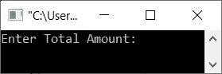
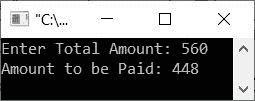
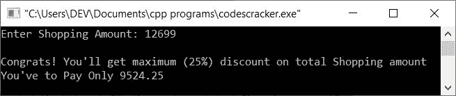

# C++ 程序：应用折扣后计算价格

> 原文：<https://codescracker.com/cpp/program/cpp-calculate-discount-purchase-amount.htm>

这篇文章包含了一个 C++ 程序，在根据用户(在运行时)完成/输入的总购买量应用折扣(如果有的话)后，该程序将计算并打印要支付的价格。折扣必须根据下表所示的购物总额提供:

| 购物总额 | 折扣 |
| <=100 | 没有折扣 |
| >100 & <=200 | 5% |
| >200 & <=400 | 10% |
| >400 & <=800 | 20% |
| >800 | 25% |

## 查找并打印应用折扣后要支付的价格

问题是，**用 C++ 写一个程序，找到并打印应用折扣后要支付的价格。**下面给出的程序 就是这个问题的答案:

```
#include<iostream>

using namespace std;
int main()
{
   float amount, discount, topaid;
   cout<<"Enter Total Amount: ";
   cin>>amount;
   if(amount<=100)
      cout<<"Amount to be Paid: "<<amount;
   else
   {
      if(amount>100 && amount<=200)
      {
         discount = (amount*5)/100;
         topaid = amount-discount;
      }
      else if(amount>200 && amount<=400)
      {
         discount = (amount*10)/100;
         topaid = amount-discount;
      }
      else if(amount>400 && amount<=800)
      {
         discount = (amount*20)/100;
         topaid = amount-discount;
      }
      else
      {
         discount = (amount*25)/100;
         topaid = amount-discount;
      }
      cout<<"Amount to be Paid: "<<topaid;
   }
   cout<<endl;
   return 0;
}
```

下面给出的快照显示了上述 C++ 程序在减去折扣(如果有)后计算价格(要支付的金额)时产生的初始输出:



现在输入购买总金额，比如说 **560** ，按`ENTER`键计算并打印应用折扣后需要支付的 价格，如下图所示:



在上面的程序中，我应用了条件**金额< =100** 使用 **if** 检查购买金额是否小于 等于 100。如果购买金额为 100 英镑或以下，则没有折扣。因此，我将购物金额打印为 。

否则，如果条件评估为假，因此程序流转到 **else** 的主体，在 **else** 、 内部，我已经基于本文前面的表格中给出的折扣创建了总共三个条件，以检查和应用折扣。 这样，程序就创建好了。

让我们修改上面的程序，通过显示应用于他/她的购买的折扣(如果有的话)来提供良好的用户体验:

```
#include<iostream>

using namespace std;
int main()
{
   float amount, discount, topaid;
   cout<<"Enter Shopping Amount: ";
   cin>>amount;
   if(amount<=100)
   {
      cout<<"\nSorry! No discount for shopping under 100";
      cout<<"You've to Pay "<<amount;
   }
   else
   {
      if(amount>100 && amount<=200)
      {
         cout<<"\nCongrats! You'll get 5% discount on total Shopping amount";
         discount = (amount*5)/100;
         topaid = amount-discount;
      }
      else if(amount>200 && amount<=400)
      {
         cout<<"\nCongrats! You'll get 10% discount on total Shopping amount";
         discount = (amount*10)/100;
         topaid = amount-discount;
      }
      else if(amount>400 && amount<=800)
      {
         cout<<"\nCongrats! You'll get 20% discount on total Shopping amount";
         discount = (amount*20)/100;
         topaid = amount-discount;
      }
      else
      {
         cout<<"\nCongrats! You'll get maximum (25%) discount on total Shopping amount";
         discount = (amount*25)/100;
         topaid = amount-discount;
      }
      cout<<"\nYou've to Pay Only "<<topaid;
   }
   cout<<endl;
   return 0;
}
```

下面是它的示例运行，用户输入 **12699** 作为总购物金额:



[C++ 在线测试](/exam/showtest.php?subid=3)

* * *

* * *