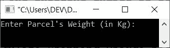
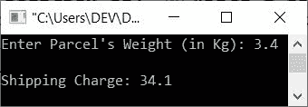

# C++ 程序：根据包裹重量计算运费

> 原文：<https://codescracker.com/cpp/program/cpp-calculate-parcel-charge.htm>

这篇文章包含了一个 C++ 程序，用来查找和打印基于包裹重量的运费。

这种类型的程序可以在电子商务平台上使用，如 Flipkart、Amazon 等。但这不是强制性的，他们不仅根据包裹的重量来计算价格。他们有自己的标准。忘了它吧，让我们用 C++ 创建一个程序，根据用户在运行时输入的包裹重量来查找并打印运费。

根据包裹重量计算运费的标准是:

*   如果包裹重量在 2 公斤以下，运费为 28.50 英镑
*   如果包裹的重量超过 2 公斤，那么每超过一公斤要加收 4 英镑的费用

## 根据重量计算运费的程序

问题是，**用 C++ 写一个程序，计算并打印运输一个包裹需要支付的费用。费用必须根据包裹的重量计算 。**下面是它的回答:

```
#include<iostream>

using namespace std;
int main()
{
   float weight, basecharge=28.50, perkgcharge=4, temp, extracharge, charge;
   cout<<"Enter Parcel's Weight (in Kg): ";
   cin>>weight;
   if(weight<=2)
      cout<<"\nShipping Charge: "<<basecharge;
   else
   {
      temp = weight-2;
      extracharge = temp * perkgcharge;
      charge = extracharge + basecharge;
      cout<<"\nShipping Charge: "<<charge;
   }
   cout<<endl;
   return 0;
}
```

下面是上面的 C++ 程序根据包裹重量计算运费的初始输出:



现在输入包裹的重量，比如说 **3.4** ，然后按`ENTER`键，根据其重量找到运费，如下图 所示:



也就是说，由于包裹的重量是 **3.4** ，因此运费是这样计算的:

```
weight          = 2 Kg + 1.4 Kg
Shipping charge = 28.5 + (1.4*4)
                = 28.5 + 5.6
                = 34.1
```

[C++ 在线测试](/exam/showtest.php?subid=3)

* * *

* * *