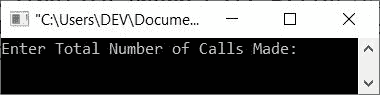
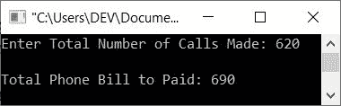

# C++ 程序：计算电话费

> 原文：<https://codescracker.com/cpp/program/cpp-calculate-telephone-call-bills.htm>

本文提供了一些用 C++ 编写的程序，这些程序可以根据拨打的电话查找并打印账单金额。用户必须在运行时输入电话呼叫的次数。以下是本文涉及的程序列表:

*   无功能计算电话费
*   使用用户自定义函数计算电话费
*   使用类和对象计算电话账单

电话费是这样计费的:

*   前 150 个电话免费
*   接下来的 250 次通话(151-400 分钟)按 1/分钟的费率计费
*   以及 400 分钟后的所有通话，按每分钟 2 英镑的费率计费

例如，如果客户总共打了 **620** 分钟的电话。那么电话账单费用的计算是这样的:

```

620 calls = 150 (Free) + 250 (at 1/minute) + 220 (at 2/minute)
          = 0 + (250*1) + (220*2)
          = 250 + 440
          = 690
```

所以， **690** 是参加 620 通话或 620 分钟通话后会得到的话费。

## 计算没有功能的电话账单

问题是，**用 C++ 写一个程序，根据用户在运行时输入的 总通话次数，计算并打印需要支付的电话账单。**下面给出的程序是这个问题的答案:

```
#include<iostream>

using namespace std;
int main()
{
   int ncall, temp, charge;
   cout<<"Enter Total Number of Calls Made: ";
   cin>>ncall;
   if(ncall<=150)
      cout<<"\nNo charge!";
   else
   {
      ncall = ncall - 150;
      if(temp<=250)
         charge = temp*1;
      else
      {
         temp = ncall-250;
         charge = 250 + (temp*2);
      }
      cout<<"\nTotal Phone Bill to Paid: "<<charge;
   }
   cout<<endl;
   return 0;
}
```

下面是上面的 C++ 程序根据拨打的电话计算电话账单时产生的初始输出:



现在键入或输入呼叫总数，以查找并打印需要支付的费用。以下是用户输入 **620** 作为总通话次数(通话分钟数)的运行示例:



## 使用函数计算电话账单

这个程序做的工作和前一个程序一样。但唯一的区别是，这个程序是使用一个名为 **phone_call()** 的用户定义函数创建的，该函数将调用次数作为其参数，并根据调用次数返回必须支付的账单金额 。

```
#include<iostream>

using namespace std;
int phone_call(int);
int main()
{
   int calls, amount;
   cout<<"Enter Total Number of Calls Made: ";
   cin>>calls;
   amount = phone_call(calls);
   cout<<"\nTotal Phone Bill to Paid: "<<amount;
   cout<<endl;
   return 0;
}
int phone_call(int ncall)
{
   int temp, charge;
   if(ncall<=150)
      return 0;
   else
   {
      ncall = ncall - 150;
      if(temp<=250)
         charge = temp*1;
      else
      {
         temp = ncall-250;
         charge = 250 + (temp*2);
      }
      return charge;
   }
}
```

这个程序做的工作和前一个程序一样，输出和前一个程序完全一样。

## 使用类计算电话账单

这是本文的最后一个程序，使用**类**创建。也就是创建了名为 **CodesCracker** 的类，带有两个私有 变量，即 **temp** 和 **charge** 以及一个名为 **phone_call()** 的公共成员函数。使用这个类的对象 (cobj)(在 **main()** 中创建的)，成员函数 **phone_call()** 被访问。

```
#include<iostream>

using namespace std;

class CodesCracker
{
   private:
      int temp, charge;
   public:
      int phone_call(int);
};
int CodesCracker::phone_call(int ncall)
{
   if(ncall<=150)
      return 0;
   else
   {
      ncall = ncall - 150;
      if(temp<=250)
         charge = temp*1;
      else
      {
         temp = ncall-250;
         charge = 250 + (temp*2);
      }
      return charge;
   }
}

int main()
{
   int calls, amount;
   CodesCracker cobj;

   cout<<"Enter Total Number of Calls Made: ";
   cin>>calls;

   amount = cobj.phone_call(calls);
   cout<<"\nTotal Phone Bill to Paid: "<<amount;
   cout<<endl;
   return 0;
}
```

这个程序也做与第一个程序相同的工作，并产生与第一个程序相似的输出。唯一的区别是它的方法。也就是说，这个程序是使用类和对象创建的。

[C++ 在线测试](/exam/showtest.php?subid=3)

* * *

* * *