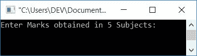
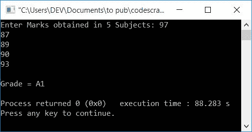
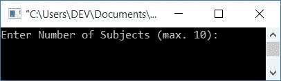
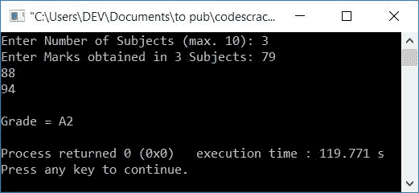

# 计算学生成绩的 C++程序

> 原文：<https://codescracker.com/cpp/program/cpp-program-calculate-student-grade.htm>

在这里，您将学习并获得基于 C++中获得的分数查找学生成绩的代码。您将经历两个程序:

*   根据五个科目的分数找出学生的分数。
*   使用用户定义的函数，根据所有科目的分数查找学生的分数。用户可以在这里输入主题的数量。

必须根据以下模式计算等级:

| 平均标记范围 | 级别 |
| 91-100 | 一流的 |
| 81-90 | 主动脉第二声 |
| 71-80 | B1 |
| 61-70 | B2 |
| 51-60 | C1 |
| 41-50 | C2 |
| 33-40 | D |
| 21-32 | E1 |
| 0-20 | E2 |

## 用 C++计算学生的成绩

要根据 C++编程的总分数来计算学生的分数，您必须要求用户输入五门学科的分数。要计算平均分数，将所有五个科目的分数相加，然后除以五。根据这个平均分，根据上面给出的表格找到等级:

```
#include<iostream>
using namespace std;
int main()
{
    int i;
    float mark, sum=0, avg;
    cout<<"Enter Marks obtained in 5 Subjects: ";
    for(i=0; i<5; i++)
    {
        cin>>mark;
        sum = sum+mark;
    }
    avg = sum/5;
    cout<<"\nGrade = ";
    if(avg>=91 && avg<=100)
        cout<<"A1";
    else if(avg>=81 && avg<91)
        cout<<"A2";
    else if(avg>=71 && avg<81)
        cout<<"B1";
    else if(avg>=61 && avg<71)
        cout<<"B2";
    else if(avg>=51 && avg<61)
        cout<<"C1";
    else if(avg>=41 && avg<51)
        cout<<"C2";
    else if(avg>=33 && avg<41)
        cout<<"D";
    else if(avg>=21 && avg<33)
        cout<<"E1";
    else if(avg>=0 && avg<21)
        cout<<"E2";
    else
        cout<<"Invalid!";
    cout<<endl;
    return 0;
}
```

这个程序是在 Code::Blocks IDE 下构建和运行的。下面是它的运行示例:



现在提供 5 个科目的分数，比如 97、87、89、90 和 93，并按回车键查看基于这些分数的分数，如下图所示:



### 使用用户定义的函数

这个程序做的工作和前面的一样，就是查找并打印学生的成绩。但是它增加了一个额外的功能。额外的功能是用户可以输入主题的编号。例如，如果他/她输入 3 作为科目数，程序将询问这三个科目的分数。

这个程序使用用户定义的函数 findGrade()计算学生的成绩。这个函数有两个参数:第一个参数是保存用户输入的所有标记的数组，第二个参数是 size(即主题的数量)。它返回一个字符串类型的值。要了解更多关于 C++ 中的[函数，请参考其单独的教程。](/cpp/cpp-functions.htm)

```
#include<iostream>
using namespace std;
const char* findGrade(float [], int);
int main()
{
    int i, n;
    float mark[10];
    cout<<"Enter Number of Subjects (max. 10): ";
    cin>>n;
    cout<<"Enter Marks obtained in "<<n<<" Subjects: ";
    for(i=0; i<n; i++)
        cin>>mark[i];
    cout<<"\nGrade = "<<findGrade(mark, n);
    cout<<endl;
    return 0;
}
const char* findGrade(float mark[], int n)
{
    int i;
    float sum=0, avg;
    for(i=0; i<n; i++)
        sum = sum+mark[i];
    avg = sum/n;
    if(avg>=91 && avg<=100)
        return "A1";
    else if(avg>=81 && avg<91)
        return "A2";
    else if(avg>=71 && avg<81)
        return "B1";
    else if(avg>=61 && avg<71)
        return "B2";
    else if(avg>=51 && avg<61)
        return "C1";
    else if(avg>=41 && avg<51)
        return "C2";
    else if(avg>=33 && avg<41)
        return "D";
    else if(avg>=21 && avg<33)
        return "E1";
    else if(avg>=0 && avg<21)
        return "E2";
    else
        return "Invalid!";
}
```

下面是示例运行的初始快照:



现在输入科目的数量，比如说 3，然后输入在这三个科目中获得的分数，得到如下输出所示的分数:



#### 其他语言的相同程序

*   [C 计算学生成绩](/c/program/c-program-calculate-student-grade.htm)
*   [Java 计算学生成绩](/java/program/java-program-calculate-student-grade.htm)
*   [Python 计算学生成绩](/python/program/python-program-calculate-student-grade.htm)

[C++在线测试](/exam/showtest.php?subid=3)

* * *

* * *