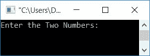
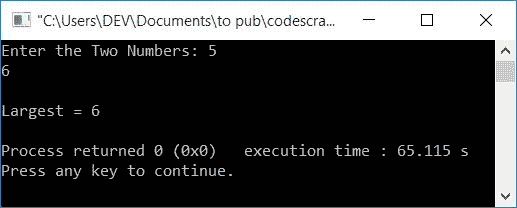
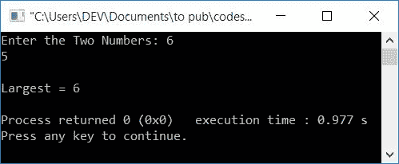

# C++程序寻找两个数中最大的一个

> 原文：<https://codescracker.com/cpp/program/cpp-program-find-greatest-of-two-numbers.htm>

在本文中，您将学习并获得在运行时用 C++查找并打印用户给定的两个数中最大的一个的代码。以下是用于创建程序的方法列表:

*   使用 *if-else* 找到两个数中最大的一个
*   使用条件运算符
*   使用用户定义的函数
*   使用类和对象

## 使用 if-else 查找两个数字中最大的一个

在 c++编程中，要找到两个数字之间的最大值，你必须让用户 输入任意两个数字。现在用 **if-else** 语句找出最大的。然后打印最大的，如下面给出的程序中的 所示。

问题是，**用 C++写一个程序，找出两个数**中最大的/最大的。以下是它的答案:

```
#include<iostream>
using namespace std;
int main()
{
    int numOne, numTwo, larg;
    cout<<"Enter the Two Numbers: ";
    cin>>numOne>>numTwo;
    if(numOne>numTwo)
        larg = numOne;
    else
        larg = numTwo;
    cout<<"\nLargest = "<<larg;
    cout<<endl;
    return 0;
}
```

这个程序是在 *Code::Blocks* IDE 下构建和运行的。下面是它的运行示例:



现在提供任意两个数字，比如说 **5** 和 **6** 。按`ENTER`键查找并打印最大的 ，如下图所示:



这是另一个带有用户输入的示例运行， **6** (作为第一个数字)和 **5** (作为第二个数字):



在上面的程序中，使用 **if-else** ，我们比较了 **numOne** (第一个数字)和 **numTwo** (第二个数字)的值。也就是说，如果 **numOne** 的值大于 **numTwo** 的值，那么 **numOne** 的值被初始化为 **larg** 。否则 **numTwo** 的值被初始化为 **larg**

从逻辑上讲，当用户输入两个数字时，以同样的顺序说出 **5** 和 **6** 。即 5 为第一，6 为 第二数。然后，5 存储在 **numOne** 中，6 存储在 **numTwo** 中

如果对求值，那么现在是**的条件。也就是说， **numOne > numTwo** 或**5>6**T16】评估为假，因此程序流程不会进入 **if** 的主体。相反，它去它的 **否则**的部分。并且 **numTwo** (6)的值被初始化为 **larg****

最后只需在输出上打印出 **larg** 的值，这将是你屏幕上最大的数字。

## 使用条件运算符查找两个数中的最大值

这是另一个 C++程序，它也查找并打印给定的两个数字之间的最大值，但是使用了条件运算符(**？:**)。

```
#include<iostream>
using namespace std;
int main()
{
    int numOne, numTwo, larg;
    cout<<"Enter the Two Numbers: ";
    cin>>numOne>>numTwo;
    larg = (numOne>numTwo) ? numOne : numTwo;
    cout<<"\nLargest = "<<larg;
    cout<<endl;
    return 0;
}
```

这个程序产生与前一个程序相同的输出。在这个程序中，下面的代码:

```
(numOne>numTwo) ? numOne : numTwo
```

声明，如果 **numOne** 的值大于 **numTwo** 的值，则整个表达式 变为 **numOne** 。否则整个表达式变成 **numTwo** 。

也就是说，如果条件运算符(？:)评估为真，则 **numOne** 的 值被初始化为 **larg** 。否则 **numTwo** 的值被初始化为 larg**larg**

## 用函数求两个数中的最大值

让我们创建另一个 C++程序，使用一个用户定义的函数， **largeOfTwo()** 来查找两个数字中的最大值。

函数 **largeOfTwo()** 将两个数字作为其参数，并返回两个参数中最大的一个。

```
#include<iostream>
using namespace std;
int largeOfTwo(int, int);
int main()
{
    int numOne, numTwo, larg;
    cout<<"Enter the Two Numbers: ";
    cin>>numOne>>numTwo;
    larg = largeOfTwo(numOne, numTwo);
    cout<<"\nLargest = "<<larg;
    cout<<endl;
    return 0;
}
int largeOfTwo(int nOne, int nTwo)
{
    if(nOne>nTwo)
        return nOne;
    else
        return nTwo;
}
```

## 使用类和对象找出两个数中最大的一个

这是本文的最后一个程序，它的工作与前面的程序相同。唯一不同的是，这个程序使用 C++的类和对象特性来查找和打印用户输入的两个数字中最大的一个。

```
#include<iostream>
using namespace std;
class CodesCracker
{
    public:
        int findLargest(int, int);
};
int CodesCracker::findLargest(int a, int b)
{
    if(a>b)
        return a;
    else
        return b;
}
int main()
{
    CodesCracker c;
    int numOne, numTwo, larg;
    cout<<"Enter the Two Numbers: ";
    cin>>numOne>>numTwo;
    larg = c.findLargest(numOne, numTwo);
    cout<<"\nLargest = "<<larg;
    cout<<endl;
    return 0;
}
```

在 **main()** 函数中，创建了一个类型为 **CodesCracker** 的对象 **c** 。使用这个对象， 我们调用了类 **CodesCracker** 的函数 **findLargest()** 。

#### 其他语言的相同程序

*   [C 找出两个数中最大的一个](/c/program/c-program-find-greatest-of-two-numbers.htm)
*   [Java 寻找两个数中最大的一个](/java/program/java-program-find-largest-of-two-numbers.htm)
*   [Python 找到两个数中最大的一个](/python/program/python-program-find-largest-of-two-numbers.htm)

[C++在线测试](/exam/showtest.php?subid=3)

* * *

* * *