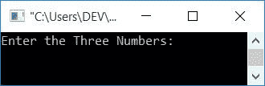
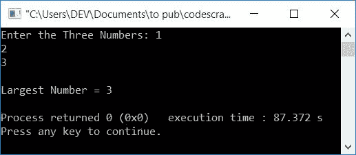
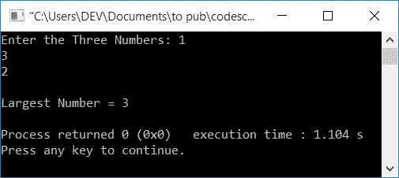
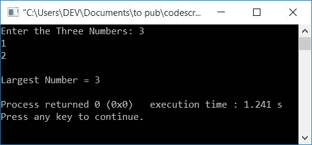

# C++程序寻找三个数中最大的一个

> 原文：<https://codescracker.com/cpp/program/cpp-program-find-greatest-of-three-numbers.htm>

在本文中，您将学习并获得在运行时用 C++查找并打印用户输入的三个数字中最大的一个的代码。该程序通过以下方式创建:

*   在没有函数的情况下，找出三个数中最大的一个
*   使用用户定义的函数找到三个数字中最大的一个

两个程序都使用 *if-else* 来查找并打印用户输入的任意三个数字中的最大值或最大值。

## 在 C++中寻找三个数中最大的一个

在 C++ 编程中，要找到三个数字中最大的一个，你必须让用户的 输入这三个数字。现在使用 *if-else* 阶梯找出三个中最大的，如下面给出的 程序所示:

问题是，**用 C++写一个程序，找出三个数中最大的一个。**下面是它的回答:

```
#include<iostream>
using namespace std;
int main()
{
    int numOne, numTwo, numThree, larg;
    cout<<"Enter the Three Numbers: ";
    cin>>numOne>>numTwo>>numThree;
    if(numOne>numTwo)
    {
        if(numTwo>numThree)
            larg = numOne;
        else
        {
            if(numThree>numOne)
                larg = numThree;
            else
                larg = numOne;
        }
    }
    else
    {
        if(numTwo>numThree)
            larg = numTwo;
        else
            larg = numThree;
    }
    cout<<"\nLargest Number = "<<larg;
    cout<<endl;
    return 0;
}
```

这个程序是在 *Code::Blocks* IDE 下构建和运行的。下面是它的运行示例:



现在提供任意三个数字作为输入，比如说 **1，2，3** 。这里第三个数字最大，第二个数字 第二大。按`ENTER`键打印三个数字中最大的一个，如下图的 输出所示:



这是另一个运行用户输入 **1，3，2** 的例子。这里第二个数字最大，第三个数字是 第二大:



下面是用户输入的另一个示例运行， **3，1，2** :



#### 前一个程序的主要逻辑

代码背后的主要逻辑是:

*   最初检查第一个数字是否大于第二个数字:
    *   如果第一个数字大于第二个数字，则检查第二个数字是否大于第三个数字:
        *   如果是真的。那么第一个数字大于第二个，第二个数字大于第三个
        *   所以第一个数字是最大的数字
    *   如果第二个数不大于第三个数，意味着第三个数大于第二个数
    *   因为第三个数大于第二个数，所以检查第三个数是否也大于第一个数:
        *   如果是真的。那么第三个数大于第一和第二个数
        *   所以第三个数字是最大的数字
        *   如果第三个数不大于第一个数，则意味着第一个数大于第三个数
        *   因为第一个数字大于第三和第二个数字
        *   所以第一个数字是最大的数字
*   如果第一个数字不大于第二个，则第二个数字大于第一个:
    *   因为第二个数字大于第一个，所以检查第二个数字是否也大于第三个:
        *   如果是真的。那么第二个数大于第一和第三个数
        *   所以第二个数字最大
        *   如果第二个数不大于第三个数，意味着第三个数大于第二个数
        *   因为第三个数大于第二个数，而第二个数大于第一个数
        *   所以第三个数字是最大的

#### 之前的程序解释为模拟运行

用户输入 **2、1、3** 的上述程序的试运行如下:

*   当用户以相同的模式输入 **2，1，3** 时，则 2 存放在 **numOne**中，1 存放在 **numTwo** 中，3 存放在 **numThree** 中。 即 **numOne=2** ， **numTwo=1** ， **numThree=3**
*   现在条件， **numOne > numTwo** 或 **2 > 1** 评估为真， 因此程序流程进入 **if** 块
*   现在条件， **numTwo > numThree** 或 **1 > 3** 评估为 假，因此程序流不进入 **if** 的主体，而是 进入其 **else** 的部分
*   在那里，条件 **numThree > numOne** 或 **3 > 2** 评估 为真，因此程序流程进入 **if** 的主体
*   并且 **numThree** 的值被初始化为 **larg**
*   因为条件评估为真，所以程序流程跳过**否则**的 部分
*   而对于最外层的 **if-else** ，因为 **if** 的条件评估 为真，因此同样在这种情况下， **else** 的部分被跳过
*   因此，程序流程转到将 **larg** 的值打印为输出的语句
*   它将打印输入的三个数字中最大的一个

## 用函数找出三个数中最大的一个

这个程序做的工作和前一个程序一样。但是在内部，这个程序使用不同的方法来完成任务。也就是说，这个程序是使用用户定义的函数 **findLargest()** 创建的

函数 **findLargest()** 将三个数字作为其参数，并返回其 三个参数中最大的一个。所以这个函数返回最大的数字，并在 **main()** 函数中初始化为 **larg** 。因此只需打印出 **larg** 的值

```
#include<iostream>
using namespace std;
int findLargest(int, int, int);
int main()
{
    int numOne, numTwo, numThree, larg;
    cout<<"Enter the Three Numbers: ";
    cin>>numOne>>numTwo>>numThree;
    larg = findLargest(numOne, numTwo, numThree);
    cout<<"\nLargest Number = "<<larg;
    cout<<endl;
    return 0;
}
int findLargest(int nOne, int nTwo, int nThree)
{
    if(nOne>nTwo)
    {
        if(nTwo>nThree)
            return nOne;
        else
        {
            if(nThree>nOne)
                return nThree;
            else
                return nOne;
        }
    }
    else
    {
        if(nTwo>nThree)
            return nTwo;
        else
            return nThree;
    }
}
```

这个程序产生与前一个程序相同的输出。

#### 其他语言的相同程序

*   [C 找出三个数中最大的一个](/c/program/c-program-find-greatest-of-three-numbers.htm)
*   [Java 寻找三个数字中最大的一个](/java/program/java-program-find-largest-of-three-numbers.htm)
*   [Python 找到三个数字中最大的一个](/python/program/python-program-find-largest-of-three-numbers.htm)

[C++在线测试](/exam/showtest.php?subid=3)

* * *

* * *