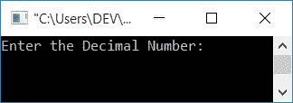
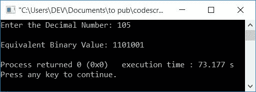
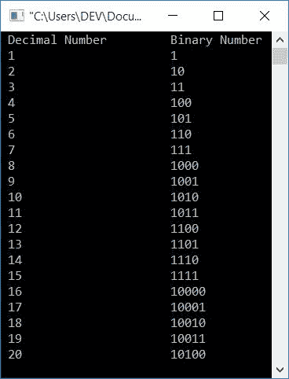
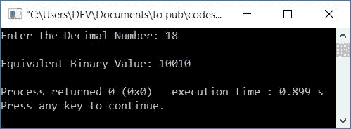

# C++ 程序：将十进制转换为二进制

> 原文：<https://codescracker.com/cpp/program/cpp-program-convert-decimal-to-binary.htm>

在本文中，您将学习并获得 C++ 中十进制到二进制转换的代码。使用以下方法创建程序:

*   使用数组将十进制转换为二进制
*   不使用数组
*   使用用户定义的函数

还提供一些额外的程序。但是在浏览这里所有可用的程序之前，如果你不知道用于转换的步骤，那么你可以参考[十进制到二进制](/computer-fundamental/decimal-to-binary.htm)来得到所有需要的东西。

## C++ 中的十进制到二进制

在 [C++](/cpp/index.htm) 编程中要将十进制数转换成二进制数，你得要求 用户先输入十进制数。然后将其转换为等效的二进制值。如下面给出的程序所示，在输出上打印其等效的二进制值 :

问题是，**用 C++ 写程序接收一个十进制数，用二进制打印它的等效值。** 下面给出这个问题的答案:

```
#include<iostream>
using namespace std;
int main()
{
    int decimalNum, binaryNum[20], i=0;
    cout<<"Enter the Decimal Number: ";
    cin>>decimalNum;
    while(decimalNum!=0)
    {
        binaryNum[i] = decimalNum%2;
        i++;
        decimalNum = decimalNum/2;
    }
    cout<<"\nEquivalent Binary Value: ";
    for(i=(i-1); i>=0; i--)
        cout<<binaryNum[i];
    cout<<endl;
    return 0;
}
```

这个程序是在 *Code::Blocks* IDE 下构建和运行的。下面是它的运行示例:



现在输入任意十进制数，比如说 **105** ，按`ENTER`键打印二进制数系统中的等价 值，如下图所示:



用户输入 **105** (十进制数)的上述程序的试运行如下:

1.  初始值， **i=0**
2.  当用户输入一个十进制数，比如说 **105** ，那么它会被存储在 **decimalNum** 中。所以 **decimalNum=105**
3.  现在条件 **decimalNum！=0** (属于**，而循环**)被求值
4.  条件**分米！=0** 或 **105！=0** 评估为真，因此程序流程进入 循环
5.  并且 **decimalNum%2** 或 **105%2** 或 **1** 初始化为 **binaryNum[i]** 或 **binary num[0]**。所以， **binaryNum[0]=1**
6.  **i** 的值增加。现在 **i=1**
7.  并且 **decimalNum/2** 或 **52** 被初始化为 **decimalNum** 。现在 **decimalNum=52**
8.  程序流程返回并评估**的条件，同时用新值 **十进制数**再次循环**(52)
9.  因为再次条件评估为真，所以程序流再次进入循环
10.  同样， **decimalNum%2** 或 **52%2** 或 **0** 被初始化为 **binaryNum[i]** 或 **binary num[1]**。所以 **binaryNum[1]=0**
11.  再次， **i** 的值增加。所以 **i=2**
12.  然后 **decimalNum/2** 或 **52/2** 或 **26** 被初始化为 **decimalNum** 。所以 **decimal num = 26**
13.  用新值**十进制数**和 **i** 从第 8 步到第 12 步进行相同的处理
14.  以类似的方式继续该过程，直到循环的条件**评估为假， 我们将得到 **binaryNum[]** 的值为:**
    *   binaryNum[0]=1
    *   binaryNum[1]=0
    *   binaryNum[2]=0
    *   binaryNum[3]=1
    *   binaryNum[4]=0
    *   binaryNum[5]=1
    *   binaryNum[6]=1
15.  当 **decimalNum** 的值等于 0 时，则条件 **decimalNum！=0** 或 **0！=0** 评估为假，因此循环结束时*的评估。并且使用**进行循环**，打印出 **binaryNum[]** 的 值*
16.  **binaryNum[]** 的值从其最后一个到第 **0 个<sup>到第</sup>个**索引打印出来
17.  那将是，1101001

### 从 1 到 20 将十进制转换为二进制

这是另一个程序，它将 1 到 20 之间的所有十进制数转换成等价的二进制值。

```
#include<iostream>
using namespace std;
int main()
{
    int decimalNum, binaryNum[10], i, k;
    cout<<" Decimal Number\t\tBinary Number\n";
    for(k=1; k<=20; k++)
    {
        i=0;
        decimalNum = k;
        while(decimalNum!=0)
        {
            binaryNum[i] = decimalNum%2;
            i++;
            decimalNum = decimalNum/2;
        }
        cout<<" "<<k<<"\t\t\t";
        for(i=(i-1); i>=0; i--)
            cout<<binaryNum[i];
        cout<<endl;
    }
    cout<<endl;
    return 0;
}
```

下面是上述程序产生的输出:



## 不使用数组的十进制到二进制转换

问题是，**用 C++ 写一个不使用数组，把十进制数转换成二进制数的程序。** 下面是它的答案。该程序不使用数组将任何给定的十进制数转换成其等效的二进制值 :

```
#include<iostream>
using namespace std;
int main()
{
    int decimalNum, binaryNum=0, mul=1, rem;
    cout<<"Enter the Decimal Number: ";
    cin>>decimalNum;
    while(decimalNum>0)
    {
        rem = decimalNum%2;
        binaryNum = binaryNum+(rem*mul);
        mul = mul*10;
        decimalNum = decimalNum/2;
    }
    cout<<"\nEquivalent Binary Value: "<<binaryNum;
    cout<<endl;
    return 0;
}
```

以下是用户输入的十进制数 **18** 的运行示例:



### 使用用户定义的函数

这个程序也做与前一个程序相同的工作。唯一的区别是，这个程序是使用一个用户定义的函数 **DecimalToBinary()** 创建的。也就是说，创建这个函数是为了将十进制转换为二进制。

该函数以十进制数作为参数，并返回其等效的二进制值。返回值被初始化为 **binaryNum** (在 **main()** 函数中)。打印 **binaryNum** 的值作为输出。

```
#include<iostream>
using namespace std;
int DecimalToBinary(int);
int main()
{
    int decimalNum, binaryNum;
    cout<<"Enter the Decimal Number: ";
    cin>>decimalNum;
    binaryNum = DecimalToBinary(decimalNum);
    cout<<"\nEquivalent Binary Value: "<<binaryNum;
    cout<<endl;
    return 0;
}
int DecimalToBinary(int decimalNum)
{
    int binaryNum=0, mul=1, rem;
    while(decimalNum>0)
    {
        rem = decimalNum%2;
        binaryNum = binaryNum+(rem*mul);
        mul = mul*10;
        decimalNum = decimalNum/2;
    }
    return binaryNum;
}
```

它将产生与前一个程序相同的输出。您也可以通过以下方式使用用户定义的函数创建相同用途的程序:

```
#include<iostream>
using namespace std;
int DecimalToBinary(int, int);
int binaryNum[20];
int main()
{
    int decimalNum, i;
    cout<<"Enter the Decimal Number: ";
    cin>>decimalNum;
    i = DecimalToBinary(decimalNum, 0);
    cout<<"\nEquivalent Binary Value: ";
    for(i=(i-1); i>=0; i--)
        cout<<binaryNum[i];
    cout<<endl;
    return 0;
}
int DecimalToBinary(int decimalNum, int i)
{
    while(decimalNum!=0)
    {
        binaryNum[i] = decimalNum%2;
        i++;
        decimalNum = decimalNum/2;
    }
    return i;
}
```

#### 其他语言的相同程序

*   [C 十进制到二进制](/c/program/c-program-convert-decimal-to-binary.htm)
*   [Java 十进制到二进制](/java/program/java-program-convert-decimal-to-binary.htm)
*   [Python 十进制转二进制](/python/program/python-program-convert-decimal-to-binary.htm)

[C++ 在线测试](/exam/showtest.php?subid=3)

* * *

* * *