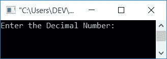
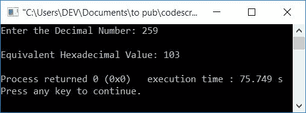
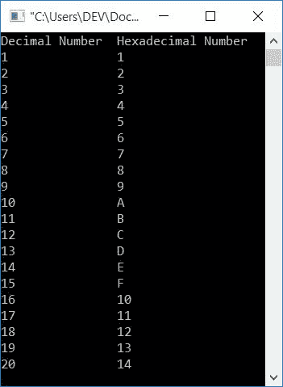
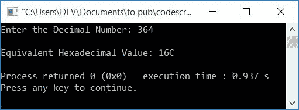

# C++ 程序：将十进制转换为十六进制

> 原文：<https://codescracker.com/cpp/program/cpp-program-convert-decimal-to-hexadecimal.htm>

在本文中，您将学习并获得 C++ 中十进制到十六进制转换的代码。C++ 中的十进制到十六进制转换程序是使用以下方法创建的:

*   不使用函数将十进制转换为十六进制
*   使用用户定义的函数

但是在浏览这些程序之前，如果你不知道一些用于转换的简单步骤，那么你可以参考[十进制到十六进制](/computer-fundamental/decimal-to-hexadecimal.htm)来得到每一个 需要的东西。

## C++ 中的十进制到十六进制

在 [C++](/cpp/index.htm) 编程中，要将一个数从十进制转换成十六进制，你必须要求用户的 首先输入想要的十进制数。然后将其转换为等效的十六进制值。最后 在输出上打印其等价的十六进制值，如下面给出的程序所示:

问题是，**用 C++ 写一个程序来接收十进制数，并以十六进制打印其等价的 值。**这个问题的答案如下:

```
#include<iostream>
using namespace std;
int main()
{
    int decimalNum, rem, i=0;
    char hexaDecimalNum[50];
    cout<<"Enter the Decimal Number: ";
    cin>>decimalNum;
    while(decimalNum!=0)
    {
        rem = decimalNum%16;
        if(rem<10)
            rem = rem+48;
        else
            rem = rem+55;
        hexaDecimalNum[i] = rem;
        i++;
        decimalNum = decimalNum/16;
    }
    cout<<"\nEquivalent Hexadecimal Value: ";
    for(i=i-1; i>=0; i--)
        cout<<hexaDecimalNum[i];
    cout<<endl;
    return 0;
}
```

这个程序是在 *Code::Blocks* IDE 下构建和运行的。下面是它的运行示例:



现在输入输入，比如说 **259** (十进制数)，按`ENTER`键转换并打印十六进制的 等效值，如下图所示:



用户输入 **259** (十进制数)的上述程序的试运行如下:

*   初始值， **i=0**
*   当用户输入十进制数时，比如说 **259** ，然后它被存储在 **decimalNum** 变量中。 所以 **decimalNum=259**
*   现在，while 循环的条件得到评估。
*   也就是条件 **decimalNum！=0** 或者 **259！=0** 评估为真，因此程序流程进入循环内的
*   **decimalNum%16** 或 **259%16** 或 **3** 被初始化为 **rem** 。所以 **rem=3**
*   现在条件 **rem < 10** 或 **3 < 10** 评估为真，因此程序流进入 if 的主体和语句
    `rem = rem+48;`
    评估
*   即 **rem+48** 或 **3+48** 或 **51** 被初始化为 **rem** 。所以 **rem=51**
*   因为，**的条件如果**评估为真，那么 **else** 的身体就会被跳过
*   现在 **rem** (51)的值被初始化为**十六进制数[i]** 或**十六进制数[0]**
*   **i** 的值增加。现在 **i=1**
*   然后 **decimalNum/16** 或 **259/16** 或 **16** 被初始化为 **decimalNum** 。所以 **decimal num = 16**
*   现在程序流程返回并评估**的条件，同时用新的值 **十进制数** (16)再次循环**
*   条件再次评估为真，因此程序流再次进入循环
*   **decimalNum%16** 或 **16%16** 或 **0** 被初始化为 **rem**
*   如果即 **rem < 10** 或 **0 < 10** 再次评估为真， 因此 **rem+48** 或 **0+48** 或 **48** 被初始化为 **rem** 。现在 **rem=0**
*   并且 **rem** 或 **0** 被初始化为 **hexaDecimalNum[i]** 或 **hexaDecimalNum[1]** 。所以 **hexaDecimalNum[1]= 0**
*   再次， **i** 的值增加。所以 **i=2**
*   **decimalNum/16** 或 **1** 被初始化为 **decimalNum**
*   继续该过程，直到循环的条件**评估为假**
*   继续这个过程，我们将得到 **rem** 的值作为 **51，48，49** ，它被初始化为 **hexaDecimalNum[0]，hexaDecimalNum[1]** ，和 **hexaDecimalNum[2]**
*   打印**十六进制数[]** 从最后一个到第 **0 个<sup>第</sup>个**个索引的值
*   因为 <u>51，48，49 是 3，0，1</u> 的 ASCII 值。因此<u>以相反的顺序，使用**为循环**打印</u> 103。这是给定十进制数(即 259)的等价十六进制值

**注-** 如果 **rem** (余数)的值将大于或等于 10，那么等价的 十六进制字母表的 ASCII 值被赋值(A-F)。即 A 代表 10，B 代表 11，C 代表 12 等等。

### 从 1 到 20 将十进制转换为十六进制

这个程序将 1 到 20 之间的所有十进制数转换成等价的十六进制数，而不需要用户输入:

```
#include<iostream>
using namespace std;
int main()
{
    int decimalNum, rem, i, k;
    char hexaDecimalNum[50];
    cout<<"Decimal Number\tHexadecimal Number\n";
    for(k=1; k<=20; k++)
    {
        decimalNum=k;
        i=0;
        while(decimalNum!=0)
        {
            rem = decimalNum%16;
            if(rem<10)
                rem = rem+48;
            else
                rem = rem+55;
            hexaDecimalNum[i] = rem;
            i++;
            decimalNum = decimalNum/16;
        }
        cout<<k<<"\t\t";
        for(i=i-1; i>=0; i--)
            cout<<hexaDecimalNum[i];
        cout<<endl;
    }
    return 0;
}
```

下面是它的示例输出:



### 使用函数将十进制转换为十六进制

让我们使用用户定义的函数 **DecToHexDec()** 来创建相同目的的程序。该函数将 的十进制数转换为十六进制数。

```
#include<iostream>
using namespace std;
int DecToHexDec(int dec, int);
char hexaDecNum[50];
int main()
{
    int decimalNum, i;
    cout<<"Enter the Decimal Number: ";
    cin>>decimalNum;
    i = DecToHexDec(decimalNum, 0);
    cout<<"\nEquivalent Hexadecimal Value: ";
    for(i=i-1; i>=0; i--)
        cout<<hexaDecNum[i];
    cout<<endl;
    return 0;
}
int DecToHexDec(int dec, int i)
{
    int rem;
    while(dec!=0)
    {
        rem = dec%16;
        if(rem<10)
            rem = rem+48;
        else
            rem = rem+55;
        hexaDecNum[i] = rem;
        i++;
        dec = dec/16;
    }
    return i;
}
```

以下是用户输入 **364** 作为十进制数输入的示例运行:



#### 其他语言的相同程序

*   [C 十进制到十六进制转换](/c/program/c-program-convert-decimal-to-hexadecimal.htm)
*   [Java 十进制到十六进制的转换](/java/program/java-program-convert-decimal-to-hexadecimal.htm)
*   [Python 十进制到十六进制的转换](/python/program/python-program-convert-decimal-to-hexadecimal.htm)

[C++ 在线测试](/exam/showtest.php?subid=3)

* * *

* * *