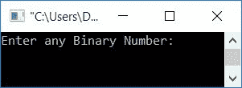
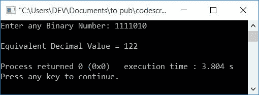
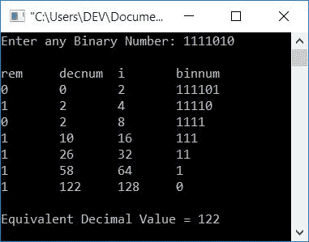

# C++ 程序：将二进制转换成十进制

> 原文：<https://codescracker.com/cpp/program/cpp-program-convert-binary-to-decimal.htm>

在本文中，您将学习并获得在使用和不使用 C++ 函数的情况下进行二进制到十进制转换的代码。

但是在浏览程序之前，如果你不知道二进制到十进制转换背后的步骤、公式或逻辑，那么你可以参考[二进制到十进制转换](/computer-fundamental/binary-to-decimal.htm)。在那里，你会在很短的时间内了解到关于 T2 的一切。

## 没有函数的二进制到十进制

在 [C++](/cpp/index.htm) 编程中，要将用户输入的任何数字(二进制数)转换为等效的十进制值，您必须要求用户首先输入二进制数。然后 应用逻辑并将其转换成等价的十进制值，如下面给出的程序所示。

让我们先看看这个程序，稍后再解释。

```
#include<iostream>
using namespace std;
int main()
{
    int binnum, decnum=0, i=1, rem;
    cout<<"Enter any Binary Number: ";
    cin>>binnum;
    while(binnum!=0)
    {
        rem = binnum%10;
        decnum = decnum + (rem*i);
        i = i*2;
        binnum = binnum/10;
    }
    cout<<"\nEquivalent Decimal Value = "<<decnum;
    cout<<endl;
    return 0;
}
```

这个程序是在 *Code::Blocks* IDE 下构建和运行的。下面是它的运行示例:



现在以二进制数的形式提供任何输入，比如说 **1111010** ，并按`ENTER`键查看其十进制的等价 值，如下面给出的输出所示:



#### 通过模拟运行解释程序

使用用户输入 **1111010** 进行上述程序的试运行:

1.  初始 **decnum=0** ， **i=1** ， **binnum=1111010** (用户输入)
2.  状况**宾纳姆！=0** (在`while`循环内部)或 **1111010！=0** 评估为真
3.  因此程序流进入循环内部
4.  并且 **binnum%10** 或 **1111010%10** 或 **0** 被初始化为 **rem** 。现在 **rem=0**
5.  同样， **decnum+(rem*i)** 或 **0+(0*1)** 或 **0** 被初始化为 **decnum** 。现在 **decnum = 0**
6.  然后 **i*2** 或 **1*2** 或 **2** 被初始化为 **i** 。现在 **i=2**
7.  最后， **binnum/10** 或 **1111010/10** 或 **111101** 被初始化为 **binnum** 。 现在 **binnum=111101**
8.  在执行完 **`while`循环**的所有四条语句后(第一次)，我们有 **decnum=0** 、 T4】I = 2 和 **binnum=111101**
9.  当循环时，程序流返回到**的状态**
10.  又来了状况**宾纳姆！=0** 或 **111101！=0** 评估为真，因此程序流程再次 进入循环内部
11.  并且 **binnum%10** 或 **111101%10** 或 **1** 被初始化为 **rem** 。现在 **rem=1**
12.  类似地， **decnum+(rem*i)** 或 **0+(1*2)** 或 **2** 被初始化为 **decnum** 。现在 **decnum = 2**
13.  并且 **i*2** 或 **2*2** 或 **4** 被初始化为 **i** 。现在 **i=4**
14.  最后， **binnum/10** 或 **111101/10** 或 **11110** 被初始化为 **binnum** 。 现在 **binnum=11110**
15.  现在用新的值 **decnum** 、 **i** 和 **binnum** 从步骤 9 进行到步骤 14
16.  现在我们有 **decnum=2** ， **i=8** 和 **binnum=1111**
17.  转到第 15 步
18.  现在我们有 **decnum=10** 、 **i=16** 和 **binnum=111**
19.  转到第 15 步
20.  现在我们有 **decnum=26** 、 **i=32** 和 **binnum=11**
21.  转到第 15 步
22.  现在我们有 **decnum=58** 、 **i=64** 和 **binnum=1**
23.  转到第 15 步
24.  现在我们有 **decnum=122** ， **i=128** ， **binnum=0**

#### 管状干式运行

|`while`循环评估 | 雷姆 | 德昌 | 我 | 宾内 |
| 1 <sup>st</sup> 评估 | Zero | Zero | Two | One hundred and eleven thousand one hundred and one |
| 第二次<sup>和</sup>评估 | one | Two | four | Eleven thousand one hundred and ten |
| 3 第<sup>次</sup>评估 | Zero | Two | eight | One thousand one hundred and eleven |
| 4 第<sup>次</sup>评估 | one | Ten | Sixteen | One hundred and eleven |
| 5 第<sup>次</sup>评估 | one | Twenty-six | Thirty-two | Eleven |
| 6 第<sup>次</sup>评估 | one | Fifty-eight | Sixty-four | one |
| 7 第<sup>次</sup>评估 | one | One hundred and twenty-two | One hundred and twenty-eight | Zero |

在执行 **`while`循环**的 期间，您还可以通过放置以下语句打印所有四个变量的值，比如 **rem、decnum、I、**和 **binnum** :

```
cout<<"\nrem\tdecnum\ti\tbinnum\n";
```

就在 *`while`循环*之前。和下面的声明:

```
cout<<rem<<"\t"<<decnum<<"\t"<<i<<"\t"<<binnum<<endl;
```

就在**的第四条语句之后，`while`循环**的正文。现在，用户输入 **1111010** ，输出如下:



## 使用函数将二进制转换为十进制

这个程序使用用户定义的函数 **BinToDec()** 将二进制转换成十进制。它以二进制数 作为参数，并返回其等价的十进制值。

这个程序使用了 **pow()** 函数。它有两个参数，第一个参数是基数，而第二个参数是指数。因此， **pow(2，5)** 的意思是 **2 <sup>5</sup>** ，即等于， **32** 。

```
#include<iostream>
#include<math.h>
using namespace std;
int BinToDec(int bin);
int main()
{
    int binnum, decnum;
    cout<<"Enter any Binary Number: ";
    cin>>binnum;
    decnum = BinToDec(binnum);
    cout<<"\nEquivalent Decimal Value = "<<decnum;
    cout<<endl;
    return 0;
}
int BinToDec(int bin)
{
    int dec=0, i=0, rem;
    while(bin!=0)
    {
        rem = bin%10;
        dec = dec + rem*pow(2,i);
        i++;
        bin = bin/10;
    }
    return dec;
}
```

这个程序产生与前一个程序相同的输出。你可以自己试运行一下。想了解更多 C++ 中的[函数，可以参考其单独教程。](/cpp/cpp-functions.htm)

#### 其他语言的相同程序

*   [C 二进制到十进制的转换](/c/program/c-program-convert-binary-to-decimal.htm)
*   [Java 二进制到十进制的转换](/java/program/java-program-convert-binary-to-decimal.htm)
*   [Python 二进制到十进制的转换](/python/program/python-program-convert-binary-to-decimal.htm)

[C++ 在线测试](/exam/showtest.php?subid=3)

* * *

* * *