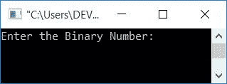
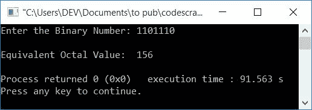
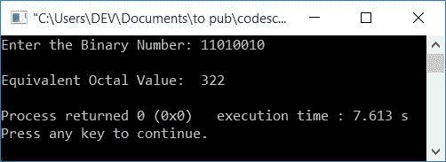

# C++ 程序：将二进制转换为八进制

> 原文：<https://codescracker.com/cpp/program/cpp-program-convert-binary-to-octal.htm>

在本文中，您将学习并获得 C++中二进制到八进制转换的代码。程序创建时使用和不使用函数。

但是在开始程序之前，如果你不知道转换的步骤和公式，那么你可以参考[二进制到八进制](/computer-fundamental/binary-to-octal.htm)。在那里你会得到每一件 需要的东西。

## C++中的二进制到八进制

在 [C++](/cpp/index.htm) 编程中，要将二进制数转换成八进制数，你必须要求用户 输入任何二进制数。然后将其转换成等价的八进制值，如下面给出的程序所示。

问题是，**用 C++写一个程序，接收任意二进制数，打印其等价的八进制值。** 下面是它的回答:

```
#include<iostream>
using namespace std;
int main()
{
    int binaryNum, octalDigit=0, octalNum[20];
    int i=0, mul=1, chk=1, rem;
    cout<<"Enter the Binary Number: ";
    cin>>binaryNum;
    while(binaryNum!=0)
    {
        rem = binaryNum%10;
        octalDigit = octalDigit + (rem*mul);
        if(chk%3==0)
        {
            octalNum[i] = octalDigit;
            mul = 1;
            octalDigit = 0;
            chk = 1;
            i++;
        }
        else
        {
            mul = mul*2;
            chk++;
        }
        binaryNum = binaryNum/10;
    }
    if(chk!=1)
        octalNum[i] = octalDigit;
    cout<<"\nEquivalent Octal Value:  ";
    for(i=i; i>=0; i--)
        cout<<octalNum[i];
    cout<<endl;
    return 0;
}
```

这个程序是在 *Code::Blocks* IDE 下构建和运行的。下面是它的运行示例:



现在输入二进制数，比如说 **1101110** ，然后按`ENTER`键，以八进制形式打印其等价的 值，如下图所示:



下面是另一个用户输入为 **11010010** 的运行示例:



用户输入为 **1101110** 的(上述程序的)试运行如下:

*   初始值， **i=0，mul=1，chk=1，octalDigit=0**
*   当用户输入二进制数，比如说 **1101110** ，那么它就会被初始化为 **binaryNum** 。因此 **binary num = 1101110**
*   现在因为条件*(while 循环* ) **binaryNum！=0** 或者 **1101110！=0** 评估为 真，因此程序流程进入循环内部
*   在循环内部，从第一条语句开始，所有语句被逐一执行
*   也就是说， **binaryNum%10** 或 **1101110%10** 或 **0** 被初始化为 **rem** 。所以 **rem=0**
*   **octal git+(rem * mul)**或 **0 + (0*1)** 或 **0** 被初始化为**octal git**。 所以 **octalDigit=0**
*   现在 **if** 语句的条件，即 **chk%3==0** 或 **1%3==0** 或 **1==0** 评估 为假，因此程序不进入 **if** 的主体，而是进入其 **else** 的 主体
*   在 **else** 体内， **mul*2** 或 **1*2** 或 **2** 被初始化为 **mul** 。 现在 **mul=2**
*   并且 **chk** 的值增加。现在 **chk=2**
*   最后执行 **while 循环**的最后一条语句，即 **binaryNum/10** 或**1101110/10**T12 或 **110111** 被初始化为 **binaryNum** 。现在 **binaryNum=110111**
*   现在，程序流程返回并评估**的条件，同时用新的值 **binary num**再次循环**。
*   第二次条件也评估为真，因此程序流程再次进入循环。
*   这个过程继续，直到循环的条件*评估为假。也就是说， 的值 **binaryNum** 变得等于 **0***
*   这样，下面是每次评估 **while 循环**后的值:
    1.  rem=0，八进制数=0，mul=2，chk=2，binaryNum=110111
    2.  rem=1，八进制数=2，mul=4，chk=3，binaryNum=11011
    3.  rem=1，octalDigit=6，octalNum[0]=6，mul=1，octalDigit=0，chk=1，i=1，binaryNum=1101。在该评估中，如果也评估为真，则**的条件为真**
    4.  rem=1，八进制数=1，mul=2，chk=2，binaryNum=110
    5.  rem=0，八进制数=1，mul=4，chk=3，binaryNum=11
    6.  rem=1，octalDigit=5，octalNum[1]=5，mul=1，octalDigit=0，chk=1，i=2，binaryNum=1。如果评估为真，则再次返回**的条件**
    7.  rem=1，八进制数=1，mul=2，chk=2，binaryNum=0
*   由于 **binaryNum** 的值现在为 0，因此 **while 循环**的条件评估为 假，因此 *while 循环*评估结束
*   现在的条件**如果是**，那就是 **chk！=1** 得到评估。因为病情 **chk！=1** 或 T6】2！=1 评估为真，因此 **octalDigit** 或 **1** 被初始化为 **octalNum[2]**
*   现在使用循环的**，从最后一个到 **0<sup>th</sup>**索引开始打印 **octalNum[]** 的值。**
*   这就是首先打印的 **octalNum[2]** 的值。然后打印出 **octalNum[1]** 和 **octalNum[0]** 。等于或打印 **156** 作为输出

### 使用用户定义的函数

让我们创建另一个程序，它使用用户定义的函数 **BinaryToOctal()** 来做同样的工作。这个 函数接收二进制数作为参数，并将其转换成等价的八进制值。

```
#include<iostream>
using namespace std;
void BinaryToOctal(int);
int i=0, octalNum[20];
int main()
{
    int binaryNum;
    cout<<"Enter any Binary Number: ";
    cin>>binaryNum;
    BinaryToOctal(binaryNum);
    cout<<"\nEquivalent Octal Value: ";
    for(i=i; i>=0; i--)
        cout<<octalNum[i];
    cout<<endl;
    return 0;
}
void BinaryToOctal(int binaryNum)
{
    int octalDigit=0, mul=1, chk=1, rem;
    while(binaryNum!=0)
    {
        rem = binaryNum%10;
        octalDigit = octalDigit + (rem*mul);
        if(chk%3==0)
        {
            octalNum[i] = octalDigit;
            mul = 1;
            octalDigit = 0;
            chk = 1;
            i++;
        }
        else
        {
            mul = mul*2;
            chk++;
        }
        binaryNum = binaryNum/10;
    }
    if(chk!=1)
        octalNum[i] = octalDigit;
}
```

它将产生与前一个程序相同的输出。你也可以用间接的方式把二进制转换成八进制。也就是先[二进制到十进制](/cpp/program/cpp-program-convert-binary-to-decimal.htm)再 [十进制到八进制](/cpp/program/cpp-program-convert-decimal-to-octal.htm)。

#### 其他语言的相同程序

*   [C 二进制到八进制](/c/program/c-program-convert-binary-to-octal.htm)
*   [Java 二进制转八进制](/java/program/java-program-convert-binary-to-octal.htm)
*   [Python 二进制转八进制](/python/program/python-program-convert-binary-to-octal.htm)

[C++在线测试](/exam/showtest.php?subid=3)

* * *

* * *