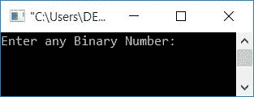
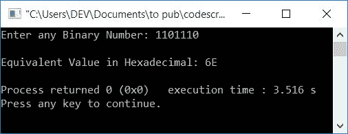
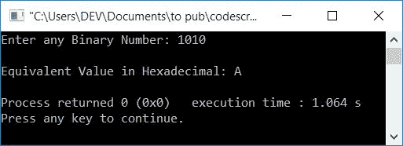

# C++ 程序：将二进制转换为十六进制

> 原文：<https://codescracker.com/cpp/program/cpp-program-convert-binary-to-hexadecimal.htm>

在本文中，您将学习并获得 C++ 中二进制到十六进制转换的代码。程序创建时使用和不使用用户自定义函数。

但是在浏览程序之前，如果你不知道[二进制到十六进制](/computer-fundamental/binary-to-hexadecimal.htm)转换的步骤和公式，那么你可以去 那里得到所有需要的东西。

## C++ 中的二进制到十六进制

在 [C++](/cpp/index.htm) 编程中要将二进制数转换成十六进制数，你得向用户 询问输入二进制数系统中的任意数。然后将其转换为等效的十六进制值。打印十六进制值 作为输出。

问题是，**用 C++ 写一个程序，接收任意二进制数并打印其等价的十六进制 值。**这个问题的答案如下:

```
#include<iostream>
using namespace std;
int main()
{
    int binaryNum, hex=0, mul=1, chk=1, rem, i=0;
    char hexDecNum[20];
    cout<<"Enter any Binary Number: ";
    cin>>binaryNum;
    while(binaryNum!=0)
    {
        rem = binaryNum%10;
        hex = hex + (rem*mul);
        if(chk%4==0)
        {
            if(hex<10)
                hexDecNum[i] = hex+48;
            else
                hexDecNum[i] = hex+55;
            mul = 1;
            hex = 0;
            chk = 1;
            i++;
        }
        else
        {
            mul = mul*2;
            chk++;
        }
        binaryNum = binaryNum/10;
    }
    if(chk!=1)
        hexDecNum[i] = hex+48;
    if(chk==1)
        i--;
    cout<<"\nEquivalent Value in Hexadecimal: ";
    for(i=i; i>=0; i--)
        cout<<hexDecNum[i];
    cout<<endl;
    return 0;
}
```

这个程序是在 *Code::Blocks* IDE 下构建和运行的。下面是它的运行示例:



现在提供二进制数字输入，比如说 **1101110** ，并按`ENTER`键将其转换为等效的十六进制 值，如下图所示:



下面是另一个示例运行，用户输入为 **1010** :



具有用户输入 **1010** 的(上述程序的)试运行如下:

*   初始值， **hex=0** ， **mul=1** ， **chk=1** ， **i=0**
*   当用户输入 **1010** 作为二进制输入时，1010 被初始化为 **binaryNum** 因此 **binaryNum=1010**
*   现在的条件是 **while 循环**， **binaryNum！=0** 或者 **1010！=0** 评估为真。 因此程序流程进入循环内部
*   **binaryNum%10** 或 **1010%10** 或 **0** 被初始化为 **rem** 。所以 **rem=0**
*   **十六进制+(rem*mul)** 或 **0+(0*1)** 或 **0** 被初始化为**十六进制**。所以**十六进制=0**
*   现在 **if** 语句的条件，即 **chk%4==0** 或 **1%4==0** 求值为 false。因此程序流不会进入 **if** 的主体，而是进入 else**if**的主体
*   并且 **mul*2** 或 **1*2** 或 **2** 被初始化为 **mul** 。现在 **mul=2**
*   然后 **chk** 的值增加。现在 **chk=2**
*   最后 *while 循环*体的最后一个语句， **binaryNum/10** 或 **1010/10** 或**101**T12】被初始化为 **binaryNum** 。现在 **binaryNum=101**
*   现在程序流程返回并评估**的条件，同时用新的值 **binary num**再次循环**。又来了状况 **101！=0** 评估为真。因此，程序流再次进入循环内部
*   处理代码，直到循环的条件**评估为假。**
*   继续这个过程，这里是我们在每次评估 *while 循环* : 后得到的值
    *   首次求值后
        **rem = 0**， **hex=0** ， **mul=2** ， **chk=2** ， **binaryNum=101**
    *   第二次求值后
        **rem = 1**， **hex=2** ， **mul=4** ， **chk=3** ， **binaryNum=10**
    *   第三次求值后
        **rem = 0**， **hex=2** ， **mul=8** ， **chk=4** ， **binaryNum=1**
    *   第四次求值后，这次**的条件 if** 语句，即 **chk%4==0** 或 T4】4% 4 = = 0 或 **0==0** 求值为真
        **rem = 1**， **hex=0** ， **hexDecNum[0]=A** ， **mul=1** ，
*   现在经过第四次评估后， **binaryNum** 的值为 0。所以条件 **binaryNum！=0** 或 **0！=0** 评估为假。因此，程序流这次不会进入循环。这意味着， 循环结束时*的求值*
*   现在**的条件如果**(在 *while 循环*之后，不在里面)， **chk！= 1**T8】或 **1！=1** 评估为假
*   如果的条件成立，现在程序流程进行到下一个**，并评估其条件，即**chk = = 1**T10】或 **1==1** 评估为真。因此 **i** 的值递减。现在 **i=0****
*   使用**循环**，从 **i** 的值开始，一直持续到其值等于 到 0，逐个打印值 **hexDecNum[]**
*   因为 **i** 的值为 0，所以循环只进行一次评估。所以 **hexDecNum[0]** 的值被打印出来，这等于 **A**

### 使用用户定义的函数

下面是另一个程序，它也可以将用户在运行时输入的任何二进制数转换为等效的十六进制值，但是使用了用户定义的函数 **BinaryToHexaDec()** 。

```
#include<iostream>
using namespace std;

void BinaryToHexaDec(int bin);
int i=0;
char hexDecNum[20];
int main()
{
    int binaryNum;
    cout<<"Enter any Binary Number: ";
    cin>>binaryNum;
    BinaryToHexaDec(binaryNum);
    cout<<"\nEquivalent Value in Hexadecimal: ";
    for(i=i; i>=0; i--)
        cout<<hexDecNum[i];
    cout<<endl;
    return 0;
}
void BinaryToHexaDec(int bin)
{
    int hex=0, mul=1, chk=1, rem;
    while(bin!=0)
    {
        rem = bin%10;
        hex = hex + (rem*mul);
        if(chk%4==0)
        {
            if(hex<10)
                hexDecNum[i] = hex+48;
            else
                hexDecNum[i] = hex+55;
            mul = 1;
            hex = 0;
            chk = 1;
            i++;
        }
        else
        {
            mul = mul*2;
            chk++;
        }
        bin = bin/10;
    }
    if(chk!=1)
        hexDecNum[i] = hex+48;
    if(chk==1)
        i--;
}
```

这个程序将产生与前一个程序相同的输出。

#### 其他语言的相同程序

*   [C 二进制到十六进制](/c/program/c-program-convert-binary-to-hexadecimal.htm)
*   [Java 二进制到十六进制](/java/program/java-program-convert-binary-to-hexadecimal.htm)
*   [Python 二进制到十六进制](/python/program/python-program-convert-binary-to-hexadecimal.htm)

[C++ 在线测试](/exam/showtest.php?subid=3)

* * *

* * *