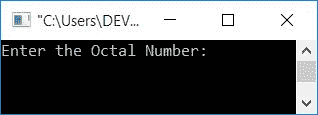
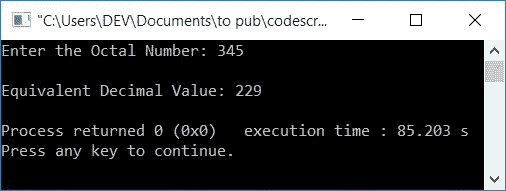
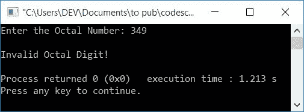

# 将八进制转换成十进制的 C++程序

> 原文：<https://codescracker.com/cpp/program/cpp-program-convert-octal-to-decimal.htm>

在本文中，您将学习并获得 C++中八进制到十进制转换的代码。八进制到十进制的转换程序是使用和不使用函数创建的。

但是在开始程序之前，如果你不知道用于转换的简单公式和步骤，那么你可以参考[八进制到十进制的公式](/computer-fundamental/octal-to-decimal.htm)来得到每一个 需要的东西。

## C++中的八进制到十进制

在 [C++](/cpp/index.htm) 编程中，要将八进制数转换成十进制数，你必须要求 用户输入八进制数，然后将其转换成等价的十进制值。如下面给出的程序所示，在输出上打印等价的十进制 值。

问题是，**用 C++写一个把八进制数转换成十进制数的程序。**下面是它的回答:

```
#include<iostream>
#include<math.h>
using namespace std;
int main()
{
    int octalNum, decimalNum=0, i=0, rem;
    cout<<"Enter the Octal Number: ";
    cin>>octalNum;
    while(octalNum!=0)
    {
        rem = octalNum%10;
        decimalNum = decimalNum + (rem*pow(8,i));
        i++;
        octalNum = octalNum/10;
    }
    cout<<"\nEquivalent Decimal Value: "<<decimalNum;
    cout<<endl;
    return 0;
}
```

这个程序是在 *Code::Blocks* IDE 下构建和运行的。下面是它的运行示例:



现在输入任意八进制数，如 **345** ，按`ENTER`键转换并打印 其等效的十进制值，如下图所示:



使用八进制数输入 **345** 对上述程序进行模拟运行，如下所示:

*   初始值， **decimalNum=0** ， **i=0**
*   当用户输入八进制数作为输入时，比如说 **345** ，然后它被存储在**八进制变量**中。 所以 **octalNum=345**
*   现在的状况， **octalNum！=0** 或 **345！=0** 评估为真，因此程序流程进入**内的 ，同时循环**
*   在那里， **octalNum%10** 或 **345%10** 或 **5** 被初始化为 **rem** 。所以 **rem=5**
*   并且 **decimalNum + (rem*pow(8，i))** 或 **0+(5*8 <sup>i</sup> )** 或 **0+(5*8 <sup>0</sup> )** 或 T10】5 * 1 或 **5** 被初始化为 **decimalNum** 。所以 **decimalNum=5**
*   **i** 的值增加。所以 **i=1**
*   并且**八进制数/10** 或 **345/10** 或 **34** 被初始化为**八进制数**。所以 **octalNum=34**
*   程序流程返回并评估**的条件，同时再次循环**
*   继续执行 *while 循环*,直到其条件评估为假
*   在其条件评估为假之前，我们将获得如下值(在每次评估之后):
    1.  rem=5，decimalNum=5，i=1，octalNum=34
    2.  rem=4，十进制数=37，i=2，八进制数=3
    3.  rem=3，decimalNum=229，i=3，octalNum=0
*   现在打印十进制数 (229)的值，这将是给定的八进制数 (345)的十进制等效值

### 不使用 pow()函数

要在不使用 **pow()** 函数的情况下创建相同的程序(从上一个程序开始)，只需替换下面的 语句:

```
decimalNum = decimalNum + (rem*pow(8,i));
i++;
```

下面给出了声明:

```
decimalNum = decimalNum + (rem*mul);
mul = mul*8;
```

**注意**——不要忘记在程序开始时声明变量 **mul** 。并将其初始 值初始化为 1

从程序中删除变量 **i** 的声明和初始化。也去掉头文件， **math.h** 。其余的事情将是一样的。

### 处理无效八进制输入的程序

八进制数的基数是 8。因此，它总共有 8 个数字，从 0 到 7。其他数字如 **8** 和 **9** 不是有效的八进制数字。因此，如果用户输入包含 8 或 9 的数字。那么这里的 就是要处理的程序:

```
#include<iostream>
using namespace std;
int main()
{
    int octalNum, rem, temp, chk=0;
    cout<<"Enter the Octal Number: ";
    cin>>octalNum;
    temp = octalNum;
    while(temp!=0)
    {
        rem = temp%10;
        if(rem>=8)
        {
            chk++;
            break;
        }
        temp = temp/10;
    }
    if(chk==0)
    {
        int decimalNum=0, mul=1;
        while(octalNum!=0)
        {
            rem = octalNum%10;
            decimalNum = decimalNum + (rem*mul);
            mul = mul*8;
            octalNum = octalNum/10;
        }
        cout<<"\nEquivalent Decimal Value: "<<decimalNum;
    }
    else
        cout<<"\nInvalid Octal Digit!";
    cout<<endl;
    return 0;
}
```

下面是它的示例运行，用户输入 **349** 作为八进制数。因为它包含了**9**(349 的第三个 数字)，并且 9 是一个无效的八进制数字，因此这里是您将看到的输出:



### 使用函数将八进制转换为十进制

这是 C++中关于八进制到十进制转换的最后一个程序。它是使用用户定义的函数 **OctalToDecimal()** 创建的。 该函数以八进制数为参数，返回其等价的十进制值或 0。

如果输入的八进制数中存在任何无效的八进制数字，则返回 0，否则返回等效的十进制值。

```
#include<iostream>
using namespace std;
int OctalToDecimal(int);
int main()
{
    int octalNum, decimalNum;
    cout<<"Enter the Octal Number: ";
    cin>>octalNum;
    decimalNum = OctalToDecimal(octalNum);
    if(decimalNum==0)
        cout<<"\nInvalid Octal Digit!";
    else
        cout<<"\nEquivalent Decimal Value: "<<decimalNum;
    cout<<endl;
    return 0;
}
int OctalToDecimal(int octalNum)
{
    int temp, rem, chk=0;
    temp = octalNum;
    while(temp!=0)
    {
        rem = temp%10;
        if(rem>=8)
        {
            chk++;
            break;
        }
        temp = temp/10;
    }
    if(chk==0)
    {
        int decimalNum=0, mul=1;
        while(octalNum!=0)
        {
            rem = octalNum%10;
            decimalNum = decimalNum + (rem*mul);
            mul = mul*8;
            octalNum = octalNum/10;
        }
        return decimalNum;
    }
    else
        return 0;
}
```

这个程序产生与前一个程序相同的输出。

#### 其他语言的相同程序

*   [C 八进制到十进制](/c/program/c-program-convert-octal-to-decimal.htm)
*   [Java 八进制到十进制](/java/program/java-program-convert-octal-to-decimal.htm)
*   [Python 八进制到十进制](/python/program/python-program-convert-octal-to-decimal.htm)

[C++在线测试](/exam/showtest.php?subid=3)

* * *

* * *