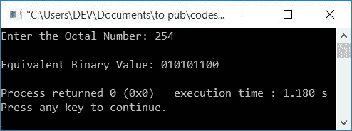

# C++ 程序：将八进制转换为二进制

> 原文：<https://codescracker.com/cpp/program/cpp-program-convert-octal-to-binary.htm>

在本文中，您将学习并获得 C++ 中八进制到二进制转换的代码。创建的第一个程序实际上转换并打印给定八进制数的二进制等效值。第二个程序只是一个接一个地打印每个八进制数字的二进制等价物。

在浏览这些程序之前，如果你不知道用于转换的简单步骤和公式，那么你可以参考[八进制到二进制的公式](/computer-fundamental/octal-to-binary.htm)来得到每一个 需要的东西。

在 C++ 中，有两种方法可以用来创建八进制到二进制转换的程序:

1.  八进制到二进制直接转换
2.  八进制到二进制的间接转换

在间接转换中，首先将给定的[八进制数转换成其等价的十进制值](/cpp/program/cpp-program-convert-octal-to-decimal.htm) 。然后将十进制的 [转换成等价的二进制值](/cpp/program/cpp-program-convert-decimal-to-binary.htm)。但在这里， 该程序仅在直接转换时创建。因为你可以和自己接近间接转化。间接进场的 程序已经在单独的文章中给出。

## C++ 中的八进制到二进制

在 [C++](/cpp/index.htm) 编程中要把八进制数转换成二进制数，你得让用户 输入八进制数，然后再把它转换成等价的二进制数。最后在输出上显示二进制值 ，如下面给出的程序所示:

问题是，**用 C++ 写一个程序，把八进制转换成二进制。**这个问题的答案在下面 给出:

```
#include<iostream>
#include<string.h>
using namespace std;
int main()
{
    int octalNum, rev=0, rem, chk=0;
    char binaryNum[40] = "";
    cout<<"Enter the Octal Number: ";
    cin>>octalNum;
    while(octalNum!=0)
    {
        rem = octalNum%10;
        if(rem>7)
        {
            chk++;
            break;
        }
        rev = (rev*10) + rem;
        octalNum = octalNum/10;
    }
    if(chk==0)
    {
        octalNum = rev;
        cout<<"\nEquivalent Binary Value: ";
        while(octalNum!=0)
        {
            rem = octalNum%10;
            switch(rem)
            {
                case 0: strcat(binaryNum, "000");
                    break;
                case 1: strcat(binaryNum, "001");
                    break;
                case 2: strcat(binaryNum, "010");
                    break;
                case 3: strcat(binaryNum, "011");
                    break;
                case 4: strcat(binaryNum, "100");
                    break;
                case 5: strcat(binaryNum, "101");
                    break;
                case 6: strcat(binaryNum, "110");
                    break;
                case 7: strcat(binaryNum, "111");
                    break;
            }
            octalNum = octalNum/10;
        }
        cout<<binaryNum;
    }
    else
        cout<<"\nInvalid Octal Digit!";
    cout<<endl;
    return 0;
}
```

这个程序是在 *Code::Blocks* IDE 下构建和运行的。下面是它的运行示例:


现在提供任何八进制数，比如说 **364** 作为输入，然后按`ENTER`键转换并打印 它的二进制等效值，如下图所示:


函数 **strcat()** 用于[连接字符串](/cpp/program/cpp-program-concatenate-string.htm)。 它以两个字符串作为它的自变量。第二个字符串的值被追加到第一个字符串的末尾。

以下代码块(包含在上述程序中):

```
while(octalNum!=0)
{
    rem = octalNum%10;
    if(rem>7)
    {
        chk++;
        break;
    }
    rev = (rev*10) + rem;
    octalNum = octalNum/10;
}
```

用于检查给定的八进制数中的任何一位是否大于 7。如果发现任何大于 7 的数字，则该数字不是有效的八进制数字。因为八进制数只能是 8 位数，即从 0 到 7。

**while 循环**执行方式如下(假设用户输入为 **364** ):

*   条件**八分圆！=0** 或者 **364！=0** 评估为真，因此程序流程进入 循环
*   在那里， **octalNum%10** 或 **364%10** 或 **4** 被初始化为 **rem**
*   而**的条件如果**，即 **rem > 7** 评估为假，因此程序 流程不进入 **if** 的主体，而是转到 **if** 的 代码块之后可用的语句
*   即 **(rev*10)+rem** 或 **(0*10)+4** 或 **4** 被初始化为 **rev**
*   并且循环的最后一个语句**被求值，即 **octalNum/10** 或 **364/10** 或 **36**被初始化为 **octalNum****
*   程序流程返回并评估**的条件，同时再次循环**。
*   while 循环对**的评估继续，直到 **octalNum** 的值变为等于 0。那就是 条件评估为假**
*   因为 **364** 中没有任何数字大于 7，所以程序流程不会进入 **if** 的 体
*   这意味着， **chk** 的值为 0(在程序开始时初始化)
*   因此在 **while 循环**结束后，我们检查了 **chk** 的值是否保持其 初始值(0)
*   如果它保持它的初始值，然后进一步将八进制数转换成二进制数。否则，打印类似于**输入了无效的八进制数字！**
*   现在，让我们对 **if (chk==0)** 块中的所有代码块进行预演，如下所示

因此，带有用户输入 **364** 的上述程序的试运行如下(在 **if** 块内):

*   **binaryNum=""** ， **rev=463** (如 ，[在循环时用**将前面的数字**](/cpp/program/cpp-program-reverse-numbers.htm)反过来
*   **rev** (463)的值被初始化为**八进制**。所以 **octalNum=463**
*   现在对 **while 循环**(如果)的条件进行评估
*   也就是条件， **octalNum！=0** 或者 **463！=0** 评估为真，因此程序流程进入循环内部 ，并且 **octalNum%10** 或 **463%10** 或 **3** 被初始化为 **rem**
*   现在使用**开关**，将 **rem** 的值与所有 8 种情况进行比较。也就是它的 值等于 0，1，2，....，或 7
*   无论它的值是什么，都将其二进制等效项连接到 **binaryNum** 变量
*   因为 **rem** 的值是 3，所以**案例 3:** 的语句得到求值。即
    `strcat(binaryNum, "011");`
    得到求值。因此， **binaryNum=011** (由于 **binaryNum** 的初始值 为空)。从下一次开始，在 **011** 之后添加二进制等价物
*   并且**八进制数/10** 或 **463/10** 或 **46** 被初始化为**八进制数**。因此**八进制**的新值 为 **46**
*   现在程序流程返回并评估**的条件，同时用 **八进制**的新值再次循环**
*   也就是条件， **octalNum！=0** 或 **46！=0** 评估为真，程序流程再次进入循环内的
*   该过程继续，直到循环的条件**评估为假**
*   在继续评估 *while 循环*的代码块的过程中，我们将得到如下值:
    *   rem=3，binaryNum=011，octalNum=46
    *   rem=6，binaryNum=011110，octalNum=4
    *   rem=4，binaryNum=011110100，octalNum=0
*   现在在输出上打印出 **binaryNum** 的值，这将是给定的 八进制数(364)的二进制等效值(011110100)

### 打印八进制数的二进制等价物

现在让我们创建另一个程序，它只在运行时打印用户给定的八进制数的二进制等效值，而不进行实际转换。

```
#include<iostream>
using namespace std;
int main()
{
    int octalNum, rev=0, rem;
    cout<<"Enter the Octal Number: ";
    cin>>octalNum;
    while(octalNum!=0)
    {
        rem = octalNum%10;
        rev = (rev*10) + rem;
        octalNum = octalNum/10;
    }
    octalNum = rev;
    cout<<"\nEquivalent Binary Value: ";
    while(octalNum!=0)
    {
        rem = octalNum%10;
        switch(rem)
        {
            case 0: cout<<"000";
                break;
            case 1: cout<<"001";
                break;
            case 2: cout<<"010";
                break;
            case 3: cout<<"011";
                break;
            case 4: cout<<"100";
                break;
            case 5: cout<<"101";
                break;
            case 6: cout<<"110";
                break;
            case 7: cout<<"111";
                break;
            default: cout<<"--InvalidOctalDigit("<<rem<<")--";
                break;
        }
        octalNum = octalNum/10;
    }
    cout<<endl;
    return 0;
}
```

下面是用户输入 **254** (八进制数)的运行示例:



如果用户输入一个包含一个或多个无效八进制数字的八进制数，说 **2948** 。下面是您将看到的 输出:


#### 其他语言的相同程序

*   [C 八进制到二进制](/c/program/c-program-convert-octal-to-binary.htm)
*   [Java 八进制到二进制](/java/program/java-program-convert-octal-to-binary.htm)
*   [Python 八进制转二进制](/python/program/python-program-convert-octal-to-binary.htm)

[C++ 在线测试](/exam/showtest.php?subid=3)

* * *

* * *