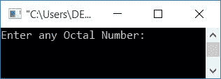
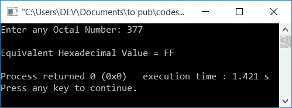

# C++ 程序：将八进制转换为十六进制

> 原文：<https://codescracker.com/cpp/program/cpp-program-convert-octal-to-hexadecimal.htm>

在本文中，您将学习并获得 C++中八进制到十六进制转换的代码。程序创建时使用和不使用用户自定义函数。

在浏览程序之前，如果你不知道八进制转换为十六进制的公式或步骤，你可以参考[八进制转换为十六进制的步骤](/computer-fundamental/octal-to-hexadecimal.htm) 来获得八进制转换为十六进制所需的一切。

## 八进制到十六进制无函数

在 [C++](/cpp/index.htm) 编程中，要将八进制数转换成十六进制数，你必须要求用户的 首先输入八进制数。然后将其转换为等效的十六进制值，如下面给出的 程序所示:

```
#include<iostream>
#include<string.h>
using namespace std;
int main()
{
    int octalNum, rev=0, rem, chk=0, hex=0, mul=1, i=0, k=0;
    char binaryNum[40] = "", hexnum[40];
    cout<<"Enter any Octal Number: ";
    cin>>octalNum;
    while(octalNum!=0)
    {
        rem = octalNum%10;
        if(rem>7)
        {
            chk++;
            break;
        }
        rev = (rev*10) + rem;
        octalNum = octalNum/10;
    }
    if(chk==0)
    {
        octalNum = rev;
        while(octalNum!=0)
        {
            rem = octalNum%10;
            switch(rem)
            {
                case 0: strcat(binaryNum, "000");
                    break;
                case 1: strcat(binaryNum, "001");
                    break;
                case 2: strcat(binaryNum, "010");
                    break;
                case 3: strcat(binaryNum, "011");
                    break;
                case 4: strcat(binaryNum, "100");
                    break;
                case 5: strcat(binaryNum, "101");
                    break;
                case 6: strcat(binaryNum, "110");
                    break;
                case 7: strcat(binaryNum, "111");
                    break;
            }
            octalNum = octalNum/10;
        }
        while(binaryNum[k]!='\0')
            k++;
        chk=1;
        k--;
        while(k>=0)
        {
            if(binaryNum[k]=='0')
                rem = 0;
            else
                rem = 1;
            hex = hex + (rem*mul);
            if(chk%4==0)
            {
                if(hex<10)
                    hexnum[i] = hex+48;
                else
                    hexnum[i] = hex+55;
                mul = 1;
                hex = 0;
                chk = 1;
                i++;
            }
            else
            {
                mul = mul*2;
                chk++;
            }
            k--;
        }
        if(chk!=1)
            hexnum[i] = hex+48;
        if(chk==1)
            i--;
        cout<<"\nEquivalent Hexadecimal Value = ";
        chk = 0;
        for(i=i; i>=0; i--)
        {
            if(hexnum[i]=='0' && chk==0)
            {
                chk++;
                continue;
            }
            else
                cout<<hexnum[i];
        }
    }
    else
        cout<<"\nInvalid Octal Digit "<<rem;
    cout<<endl;
    return 0;
}
```

这个程序是在 *Code::Blocks* IDE 下构建和运行的。下面是它的运行示例:



现在输入任意一个八进制数，比如说 **377** ，然后按`ENTER`键查看其等价的十六进制值，如下图所示:



这个程序将八进制转换成二进制，然后将二进制转换成十六进制

你还可以采用第二种方法，即[八进制到十进制](/cpp/program/cpp-program-convert-octal-to-decimal.htm)然后 十进制到十六进制。这里使用第一种方式 ，因为第二种方式更容易创建和理解。所以你可以跟随文章并自己创作。

## 使用函数将八进制转换为十六进制

这个程序做的工作和前一个程序一样。唯一不同的是，它是使用用户定义的函数 **octalToHexa()** 创建的。

```
#include<iostream>
#include<string.h>
int reverseNum(int);
void octalToHexa(int);
static int chk, i;
char hexnum[40];
using namespace std;
int main()
{
    int octalNum;
    cout<<"Enter any Octal Number: ";
    cin>>octalNum;
    octalToHexa(octalNum);
    if(chk!=0)
    {
        cout<<"\nEquivalent Hexadecimal Value = ";
        chk = 0;
        for(i=i; i>=0; i--)
        {
            if(hexnum[i]=='0' && chk==0)
            {
                chk++;
                continue;
            }
            else
                cout<<hexnum[i];
        }
    }
    else
        cout<<"\nInvalid Octal Digit!";
    cout<<endl;
    return 0;
}
void octalToHexa(int octalNum)
{
    int rev=0, rem, hex=0, mul=1, k=0;
    char binnum[40] = "";
    rev = reverseNum(octalNum);
    if(rev!=0)
    {
        octalNum = rev;
        while(octalNum!=0)
        {
            rem = octalNum%10;
            switch(rem)
            {
                case 0: strcat(binnum, "000");
                    break;
                case 1: strcat(binnum, "001");
                    break;
                case 2: strcat(binnum, "010");
                    break;
                case 3: strcat(binnum, "011");
                    break;
                case 4: strcat(binnum, "100");
                    break;
                case 5: strcat(binnum, "101");
                    break;
                case 6: strcat(binnum, "110");
                    break;
                case 7: strcat(binnum, "111");
                    break;
            }
            octalNum = octalNum/10;
        }
        while(binnum[k]!='\0')
            k++;
        chk=1;
        k--;
        while(k>=0)
        {
            if(binnum[k]=='0')
                rem = 0;
            else
                rem = 1;
            hex = hex + (rem*mul);
            if(chk%4==0)
            {
                if(hex<10)
                    hexnum[i] = hex+48;
                else
                    hexnum[i] = hex+55;
                mul = 1;
                hex = 0;
                chk = 1;
                i++;
            }
            else
            {
                mul = mul*2;
                chk++;
            }
            k--;
        }
        if(chk!=1)
            hexnum[i] = hex+48;
        if(chk==1)
            i--;
    }
    else
        chk=0;
}
int reverseNum(int octalNum)
{
    int rem, rev=0;
    while(octalNum!=0)
    {
        rem = octalNum%10;
        if(rem>7)
            return 0;
        rev = (rev*10) + rem;
        octalNum = octalNum/10;
    }
    return rev;
}
```

它产生与前一个程序相同的输出。

#### 其他语言的相同程序

*   [C 八进制到十六进制](/c/program/c-program-convert-octal-to-hexadecimal.htm)
*   [Java 八进制转十六进制](/java/program/java-program-convert-octal-to-hexadecimal.htm)
*   [Python 八进制转十六进制](/python/program/python-program-convert-octal-to-hexadecimal.htm)

[C++在线测试](/exam/showtest.php?subid=3)

* * *

* * *