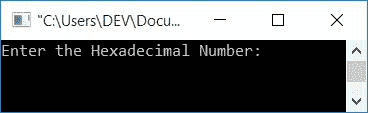

# 将十六进制转换成十进制的 C++程序

> 原文：<https://codescracker.com/cpp/program/cpp-program-convert-hexadecimal-to-decimal.htm>

在本文中，您将学习并获得 C++中十六进制到十进制转换的代码。这是程序列表，您将浏览:

*   十六进制(没有小数部分)到十进制的转换
*   十六进制(带小数部分或带小数点)到十进制的转换
*   使用函数和指针进行十六进制到十进制的转换

在浏览这些程序之前，如果你不知道一些简单的步骤和公式用于转换，那么你可以参考[十六进制到十进制](/computer-fundamental/hexadecimal-to-decimal.htm)得到 每一个需要的东西。

## C++中的十六进制到十进制

在 C++编程中，要将一个数从十六进制转换成十进制，你必须要求用户首先输入十六进制数。然后将其转换为等效的十进制值。如下面给出的程序所示。

问题是，**用 C++写一个把十六进制数转换成十进制数的程序。**以下是其 的回答:

```
#include<iostream>
#include<math.h>
using namespace std;
int main()
{
    int decimalNum=0, rem, i=0, len=0;
    char hexDecNum[20];
    cout<<"Enter the Hexadecimal Number: ";
    cin>>hexDecNum;
    while(hexDecNum[i]!='\0')
    {
        len++;
        i++;
    }
    len--;
    i=0;
    while(len>=0)
    {
        rem = hexDecNum[len];
        if(rem>=48 && rem<=57)
            rem = rem-48;
        else if(rem>=65 && rem<=70)
            rem = rem-55;
        else if(rem>=97 && rem<=102)
            rem = rem-87;
        else
        {
            cout<<"\nInvalid Hex Digit!";
            cout<<endl;
            return 0;
        }
        decimalNum = decimalNum + (rem*pow(16, i));
        len--;
        i++;
    }
    cout<<"\nEquivalent Decimal Value: "<<decimalNum;
    cout<<endl;
    return 0;
}
```

这个程序是在 *Code::Blocks* IDE 下构建和运行的。下面是它的运行示例:



现在输入任意十六进制数，比如说 **1D7F** ，按`ENTER`键转换并打印 它的等效十进制值，如下图所示:


程序不关心字母 **A-F** 的大小写(十六进制字符对应十六进制数字 10 到 15)。 即以小写或大写形式输入，如下所示:


使用十六进制数输入 **1D7F** 的上述程序的模拟运行如下:

*   初始值， **decimalNum=0** ， **i=0** ， **len=0**
*   当用户输入十六进制数，比如说 **1D7F** ，然后它被存储在 **hexDecNum** 中，存储方式是:
    *   hexDecNum[0]=1
    *   十六进制数[1]=D
    *   十六进制数[2]=7
    *   十六进制数[3]=F
    *   并且空终止字符 **\0** 被分配给第四个索引。即 **hexDecNum[4]=\0**
*   现在使用 **while 循环**，计算出 **hexDecNum[]** 的长度。即输入多少个字符 作为十六进制输入。 *while 循环*这样求值:
    *   条件 **hexDecNum[i]！='\0'** 或 **hexDecNum[0]！='\0'** 或 **1！='\0'** 评估为 真，因此程序流程进入循环，并增加两个变量的值，比如 **len**和 **i** 。所以， **i=1** 和 **len=1**
    *   程序流返回并再次评估该条件。也就是条件 **hexDecNum[i]！='\0'** 或 **hexDecNum[1]！='\0'** 或 **D！='\0'** 再次评估为真，因此程序流再次进入 循环，并增加两个变量的值
    *   当循环继续时对**的评估，直到条件评估为假。即当 **i** 的 值等于 **4** 时。conditionn 评估为 false，因为在该索引(第四个索引)处没有任何可用的 字符。因此，它与一个空终止的 字符( **\0** )匹配**
*   现在 **len** 的值递减。所以 **len=3** 和 **i=0**
*   第二个 *while 循环*的条件被评估
*   也就是说，条件 **len > =0** 或 **3 > =0** 评估为真，因此程序流程进入循环内的
*   在那里， **hexDecNum[len]** 或 **hexDecNum[3]** 或 **F** 被初始化为 **rem**
*   因为 <u>**rem** 是 **int** (整数)类型，所以 **F** 的 ASCII 值被初始化 到 **rem**</u> 。所以 **rem=70**
*   现在使用 **if-else** ，我们已经比较了 **rem** 的值(与 ASCII 值 **0-9** 、 **A-F** 和 **a-f** )并相应地处理了语句。
*   也就是因为 **rem** (70)既不大于等于 **48** 也不小于等于 **57**。因此，如果的条件得到评估，则第一个**为 else。即条件 **rem < =70** 或 **70 < =70** 评估为真，因此 **rem-55** 或 **70-55** 或 **15** 被初始化为 **rem**。 <u>15 对应 F</u>**
*   现在 **decimalNum + (rem*pow(16，i))** 或 **0 + (15*pow(16，0))** 或 **15*16 <sup>0</sup>** 或 **15 * 1**或 **15** 被初始化为 **decimalNum**
*   **len** 的值递减。所以 **len=2**
*   并且 **i** 的值增加。所以 **i=1**
*   现在程序流返回，并且循环的条件*被评估*
*   也就是说，条件 **len > =0** 或 **2 > =0** 再次评估为真，因此程序流 再次进入循环，并以与上述类似的方式处理代码
*   以类似的方式继续该过程，直到条件评估为假。
*   继续这个过程，我们将得到这样的值:
    *   rem=70, rem=15, decimalNum=15, len=2, i=1
    *   rem=55, rem=7, decimalNum=127, len=1, i=2
    *   rem=68, rem=13, decimalNum=3455, len=0, i=3
    *   rem49, rem=1, decimalNum=7551, len=(-1), i=4)
*   因为 **len** 的值现在小于 0，因此条件评估为假，并且*的 评估 while 循环*结束
*   打印 **decimalNum** 的值作为输出。也就是 **7551**

也可以直接和 **hexDecNum[]** 这个人物一个一个对比处理。为此， 替换下面的代码块:

```
if(rem>=48 && rem<=57)
    rem = rem-48;
else if(rem>=65 && rem<=70)
    rem = rem-55;
else if(rem>=97 && rem<=102)
```

下面给出了代码块:

```
if(rem>='0' && rem<='9')
    rem = rem-48;
else if(rem>='A' && rem<='F')
    rem = rem-55;
else if(rem>='a' && rem<='f')
```

### 不使用 pow()函数

如果你不想使用 **math.h** 头文件的 **pow()** 函数，那么你可以替换下面的 语句:

```
decimalNum = decimalNum + (rem*pow(16, i));
```

随着

```
k=1;
mul=1;
while(k<=i)
{
    mul=16*mul;
    k++;
}
decimalNum = decimalNum + (rem*mul);
```

**注意**——不要忘记在程序开始时声明两个新变量 **k** 和 **mul** 。并删除 头文件， **math.h** 。其余的事情将是一样的。

### 十六进制数包含小数部分怎么办？

处理含有小数部分的输入类型。那是一个包含小数部分(或小数点)的十六进制数，使用下面的程序:

```
#include<iostream>
#include<math.h>
using namespace std;
int main()
{
    int decimalNum=0, decNumOne=0, dotPosition=0;
    int rem, i=0, len=0, lenTemp;
    float decNumTwo=0;
    char hexDecNum[20];
    cout<<"Enter the Hexadecimal Number: ";
    cin>>hexDecNum;
    while(hexDecNum[i]!='\0')
    {
        if(hexDecNum[i]=='.')
            dotPosition = i;
        len++;
        i++;
    }
    len--;
    i=0;
    if(dotPosition==0)
    {
        while(len>=0)
        {
            rem = hexDecNum[len];
            if(rem>=48 && rem<=57)
                rem = rem-48;
            else if(rem>=65 && rem<=70)
                rem = rem-55;
            else if(rem>=97 && rem<=102)
                rem = rem-87;
            else
            {
                cout<<"\nInvalid Hex Digit!";
                cout<<endl;
                return 0;
            }
            decimalNum = decimalNum + (rem*pow(16, i));
            len--;
            i++;
        }
        cout<<"\nEquivalent Decimal Value: "<<decimalNum;
    }
    else
    {
        lenTemp = dotPosition-1;
        while(lenTemp>=0)
        {
            rem = hexDecNum[lenTemp];
            if(rem>=48 && rem<=57)
                rem = rem-48;
            else if(rem>=65 && rem<=70)
                rem = rem-55;
            else if(rem>=97 && rem<=102)
                rem = rem-87;
            else
            {
                cout<<"\nInvalid Hex Digit!";
                cout<<endl;
                return 0;
            }
            decNumOne = decNumOne + (rem*pow(16, i));
            lenTemp--;
            i++;
        }
        lenTemp = dotPosition+1;
        i=-1;
        while(lenTemp<=len)
        {
            rem = hexDecNum[lenTemp];
            if(rem>=48 && rem<=57)
                rem = rem-48;
            else if(rem>=65 && rem<=70)
                rem = rem-55;
            else if(rem>=97 && rem<=102)
                rem = rem-87;
            else
            {
                cout<<"\nInvalid Hex Digit!";
                cout<<endl;
                return 0;
            }
            decNumTwo = decNumTwo + (rem*pow(16, i));
            lenTemp++;
            i--;
        }
        decNumTwo = decNumOne+decNumTwo;
        cout<<"\nEquivalent Decimal Value: "<<decNumTwo;
    }
    cout<<endl;
    return 0;
}
```

下面是它的示例运行，十六进制数输入为 **5A9.63**


这里使用了变量 **dotPosition** ，检查十六进制输入 中是否有小数点。如果十六进制输入包含小数部分(或有小数点)，那么 1 被初始化为 **dotPosition** 变量。稍后检查其值是否等于 0。如果等于 0(表示 **1** 没有被 初始化)，则进行 正常转换，否则按照上述程序中的不同规则处理。

也就是说，如果一个十六进制数包含小数部分(或小数点)，那么我们就用了两部分。小数点前一个，小数点后一个。

在 decimal 之前可用的部分被转换成等效的十进制值，并被初始化为 **decNumOne** 。而小数点后可用的部分，被转换成等价的十进制值 并初始化为 **decNumTwo** ( **float** 类型变量)。最后添加并打印该值。

**注-** 十六进制(小数点后)转换成十进制的规则已经在[十六进制(带小数)转换成十进制](/computer-fundamental/hexadecimal-to-decimal.htm)的文章 中讨论过了。

### 使用函数和指针

这个程序在 C++中使用函数和指针将十六进制转换成十进制。

```
#include<iostream>
#include<math.h>
using namespace std;
unsigned long HexDecToDec(char []);
int main()
{
    unsigned long decimalNum;
    char hexDecNum[10];
    cout<<"Enter the Hexadecimal Number: ";
    cin>>hexDecNum;
    decimalNum = HexDecToDec(hexDecNum);
    if(decimalNum==0)
        cout<<"\nInvalid Hex Digit!";
    else
        cout<<"\nEquivalent Decimal Value: "<<decimalNum;
    cout<<endl;
    return 0;
}
unsigned long HexDecToDec(char hexDecNum[])
{
    char *hexDecPointer;
    int i, len = 0;
    const int base = 16;
    unsigned long decimalNum = 0;
    // Find the len of Hexadecimal Number
    for(hexDecPointer=hexDecNum; *hexDecPointer != '\0'; hexDecPointer++)
        len++;
    // Again initialize the starting address of Hexadecimal Number
    hexDecPointer = hexDecNum;
    // Now convert hex digit to decimal number one by one
    for(i=0; *hexDecPointer != '\0' || i<len; i++, hexDecPointer++)
    {
        if(*hexDecPointer>=48 && *hexDecPointer<=57)
            decimalNum = decimalNum + (*hexDecPointer - 48)*pow(base, len-i-1);
        else if(*hexDecPointer>=65 && *hexDecPointer<=70)
            decimalNum = decimalNum + (*hexDecPointer - 55)*pow(base, len-i-1);
        else if(*hexDecPointer>=97 && *hexDecPointer<=102)
            decimalNum = decimalNum + (*hexDecPointer - 87)*pow(base, len-i-1);
        else
            len=0;
    }
    if(len==0)
        return 0;
    else
        return decimalNum;
}
```

**注意-** 这个程序不支持包含小数(十进制)部分的十六进制输入。

使用用户定义的函数创建程序，将十六进制(带小数部分)转换为等效的十进制值。然后你可以使用我上面提到的程序来处理这种类型的输入。只要改变它，用你自己去创造。

#### 其他语言的相同程序

*   [C 进制到十进制的转换](/c/program/c-program-convert-hexadecimal-to-decimal.htm)
*   [Java 十六进制到十进制的转换](/java/program/java-program-convert-hexadecimal-to-decimal.htm)
*   [Python 十六进制到十进制的转换](/python/program/python-program-convert-hexadecimal-to-decimal.htm)

[C++在线测试](/exam/showtest.php?subid=3)

* * *

* * *