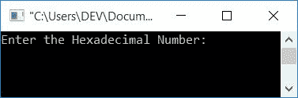
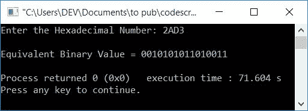
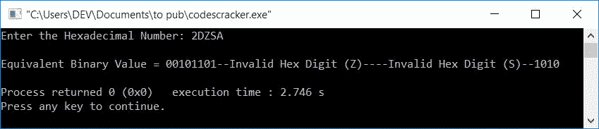
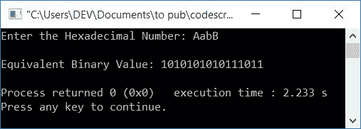

# C++ 程序：将十六进制转换为二进制

> 原文：<https://codescracker.com/cpp/program/cpp-program-convert-hexadecimal-to-binary.htm>

在本文中，您将学习并获得 C++ 中十六进制到二进制转换的代码。但是如果你不知道简单的步骤和公式用于转换，那么你可以参考[十六进制到二进制](/computer-fundamental/hexadecimal-to-binary.htm)得到每一个需要的东西。

## C++ 中的十六进制到二进制

在 [C++](/cpp/index.htm) 编程中，要将十六进制数转换成二进制数，首先要让用户 user 的 输入十六进制数。然后将其转换为等效的二进制值 并打印等效的二进制值作为输出。

您可以通过两种方式创建程序:

*   或者使用**开关盒**逐个直接打印每个十六进制数字(十六进制数字)的等效 4 位二进制值
*   或者使用 **strcat()** 函数，将 中的每一个 4 位二进制等值的十六进制数串联成一个变量，比如 **binaryNum[]** ，最后打印出 **binaryNum[]** 的值。即先转换， 再打印

### 打印十六进制输入的二进制等价物

这个程序使用**开关**大小写来匹配和打印每个十六进制数字的二进制等价物。

```
#include<iostream>
using namespace std;
int main()
{
    int i=0;
    char hexDecNum[10];
    cout<<"Enter the Hexadecimal Number: ";
    cin>>hexDecNum;
    cout<<"\nEquivalent Binary Value = ";
    while(hexDecNum[i])
    {
        switch(hexDecNum[i])
        {
            case '0':
                cout<<"0000";
                break;
            case '1':
                cout<<"0001";
                break;
            case '2':
                cout<<"0010";
                break;
            case '3':
                cout<<"0011";
                break;
            case '4':
                cout<<"0100";
                break;
            case '5':
                cout<<"0101";
                break;
            case '6':
                cout<<"0110";
                break;
            case '7':
                cout<<"0111";
                break;
            case '8':
                cout<<"1000";
                break;
            case '9':
                cout<<"1001";
                break;
            case 'A':
            case 'a':
                cout<<"1010";
                break;
            case 'B':
            case 'b':
                cout<<"1011";
                break;
            case 'C':
            case 'c':
                cout<<"1100";
                break;
            case 'D':
            case 'd':
                cout<<"1101";
                break;
            case 'E':
            case 'e':
                cout<<"1110";
                break;
            case 'F':
            case 'f':
                cout<<"1111";
                break;
            default:
                cout<<"--Invalid Hex Digit ("<<hexDecNum[i]<<")--";
        }
        i++;
    }
    cout<<endl;
    return 0;
}
```

这个程序是在 *Code::Blocks* IDE 下构建和运行的。下面是它的运行示例:



现在提供十六进制数输入，比如说 **2AD3** ，并按`ENTER`键打印其等效的 二进制值，如下图所示:



带有十六进制输入的上述程序的预演如下所示:

*   初始值， **i=0**
*   当用户输入十六进制数时，比如说 **2AD3** ，那么它会被初始化为 **hexDecNum** ，其方式为 :
    *   hexDecNum[0]=2
    *   十六进制数[1]=A
    *   十六进制数[2]=D
    *   十六进制数[3]=3
*   现在，while 循环的条件得到评估。也就是说，条件 **hexDecNum[i]** 或 **hexDecNum[0]**评估为真，因为在 **hexDecNum[0]** 有值 **2** 可用
*   因为条件评估为真，所以程序流程进入循环，并使用**开关**，字符与所有 **15** 情况匹配
*   即检查出现在 **hexDecNum[i]** 或 **hexDecNum[0]** 的字符是否等于 15 种字符情况中的任何一种，例如 **0** 、 **1** 、 **2** ，....， **A** ， **a** ， **B** ，...， **f**与否
*   如果它等于 15 个字符中的任何一个，那么打印它的等价的 4 位二进制值。否则**默认**情况被执行
*   现在 **i** 的值增加，程序流程返回并评估 T2 的条件，同时再次循环
*   当 **i** 的值变得等于 **4** 时，则条件 **hexDecNum[4]** 评估为 假，因为在 **4 <sup>th</sup>** 索引处，没有任何进一步的字符可用，而是在第四个索引处有一个 **空终止字符(\0)** 可用。
*   继续这个过程，我们将得到十六进制输入的二进制等价物 **2AD3** 作为 **0010101011010011**。其中 **2=0010** ， **A=1010** ， **D=1101** ， **3=0011**

#### 如果用户输入一个无效的十六进制数字会怎样？

在这种情况下，如果用户输入无效的十六进制数字。例如，如果用户以下列方式输入十六进制输入(包含一个或多个无效的十六进制数字，有效或无效):

*   Z -一个无效的十六进制数字
*   2DZSA -介于有效数字之间的无效十六进制数字
*   TR -两个无效的十六进制数字

在所有这三种情况下，如果程序(上面创建的)找到任何十六进制数字(不考虑它在哪里以及如何出现)，消息 **-无效的十六进制数字(HexDigit) -** 以如下方式打印:

*   对于第一种情况
    -打印无效的十六进制数字(Z)——

*   对于第二种情况
    00101101-无效的十六进制数字(Z) -无效的十六进制数字- 1010
    被打印。其中 **0010** 和 **1101** 为 **2** 和 **D** 的十六进制值。 最后 **1010** 是 **A** 的十六进制值
*   对于第三种情况
    -无效的十六进制数字(T) -无效的十六进制数字-
    得到打印

以下是第二种情况的输出示例:



**注意-** 上述程序不会将给定的十六进制数转换成其等效的二进制值。相反， 只是使用**开关**打印二进制等价物。

现在让我们创建另一个程序，它实际上将数字从十六进制转换为二进制。

### 将十六进制转换为二进制

这个程序使用 **strcat()** 函数来[将每个十六进制数字(十六进制数字)的二进制等价物一个接一个地连接到一个变量，比如 **binaryNum[]** 。 并最终将其值作为输出打印出来。](/cpp/program/cpp-program-concatenate-string.htm)

```
#include<iostream>
#include<string.h>
using namespace std;
int main()
{
    int i=0, chk=0;
    char hexDecNum[10], binaryNum[40]="";
    cout<<"Enter the Hexadecimal Number: ";
    cin>>hexDecNum;
    while(hexDecNum[i])
    {
        switch(hexDecNum[i])
        {
            case '0':
                strcat(binaryNum, "0000");
                break;
            case '1':
                strcat(binaryNum, "0001");
                break;
            case '2':
                strcat(binaryNum, "0010");
                break;
            case '3':
                strcat(binaryNum, "0011");
                break;
            case '4':
                strcat(binaryNum, "0100");
                break;
            case '5':
                strcat(binaryNum, "0101");
                break;
            case '6':
                strcat(binaryNum, "0110");
                break;
            case '7':
                strcat(binaryNum, "0111");
                break;
            case '8':
                strcat(binaryNum, "1000");
                break;
            case '9':
                strcat(binaryNum, "1001");
                break;
            case 'A':
            case 'a':
                strcat(binaryNum, "1010");
                break;
            case 'B':
            case 'b':
                strcat(binaryNum, "1011");
                break;
            case 'C':
            case 'c':
                strcat(binaryNum, "1100");
                break;
            case 'D':
            case 'd':
                strcat(binaryNum, "1101");
                break;
            case 'E':
            case 'e':
                strcat(binaryNum, "1110");
                break;
            case 'F':
            case 'f':
                strcat(binaryNum, "1111");
                break;
            default:
                chk = 1;
                break;
        }
        i++;
    }
    if(chk==0)
        cout<<"\nEquivalent Binary Value: "<<binaryNum;
    else
        cout<<"\nInvalid Hexadecimal Digit";
    cout<<endl;
    return 0;
}
```

下面是它的示例运行，十六进制数输入为 **AabB** :



#### 其他语言的相同程序

*   [C 十六进制到二进制转换](/c/program/c-program-convert-hexadecimal-to-binary.htm)
*   [Java 十六进制到二进制的转换](/java/program/java-program-convert-hexadecimal-to-binary.htm)
*   [Python 十六进制到二进制的转换](/python/program/python-program-convert-hexadecimal-to-binary.htm)

[C++ 在线测试](/exam/showtest.php?subid=3)

* * *

* * *