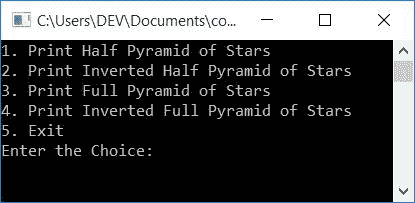

# C++ 程序：打印星形和金字塔形图案

> 原文：<https://codescracker.com/cpp/program/cpp-program-print-star-pyramid-patterns.htm>

在这篇文章中，您将学习并获得使用星号(*)、数字和字母打印多种类型图案的代码，以创建金字塔、三角形等。比如形状。以下是 C++ 中的图案程序列表:

*   打印星形的半金字塔图案(*)
*   印刷倒半金字塔形的星星图案
*   打印完整的星星金字塔图案
*   印刷倒全金字塔图案的星星
*   星星的印刷图案
*   打印数字图案
*   字母的印刷图案

本文还提供了更多的程序。让我们从第一个开始，即使用星号(*)打印半金字塔图案。

## 打印星形的半金字塔图案(*)

这是本文中第一个打印恒星(*)的半金字塔图案的程序。

```
#include<iostream>
using namespace std;
int main()
{
    int i, j;
    for(i=0; i<6; i++)
    {
        for(j=0; j<=i; j++)
            cout<<"* ";
        cout<<endl;
    }
    cout<<endl;
    return 0;
}
```

这个程序是在 *Code::Blocks* IDE 下构建和运行的，产生看起来像 半金字塔的星星图案，如下图所示:


该程序循环的*的试运行如下:*

*   循环的*的第一条语句或初始化语句首先执行，但只能一次执行。 因此 **0** 被初始化为 **i***
*   在进入循环的*主体之前，其条件必须被评估为真*
*   因此条件， **i < 6** 或 **0 < 6** 评估为真，因此程序流程进入循环内部
*   在循环内部，循环有另一个*，因此 **0** 被初始化为 **j** ，并且 条件 **j < =i** 或 **0 < =0** 被评估为真，因此程序流进入循环内部，并且 打印一个 ***** 和一个空格*
*   现在 **j** 的值增加了。也就是说，程序流程转到*内部`for`循环*的更新部分(第三条语句) 并递增 **j** 的值。所以 **j=1**
*   条件 **j < =i** 或 **1 < =0** 评估为假，因此该*循环* 的执行暂时结束
*   现在使用 **endl** ，打印一个新行，也就是说，下一个东西从新行开始
*   程序流程转到循环的外部*的更新部分，并增加 **i** 的值。 所以 **i=1***
*   并且条件 **i < 6** 或 **1 < 6** 再次评估为真，因此程序流程进入循环内的
*   该过程继续，直到其条件(循环的外部*的条件)评估为假*
*   这样，使用星号(*)的半金字塔图案就打印出来了

要在 [C++](/cpp/index.htm) 编程中打印图案，你必须使用两个 [用于循环](/cpp/cpp-iteration-statements.htm)，外**用于循环**，内**用于循环**。 循环的外部**负责行，循环**的内部**负责列。**

## 使用星号(*)打印倒置的半金字塔图案

这个 C++ 程序使用星号(*)打印一个倒置的半金字塔图案。

```
#include<iostream>
using namespace std;
int main()
{
    int i, j;
    for(i=0; i<6; i++)
    {
        for(j=i; j<6; j++)
            cout<<"* ";
        cout<<endl;
    }
    cout<<endl;
    return 0;
}
```

这个程序产生了另一种星星图案，看起来像一个倒半金字塔形的星星，如下面给出的示例输出所示:


## 打印完整的星形金字塔图案(*)

下面的 C++ 程序将打印出一个完整的金字塔形状的星星(*)。

```
#include<iostream>
using namespace std;
int main()
{
    int i, space, k=0;
    for(i=1; i<=6; i++)
    {
        for(space=1; space<=(6-i); space++)
            cout<<"  ";
        while(k!=(2*i-1))
        {
            cout<<"* ";
            k++;
        }
        k=0;
        cout<<endl;
    }
    cout<<endl;
    return 0;
}
```

这个程序产生了完整的金字塔形状的星星，如下图所示:


你也可以使用下面的代码，而不是之前的代码，打印出完整的星形金字塔图案:

```
#include<iostream>
using namespace std;
int main()
{
    int i, space, j;
    for(i=1; i<=6; i++)
    {
        for(space=6; space>i; space--)
            cout<<" ";
        for(j=0; j<i; j++)
            cout<<"* ";
        cout<<endl;
    }
    cout<<endl;
    return 0;
}
```

使用 C++ 代码，金字塔看起来像:


## 使用星号(*)打印倒置的全金字塔图案

这个 C++ 程序使用星号(*)打印一个倒置的全金字塔图案:

```
#include<iostream>
using namespace std;
int main()
{
    int i, space, j;
    for(i=1; i<=6; i++)
    {
        for(space=1; space<i; space++)
            cout<<" ";
        for(j=i; j<=6; j++)
        {
            cout<<"* ";
        }
        cout<<endl;
    }
    cout<<endl;
    return 0;
}
```

该程序生成的星星图案看起来像一个倒置的全金字塔，如下图所示:


## 星星的印刷图案

基于前面的四个程序，我们创建了一个菜单驱动的程序，它接收用户的输入作为选择，即用户想要打印什么。也就是说，用户想要打印什么样的星形图案:

```
#include<iostream>
using namespace std;
void halfPyramid();
void invertedHalfPyramid();
void fullPyramid();
void invertedFullPyramid();
int main()
{
    int ch;
    do
    {
        cout<<"1\. Print Half Pyramid of Stars\n";
        cout<<"2\. Print Inverted Half Pyramid of Stars\n";
        cout<<"3\. Print Full Pyramid of Stars\n";
        cout<<"4\. Print Inverted Full Pyramid of Stars\n";
        cout<<"5\. Exit\n";
        cout<<"Enter the Choice: ";
        cin>>ch;
        switch(ch)
        {
            case 1:
                halfPyramid();
                break;
            case 2:
                invertedHalfPyramid();
                break;
            case 3:
                fullPyramid();
                break;
            case 4:
                invertedFullPyramid();
                break;
            case 5:
                return 0;
            default:
                cout<<"\nWrong Choice!";
                break;
        }
    }while(ch>=1 && ch<=4);
    cout<<endl;
    return 0;
}
void halfPyramid()
{
    int i, j;
    for(i=0; i<6; i++)
    {
        for(j=0; j<=i; j++)
            cout<<"* ";
        cout<<endl;
    }
    cout<<endl;
}
void invertedHalfPyramid()
{
    int i, j;
    for(i=0; i<6; i++)
    {
        for(j=i; j<6; j++)
            cout<<"* ";
        cout<<endl;
    }
    cout<<endl;
}
void fullPyramid()
{
    int i, space, j;
    for(i=1; i<=6; i++)
    {
        for(space=1; space<=(6-i); space++)
            cout<<" ";
        for(j=1; j<=i; j++)
            cout<<"* ";
        cout<<endl;
    }
    cout<<endl;
}
void invertedFullPyramid()
{
    int i, space, j;
    for(i=1; i<=6; i++)
    {
        for(space=1; space<i; space++)
            cout<<" ";
        for(j=i; j<=6; j++)
            cout<<"* ";
        cout<<endl;
    }
    cout<<endl;
}
```

下面是它的初始输出:



现在提供输入，比如说 **1** 作为你的选择，如果你想打印半个星星金字塔，这里是提供 1 作为输入并按下`ENTER`键后的 示例输出:


如您所见，半金字塔被打印出来，菜单再次显示出来。现在你可以进一步操作，否则如果你想跳过或退出，然后键入 5 或输入 5，以四种方式退出打印星星图案的程序。这是样本运行的另一个快照。此快照显示了所有选项的使用情况:


## C++ 打印星号(*)图案

这个程序打印星号(*)的方式是，第一行一个星号，第二行三个星号，第三行五个星号，依此类推，直到第六行。

```
#include<iostream>
using namespace std;
int main()
{
    int i, j, k=1;
    for(i=0; i<6; i++)
    {
        for(j=0; j<k; j++)
            cout<<"* ";
        k=k+2;
        cout<<endl;
    }
    cout<<endl;
    return 0;
}
```

当编译并执行上述 C++ 程序时，它将产生以下输出:


下面是另一个程序，它打印的内容与前一个程序相同，但方式相反:

```
#include<iostream>
using namespace std;
int main()
{
    int i, j, space=20, k=1;
    for(i=0; i<6; i++)
    {
        for(j=0; j<space; j++)
            cout<<" ";
        space = space-4;
        for(j=0; j<k; j++)
            cout<<"* ";
        k = k+2;
        cout<<endl;
    }
    cout<<endl;
    return 0;
}
```

下面给出的快照显示了这个 C++ 程序的示例输出:


## 打印三角形星形图案

这个 C++ 程序打印出看起来像三角形或半金字塔的星形图案，随你怎么说。

```
#include<iostream>
using namespace std;
int main()
{
    int i, j, space=10;
    for(i=0; i<6; i++)
    {
        for(j=0; j<space; j++)
            cout<<" ";
        space = space-2;
        for(j=0; j<=i; j++)
            cout<<"* ";
        cout<<endl;
    }
    cout<<endl;
    return 0;
}
```

这是它的示例输出，打印出看起来像三角形或半金字塔的星星图案:


## C++ 打印数字图案

这个程序打印数字图案(自然数)。这个数字图案看起来像一个半金字塔:

```
#include<iostream>
using namespace std;
int main()
{
    int i, j, num=1;
    for(i=0; i<6; i++)
    {
        for(j=0; j<=i; j++)
        {
            cout<<num<<" ";
            num++;
        }
        cout<<endl;
    }
    cout<<endl;
    return 0;
}
```

该程序生成一种数字图案，也可称为自然数的半金字塔，如以下快照所示:


这是另一个程序，它的工作与前一个程序相同。唯一不同的是，该程序从每行的 **1** 开始，而不是从第一行第一列到最后一行最后一列的自然数:

```
#include<iostream>
using namespace std;
int main()
{
    int i, j, num;
    for(i=0; i<6; i++)
    {
        num=1;
        for(j=0; j<=i; j++)
        {
            cout<<num<<" ";
            num++;
        }
        cout<<endl;
    }
    cout<<endl;
    return 0;
}
```

下面给出的快照显示了该程序的示例输出:


## 字母的 C++ 打印模式

这个 C++ 程序打印字母表的模式。也就是说，使用从“A”开始的连续字母字符的半金字塔使用以下程序打印:

```
#include<iostream>
using namespace std;
int main()
{
    int i, j;
    char ch='A';
    for(i=0; i<6; i++)
    {
        for(j=0; j<=i; j++)
        {
            cout<<ch<<" ";
            ch++;
        }
        cout<<endl;
    }
    cout<<endl;
    return 0;
}
```

下面是这个 C++ 程序打印字母模式的输出示例:


下面是另一个程序，它从每行的新字母字符开始，并以重复的顺序打印所有列:

```
#include<iostream>
using namespace std;
int main()
{
    int i, j;
    char ch='A';
    for(i=0; i<6; i++)
    {
        for(j=0; j<=i; j++)
        {
            cout<<ch<<" ";
        }
        ch++;
        cout<<endl;
    }
    cout<<endl;
    return 0;
}
```

该程序产生以下输出:


## 打印给定大小的星星金字塔图案

该程序接收用户输入的**金字塔**的尺寸，使用给定尺寸的 的星号(*)打印金字塔图案。

```
#include<iostream>
using namespace std;
int main()
{
    int i, space, rowSize, k=0;
    cout<<"Enter the Number of Rows: ";
    cin>>rowSize;
    cout<<"\nPyramid of "<<rowSize<<" Rows or Lines:\n";
    for(i=1; i<=rowSize; i++)
    {
        for(space=1; space<=(rowSize-i); space++)
            cout<<"  ";
        while(k!=(2*i-1))
        {
            cout<<"* ";
            k++;
        }
        k=0;
        cout<<endl;
    }
    cout<<endl;
    return 0;
}
```

这是上述程序示例运行的初始输出:


现在提供输入，比如说 **6** 作为打印金字塔图案的行数或行数，金字塔图案有 6 行，如下面给出的快照中的 所示:


下面是另一个使用用户输入运行的示例， **10** :


#### 其他语言的相同程序

*   [C 图案程序](/c/program/c-program-print-star-pyramid-patterns.htm)
*   [Java 图案程序](/java/program/java-program-print-star-pyramid-patterns.htm)
*   [Python 图案程序](/python/program/python-program-print-star-pyramid-patterns.htm)

[C++ 在线测试](/exam/showtest.php?subid=3)

* * *

* * *