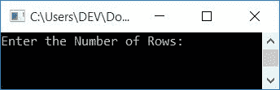
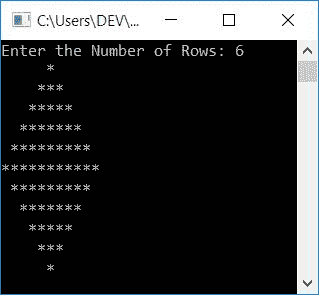
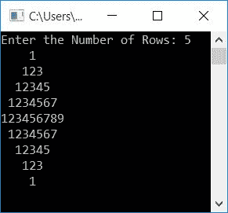
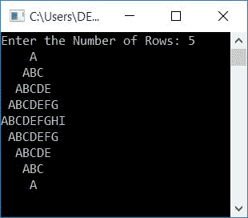

# C++ 程序：打印菱形图案

> 原文：<https://codescracker.com/cpp/program/cpp-program-print-diamond-pattern.htm>

在本文中，您将学习并获得用 C++ 语言打印菱形图案的代码。以下是本文中可用的打印菱形图案的程序列表:

*   印刷菱形图案的星星
*   数字
*   字母字符

## 印刷菱形图案的星星

要在 [C++](/cpp/index.htm) 编程中打印菱形星星图案，你必须要求用户从 中输入行数。现在使用行大小，打印菱形图案，如下面给出的程序所示:

如果用户输入 **6** 作为菱形的行大小，那么它的上三角部分扩展到 6 行，而它的 下三角部分扩展到 5 行(比行大小少一行)。

问题是，**用 C++ 写个程序打印星星的菱形图案**。以下是它的答案:

```
#include<iostream>
using namespace std;
int main()
{
    int i, j, rowNum, space;
    cout<<"Enter the Number of Rows: ";
    cin>>rowNum;
    space = rowNum-1;
    for(i=1; i<=rowNum; i++)
    {
        for(j=1; j<=space; j++)
            cout<<" ";
        space--;
        for(j=1; j<=(2*i-1); j++)
            cout<<"*";
        cout<<endl;
    }
    space = 1;
    for(i=1; i<=(rowNum-1); i++)
    {
        for(j=1; j<=space; j++)
            cout<<" ";
        space++;
        for(j=1; j<=(2*(rowNum-i)-1); j++)
            cout<<"*";
        cout<<endl;
    }
    cout<<endl;
    return 0;
}
```

这个程序是在 *Code::Blocks* IDE 下构建和运行的。下面是它的运行示例:



现在提供输入如 **6** 作为行数，按`ENTER`键打印菱形图案 ，如下图所示:



**注-** 此处输入的 **6** 不是实际的行尺寸，是菱形图案上三角部分 的行尺寸。

有三个循环用于创建菱形的上下三角形。第一个 循环的三个*是这样创建的:*

*   首先对应于*行*
*   秒对应于*个空格*
*   第三列对应于*列*(印刷星星)

菱形图案下三角部分的三个*回路*也以类似的方式工作。

以下代码块的预演:

```
space = rowNum-1;
for(i=1; i<=rowNum; i++)
{
    for(j=1; j<=space; j++)
        cout<<" ";
        space--;
    for(j=1; j<=(2*i-1); j++)
        cout<<"*";
    cout<<endl;
}
```

打印钻石的上三角部分，就像这样:

*   当用户输入行大小为 **6** 时，它将被存储在 **rowNum** 中
*   并且 **rowNum-1** 或 **6-1** 或 **5** 被存储在**空间**
*   现在程序流开始执行循环的*。也就是说， **i=0** 并且条件 **I<= rowNum**或 **0 < =6** 评估为真*
*   因此程序流程进入循环内部，现在 **j=1** 并且条件**j<=空格**或 **1<= 5**评估为真
*   因此程序流进入这个循环并打印一个空格
*   现在 **j** 的值增加了。因此 **j=2** 和条件**j<=空格**或 **2<=空格**或 **2 < =5** 再次评估为真，因此打印另一个空格
*   这样，有 4 个空格被打印，然后条件被评估为假
*   每次退出该循环后，递减**空格**的值，以从下一 行或列打印少一个空格
*   使用第三个*进行循环*，打印星星
*   也就是说，在第一次执行时， **j=1** 且条件 **j < =(2*i-1)** 或 **j < =(2*1-1)** 或 **1<=(1)**或 **1 < =1** 评估为真，因此程序流程进入该循环并打印 一个**星号(*)**
*   现在 **j** 的值增加了。所以 **j=2**
*   并且条件 **j < =(2*i-1)** 或 **2 < =(2*1-1)** 或 **2 < =(1)** 评估为假， 因此程序结束该循环
*   使用 **endl** ，下一件事从新行开始
*   现在程序流程递增循环变量 *outer 的值，即 **i** 。所以 **i=2***
*   并且条件 **i < =rowNum** 或 **2 < =6** 再次评估为真，因此程序流再次进入循环内部 ，该过程继续，直到条件评估为假

以这种方式，上面的钻石的星形图案被印刷，以类似的方式，下面的钻石也被印刷。

## 打印菱形数字图案

这是与前一个节目相同的节目。唯一的区别是，我们用数字来印刷菱形的数字图案，而不是星星。

```
#include<iostream>
using namespace std;
int main()
{
    int i, j, rowNum, space, num=1;
    cout<<"Enter the Number of Rows: ";
    cin>>rowNum;
    space = rowNum-1;
    for(i=1; i<=rowNum; i++)
    {
        for(j=1; j<=space; j++)
            cout<<" ";
        space--;
        for(j=1; j<=(2*i-1); j++)
        {
            cout<<num;
            num++;
        }
        cout<<endl;
        num = 1;
    }
    space = 1;
    for(i=1; i<=(rowNum-1); i++)
    {
        for(j=1; j<=space; j++)
            cout<<" ";
        space++;
        for(j=1; j<=(2*(rowNum-i)-1); j++)
        {
            cout<<num;
            num++;
        }
        cout<<endl;
        num = 1;
    }
    cout<<endl;
    return 0;
}
```

下面是用户输入的示例运行， **5** :



## 打印字母字符的菱形图案

这是创建字母字符菱形图案的最后一个程序。

```
#include<iostream>
using namespace std;
int main()
{
    int i, j, rowNum, space;
    char ch='A';
    cout<<"Enter the Number of Rows: ";
    cin>>rowNum;
    space = rowNum-1;
    for(i=1; i<=rowNum; i++)
    {
        for(j=1; j<=space; j++)
            cout<<" ";
        space--;
        for(j=1; j<=(2*i-1); j++)
        {
            cout<<ch;
            ch++;
        }
        cout<<endl;
        ch = 'A';
    }
    space = 1;
    for(i=1; i<=(rowNum-1); i++)
    {
        for(j=1; j<=space; j++)
            cout<<" ";
        space++;
        for(j=1; j<=(2*(rowNum-i)-1); j++)
        {
            cout<<ch;
            ch++;
        }
        cout<<endl;
        ch = 'A';
    }
    cout<<endl;
    return 0;
}
```

下面是用户输入的运行示例， **5** 作为行的大小:



#### 其他语言的相同程序

*   [C 打印菱形图案](/c/program/c-program-print-diamond-pattern.htm)
*   [Java 印花菱形图案](/java/program/java-program-print-diamond-pattern.htm)

[C++ 在线测试](/exam/showtest.php?subid=3)

* * *

* * *