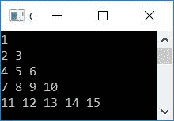
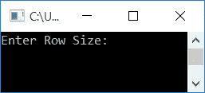
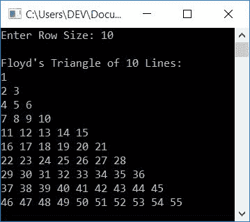

# 打印弗洛伊德三角形的 C++程序

> 原文：<https://codescracker.com/cpp/program/cpp-program-print-floyd-triangle.htm>

在本文中，您将学习并获得使用 C++程序打印默认和给定大小的弗洛伊德三角形的代码。以下是程序列表:

*   打印默认大小的弗洛伊德三角形(5 行或多行)
*   打印给定大小的弗洛伊德三角形

在创建这些程序之前，让我们先了解一下，弗洛伊德三角形是什么样子的。

### 弗洛伊德的三角形是什么？

弗洛伊德三角形是由自然数构成的直角三角形，如下所示:

```
1
2 3
4 5 6
7 8 9 10
11 12 13 14 15
```

## 打印弗洛伊德的三角形

下面给出的程序打印了弗洛伊德的 5 行三角形。问题是，**用 C++写一个程序来 打印弗洛伊德三角形。**下面是它的回答:

```
#include<iostream>
using namespace std;
int main()
{
    int i, j, num=1;
    for(i=0; i<5; i++)
    {
        for(j=0; j<=i; j++)
        {
            cout<<num<<" ";
            num++;
        }
        cout<<endl;
    }
    return 0;
}
```

这个程序是在 *Code::Blocks* IDE 下构建和运行的。下面是它的示例输出:



### 打印给定大小的弗洛伊德三角形

这个程序允许用户定义弗洛伊德三角形的大小。也就是说，弗洛伊德的三角形必须扩展到多少行或多少列。让我们来看看这个程序:

```
#include<iostream>
using namespace std;
int main()
{
    int i, j, num=1, rowSize;
    cout<<"Enter Row Size: ";
    cin>>rowSize;
    cout<<"\nFloyd's Triangle of "<<rowSize<<" Lines:\n";
    for(i=0; i<rowSize; i++)
    {
        for(j=0; j<=i; j++)
        {
            cout<<num<<" ";
            num++;
        }
        cout<<endl;
    }
    return 0;
}
```

这是它的样本运行。这是最初的输出:



现在提供输入，比如说 **10** 来打印弗洛伊德的 10 行三角形，如下图所示:



#### 其他语言的相同程序

*   [C 打印弗洛伊德的三角形](/c/program/c-program-print-floyd-triangle.htm)
*   [Java 打印弗洛伊德三角形](/java/program/java-program-print-floyd-triangle.htm)
*   [Python 打印弗洛伊德的三角形](/python/program/python-program-print-floyd-triangle.htm)

[C++在线测试](/exam/showtest.php?subid=3)

* * *

* * *