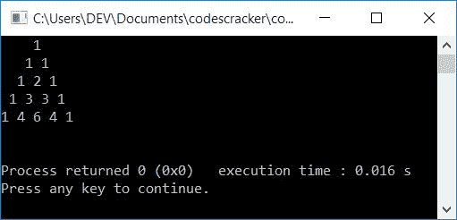
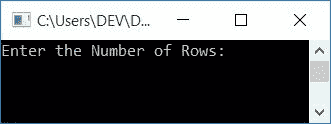
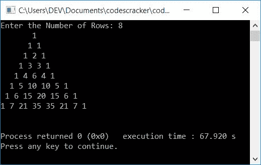

# C++ 程序：打印帕斯卡三角形

> 原文：<https://codescracker.com/cpp/program/cpp-program-print-pascal-triangle.htm>

在本文中，您将学习并获得使用 C++程序打印帕斯卡三角形的代码。下面是打印帕斯卡三角形的程序列表:

*   用完整的用户自定义代码打印帕斯卡三角形
*   用函数和公式打印帕斯卡三角形
*   将帕斯卡三角形打印到第 **n** 行。用户必须在运行时输入 **n** 的值

在创建这些程序之前，让我们先了解一下，帕斯卡三角形是如何创建的。

### 帕斯卡三角形是什么？

下图显示了帕斯卡三角形的一切:


这样就可以形成或创造出帕斯卡三角形。以获得其深入的细节，如:

*   它是如何扩张的
*   它的结构是怎样的？
*   求任意行任意列的值的公式是什么？

或者无论你想了解什么，参考[帕斯卡的三角形](/nonprog/pascal-triangle.htm)来得到 关于这个题目的所有要求的东西。

## 打印帕斯卡三角形

这个程序打印帕斯卡的 5 行或线的三角形。这个程序不允许用户定义帕斯卡三角形的大小。后来，创建了相同的程序，该程序接收来自用户的输入，以定义帕斯卡三角形的大小。

```
#include<iostream>
using namespace std;
int main()
{
    int row, col, i=1, j=0, arr[5], arrTemp[5];
    arr[0] = 1;
    arr[1] = 1;
    for(row=0; row<5; row++)
    {
        for(col=4; col>row; col--)
            cout<<" ";
        for(col=0; col<=row; col++)
        {
            if(row==0)
                cout<<"1";
            else
            {
                if(col==0 || col==row)
                    cout<<"1 ";
                else
                {
                    arrTemp[i] = arr[j]+arr[j+1];
                    cout<<arrTemp[i]<<" ";
                    i++;
                    j++;
                }
            }
        }
        cout<<endl;
        arrTemp[i] = 1;
        if(row>1)
        {
            j=0;
            arr[j]=1;
            for(j=1, i=1; j<=row; j++, i++)
                arr[j] = arrTemp[i];
            i=1;
            j=0;
        }
    }
    cout<<endl;
    return 0;
}
```

这个程序是在 *Code::Blocks* IDE 下构建和运行的。下面是它的示例输出:



## 用函数和公式打印帕斯卡三角形

现在让我们创建另一个程序，它的工作与前面的程序相同。也就是这个程序也打印帕斯卡三角形。唯一的区别是，这里我们使用了一个用户定义的函数， **fact()** ，它用于 返回作为参数传递的数字的阶乘，以及一个公式来查找每一行的列值:

```
#include<iostream>
using namespace std;
long int fact(int);
int main()
{
    int i, c;
    for(i=0; i<5; i++)
    {
        for(c=4; c>i; c--)
            cout<<" ";
        for(c=0; c<=i; c++)
            cout<<fact(i)/(fact(c)*fact(i-c))<<" ";
        cout<<endl;
    }
    cout<<endl;
    return 0;
}
long int fact(int n)
{
    int i, f=1;
    for(i=1; i<=n; i++)
        f = f*i;
    return f;
}
```

这个程序产生与前一个程序相同的输出。上述程序中用于查找每行的列值的公式是:

```
value = (row!)/((column!)*(row-columns)!)
```

**注-** 本**！**表示阶乘。要了解在 C++ 中 [求一个数的阶乘，那么 参考关于它的单独教程。](/cpp/program/cpp-program-find-factorial.htm)

**注-** 行和列都从 0 开始。

例如，计算第 4 <sup>行第 2 <sup>和第</sup>列的值。下面是使用上述公式对该值的逐步计算 :</sup>

```
value = (row!)/((column!)*(row-columns)!)
      = (4!)/((2!)*(4-2)!)
      = (24)/(2*(2!))
      = 24/(2*2)
      = 24/4
      = 6
```

所以 6 是必须出现在第四行第二列的值。

## 打印帕斯卡三角形，最多 n 行

这是帕斯卡三角形打印的最后一个程序。这个程序允许用户定义帕斯卡三角形的大小。也就是说，用户想要扩展帕斯卡三角形到多少行。

```
#include<iostream>
using namespace std;
long int fact(int);
int main()
{
    int i, c, rowSize;
    cout<<"Enter the Number of Rows: ";
    cin>>rowSize;
    for(i=0; i<rowSize; i++)
    {
        for(c=(rowSize-1); c>i; c--)
            cout<<" ";
        for(c=0; c<=i; c++)
            cout<<fact(i)/(fact(c)*fact(i-c))<<" ";
        cout<<endl;
    }
    cout<<endl;
    return 0;
}
long int fact(int n)
{
    int i, factRes=1;
    for(i=1; i<=n; i++)
        factRes = factRes*i;
    return factRes;
}
```

以下是该程序示例运行的初始输出:



现在提供输入的行数来打印帕斯卡三角形。以下是以用户输入 **8** 作为行大小的示例输出:



#### 其他语言的相同程序

*   [C 打印帕斯卡三角形](/c/program/c-program-print-pascal-triangle.htm)
*   [Java 打印帕斯卡三角形](/java/program/java-program-print-pascal-triangle.htm)

[C++在线测试](/exam/showtest.php?subid=3)

* * *

* * *