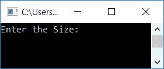
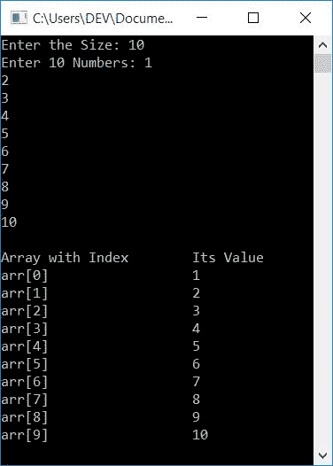
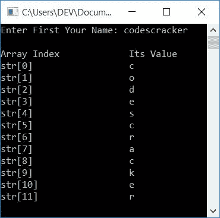

# 一维数组上的 C++程序

> 原文：<https://codescracker.com/cpp/program/cpp-program-one-dimensional-array.htm>

在本文中，您将学习并获得用 C++编写的一维(1D)数组代码。例如:

```
int arr[5] = {10, 20, 30, 40, 50};
```

**注-** 数组这种类型的变量最多可以容纳许多相同类型的值。相同的类型意味着，无论 变量(数组的变量)的类型被声明。例如，在上面的数组中， **arr** 最多可以保存 5 个整数 值。

根据上面的声明，所有 5 个整数值以如下方式存储在 **arr[]** 中:

*   arr[0]=10
*   arr[1]=20
*   arr[2]=30
*   arr[3]=40
*   arr[4]=50

**注-** 这里的 **0，1，2，3，4** 称为数组的索引。数组中的索引总是从 0 开始。

## C++中的一维数组程序

在 C++编程中要打印一维数组的[，你必须 要求用户输入](/cpp/cpp-one-dimensional-arrays.htm)[数组](/cpp/cpp-arrays.htm)的大小和元素。然后在输出 上打印出来，所有细节如下面给出的程序所示:

```
#include<iostream>
using namespace std;
int main()
{
    int arr[50], tot, i;
    cout<<"Enter the Size: ";
    cin>>tot;
    cout<<"Enter "<<tot<<" Numbers: ";
    for(i=0; i<tot; i++)
        cin>>arr[i];
    cout<<"\nArray with Index\tIts Value\n";
    for(i=0; i<tot; i++)
        cout<<"arr["<<i<<"]"<<"\t\t\t"<<arr[i]<<endl;
    cout<<endl;
    return 0;
}
```

这个程序是在 *Code::Blocks* IDE 下构建和运行的。下面是它的运行示例:



现在向 商店提供输入，比如说 **10** 作为大小， **1，2，3，4，5，6，7，8，9，10** 作为元素或数字。以下是使用这些输入运行的示例:



在上面的程序中，下面的语句:

```
cout<<"arr["<<i<<"]"<<"\t\t\t"<<arr[i]<<endl;
```

如果我们把上面陈述的事情分解成静态和动态输出(打印)，下面是列表:

*   **arr[** -静态输出。打印相同的
*   **i** -动态输出。打印出 **i** 的任何值
*   **\t\t\t** -静态输出。打印相同的内容，即三个选项卡
*   **arr[i]** -动态输出。打印 **arr[i]** 的任何值
*   **endl** -静态输出。用作换行符。也就是说，下一件事从新行开始

**注-** 这里的动态输出是指，输出随着 **i** 和**arr[I】**值的变化而变化。 里面的东西**”**被认为是静态输出

前一个数组的类型为 **int** (整数)。因此，该数组可以保存多达 50 个具有相同变量 **arr[]** 的整数值，只需改变其索引即可。现在让我们用类型为 **char** (字符)的数组来存储 字符。

```
#include<iostream>
using namespace std;
int main()
{
    char str[50];
    int i=0;
    cout<<"Enter First Your Name: ";
    cin>>str;
    cout<<"\nArray Index\t\tIts Value\n";
    while(str[i])
    {
        cout<<"str["<<i<<"]"<<"\t\t\t"<<str[i]<<endl;
        i++;
    }
    cout<<endl;
    return 0;
}
```

下面是用户输入的示例运行， **codescracker** :



#### 其他语言的相同程序

*   [C 一维数组程序](/c/program/c-program-one-dimensional-array.htm)
*   [Java 一维数组程序](/java/program/java-program-one-dimensional-array.htm)
*   [Python 一维数组程序](/python/program/python-program-one-dimensional-array.htm)

[C++在线测试](/exam/showtest.php?subid=3)

* * *

* * *