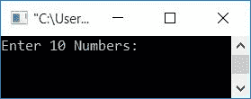
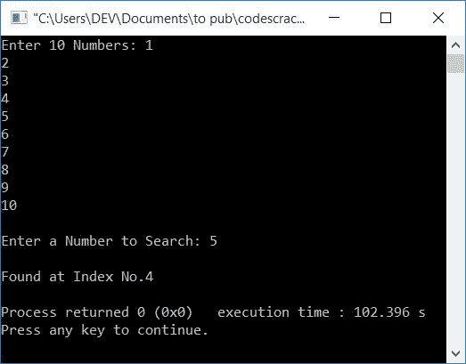
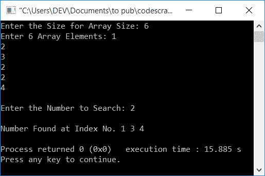

# 线性搜索的 C++程序

> 原文：<https://codescracker.com/cpp/program/cpp-program-linear-search.htm>

在本文中，您将学习并获得在 C++中实现线性搜索的代码。以下是本文中可用的线性搜索程序列表:

*   简单线性搜索程序
*   具有重复元素的线性搜索。这个程序查找并打印数组中一个数字的所有位置(找到不止一次)

在浏览这些程序之前，如果你不知道线性搜索背后使用的逻辑，那么你可以参考[线性搜索算法和例子](/computer-fundamental/linear-search.htm)来得到 每一个需要的东西。

## C++中的线性搜索

要使用线性 搜索技术在 C++编程中搜索出现在[数组](/cpp/cpp-arrays.htm)中的任何元素，您必须要求用户输入任意 10 个数字作为 10 个数组元素，然后要求输入一个数字 进行搜索，如下面给出的程序所示。

这个程序不允许用户定义数组的大小。稍后，您将浏览程序，该程序允许用户定义大小，如果多次找到某个元素，还会打印该元素的所有索引。

这是在 C++中实现线性搜索的最简单的程序。

```
#include<iostream>
using namespace std;
int main()
{
    int arr[10], i, num, index;
    cout<<"Enter 10 Numbers: ";
    for(i=0; i<10; i++)
        cin>>arr[i];
    cout<<"\nEnter a Number to Search: ";
    cin>>num;
    for(i=0; i<10; i++)
    {
        if(arr[i]==num)
        {
            index = i;
            break;
        }
    }
    cout<<"\nFound at Index No."<<index;
    cout<<endl;
    return 0;
}
```

这个程序是在 *Code::Blocks* IDE 下构建和运行的。下面是它的运行示例:



现在提供任意 10 个数字，比如说 **1，2，3，4，5，6，7，8，9，10** ，以及一个数字比如说 **5** 来从给定的数组中搜索它 。以下是提供这些输入后产生的示例输出:



**注意-** 如果用户输入一个数组中不存在的数字，那么上面给出的程序就不是一个具有这种输入类型的正确的 程序。因此我们为你准备了另一个节目，如下所示。

**注意-** 如果用户输入一个在数组中出现不止一次的数字，那么在这种情况下，上述 程序对你来说也不是一个正确的程序。因为程序只打印第一次出现索引。 其索引的其余部分被跳过。因此，进行第二个程序，如下所示。

## 具有重复元素的线性搜索

这个程序比以前的程序有许多额外的功能:

*   允许用户定义数组的大小
*   当用户输入数组中不存在的数字时，处理该类型的输入
*   如果输入的编号以重复顺序出现，则打印所有索引编号

让我们来看看这个程序及其运行示例:

```
#include<iostream>
using namespace std;
int main()
{
    int arr[100], tot, i, num, arrTemp[50], j=0, chk=0;
    cout<<"Enter the Size for Array Size: ";
    cin>>tot;
    cout<<"Enter "<<tot<<" Array Elements: ";
    for(i=0; i<tot; i++)
        cin>>arr[i];
    cout<<"\nEnter the Number to Search: ";
    cin>>num;
    for(i=0; i<tot; i++)
    {
        if(arr[i]==num)
        {
            arrTemp[j] = i;
            j++;
            chk++;
        }
    }
    if(chk>0)
    {
        cout<<"\nNumber Found at Index No. ";
        tot = chk;
        for(i=0; i<tot; i++)
            cout<<arrTemp[i]<<" ";
    }
    else
        cout<<"\nNumber doesn't Found!";
    cout<<endl;
    return 0;
}
```

以下是用户输入的运行示例:

*   6 作为数组的大小
*   1，2，3，2，2，4 作为 6 个数组元素
*   2 作为要搜索的数字

提供这些输入后，您将看到以下示例输出:



#### 其他语言的相同程序

*   [C 线性搜索](/c/program/c-program-linear-search.htm)
*   [Java 线性搜索](/java/program/java-program-linear-search.htm)

[C++在线测试](/exam/showtest.php?subid=3)

* * *

* * *