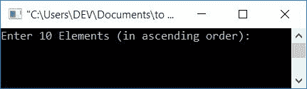
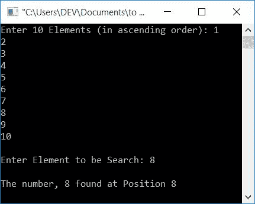
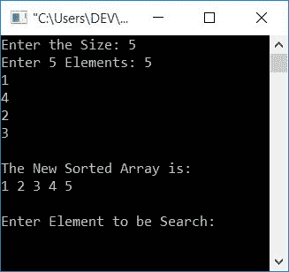
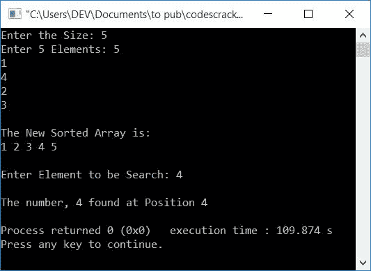
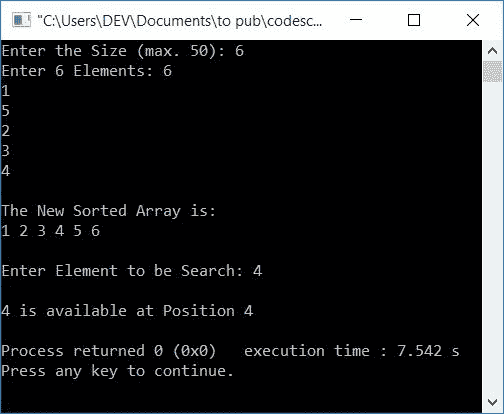
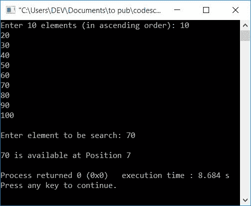

# C++ 程序：二分搜索

> 原文：<https://codescracker.com/cpp/program/cpp-program-binary-search.htm>

在本文中，您将学习并获得在 C++ 编程中使用二分搜索技术从数组中搜索元素的代码。以下是使用的方法:

*   简单二分搜索程序
*   允许用户在搜索前定义数组大小和排序
*   使用用户定义的函数
*   使用递归

在浏览以上程序之前，如果你不了解二分搜索技术，那么你可以参考[二分搜索](/computer-fundamental/binary-search.htm)来了解它的逻辑和算法。

## C++ 中的二分搜索

在 [C++](/cpp/index.htm) 编程中，要使用二分搜索技术从数组中搜索元素， 必须要求用户为[数组](/cpp/cpp-arrays.htm)输入任意 10 个元素，然后输入要搜索的 元素或数字。

使用二分搜索技术搜索元素后，如果它在列表中可用，则显示该元素的位置。下面的 C++ 程序要求用户输入任意 10 个数组元素和一个要搜索的元素。下面是简单的二分搜索程序:

```
#include<iostream>
using namespace std;
int main()
{
    int i, arr[10], num, first, last, middle;
    cout<<"Enter 10 Elements (in ascending order): ";
    for(i=0; i<10; i++)
        cin>>arr[i];
    cout<<"\nEnter Element to be Search: ";
    cin>>num;
    first = 0;
    last = 9;
    middle = (first+last)/2;
    while(first <= last)
    {
        if(arr[middle]<num)
            first = middle+1;
        else if(arr[middle]==num)
        {
            cout<<"\nThe number, "<<num<<" found at Position "<<middle+1;
            break;
        }
        else
            last = middle-1;
        middle = (first+last)/2;
    }
    if(first>last)
        cout<<"\nThe number, "<<num<<" is not found in given Array";
    cout<<endl;
    return 0;
}
```

这个程序是在 *Code::Blocks* IDE 下构建和运行的。以下是示例运行的初始快照:



现在输入任意 10 个数字(按升序)作为数组元素，比如说 **1，2，3，4，5，6，7，8，9，10** ，然后输入一个要从列表中搜索的 数字，比如说 **8** 。以下是样本运行的最终快照:



如果用户输入 10 个元素作为 **1，2，3，4，5，6，7，8，9，10** 和要搜索的元素作为 **8** ，那么上述程序的 运行如下:

*   10 个元素以如下方式存储在数组 **arr[]** 中: **arr[0]=1** ， **arr[1]=2** ， **arr[2]= 3**，以此类推
*   要搜索的数字，比如说 **8** 被初始化为 **num** 。因此， **num=8**
*   最初 **first=0** 和 **last=9**
*   **(第一个+最后一个)/2** 或 **0+9/2** 或 **4** 被初始化到**中间**。因此**中间=4**
*   因为**第一个** (0)的值小于**最后一个** (9)的值，所以 **`while`循环**的条件评估为真。因此程序流进入循环内部
*   检查 **arr[middle] < num** 是否评估为真。将变量 **中间**和 **num** ，**arr【4】<num**或 **5 < 8** 的值评估为真。因此，如果块和**中间+1** 或 **4+1** 或 **5** 被初始化为先**后**时，程序流程 进入**内部**
*   因为，如果块的条件**评估为真，那么 **else if** 和 **else** 块的语句将不会被执行。**
*   最后， **middle =(第一个+最后一个)/2** 或 **middle = (5+9)/2** 或 **middle=7**
*   当循环时，程序流返回到**的状态。条件**第一个< =最后一个** 或 **5 < =9** 再次评估为真，因此程序流程再次进入循环**
*   检查**的状态，如果**块，即**arr[中间] < num** 评估为真，则 为 **arr[7] < num** 或 **8 < 8** 评估为假。因此，如果 阻塞，程序流程转到**否则，并检查其状态**
*   条件 **arr[middle]==num** 或 **8==8** 评估为真。因此，程序流程进入 这个**内部，否则如果**阻塞并执行其语句
*   即打印数字的位置。因为该数字位于索引号 7。因此，我将它的位置打印为 8，因为数组中的索引是从 0 开始的，而不是从 1
*   打印完元素位置后，使用 **break** 关键字从 **`while`循环**中跳出
*   从 **`while`循环**退出后，如果阻塞，使用**检查情况，即 **第一个**的值是否大于**最后一个**的值**
*   如果条件评估为真，则打印一条消息，说明在列表中找不到该号码

### 允许用户定义大小

这个程序允许用户定义数组的大小。它也不关心用户输入数据的方式，即，是升序还是随机顺序。因为，在接收到所有的数字之后，我们已经创建了一个代码块，以升序对列表进行排序(在执行搜索操作之前)。然后要求从排序列表中输入要搜索的元素，如下面给出的程序所示:

```
#include<iostream>
using namespace std;
int main()
{
    int len, i, arr[50], num, j, temp, first, last, middle;
    cout<<"Enter the Size: ";
    cin>>len;
    cout<<"Enter "<<len<<" Elements: ";
    for(i=0; i<len; i++)
        cin>>arr[i];
    // sort the array first
    for(i=0; i<(len-1); i++)
    {
        for(j=0; j<(len-i-1); j++)
        {
            if(arr[j]>arr[j+1])
            {
                temp = arr[j];
                arr[j] = arr[j+1];
                arr[j+1] = temp;
            }
        }
    }
    // print the sorted array
    cout<<"\nThe New Sorted Array is:\n";
    for(i=0; i<len; i++)
        cout<<arr[i]<<" ";
    // now back to binary search
    cout<<"\n\nEnter Element to be Search: ";
    cin>>num;
    first = 0;
    last = (len-1);
    middle = (first+last)/2;
    while(first <= last)
    {
        if(arr[middle]<num)
            first = middle+1;
        else if(arr[middle]==num)
        {
            cout<<"\nThe number, "<<num<<" found at Position "<<middle+1;
            break;
        }
        else
            last = middle-1;
        middle = (first+last)/2;
    }
    if(first>last)
        cout<<"\nThe number, "<<num<<" is not found in given Array";
    cout<<endl;
    return 0;
}
```

假设用户输入数组大小为 **5** 并且其元素为 **5，1，4，2，3** ，下面是它的运行示例:



现在输入一个元素，比如说 **4** ，从列表中搜索它，并输出它的位置，如下面给出的 所示:



要了解有关数组排序的更多信息，您可以在程序中遵循并应用以下任何排序方法:

*   [冒泡排序](/cpp/program/cpp-program-bubble-sort.htm)
*   [选择排序](/cpp/program/cpp-program-selection-sort.htm)
*   [插入排序](/cpp/program/cpp-program-Insertion-sort.htm)

## 使用用户定义的函数

这个程序是使用用户定义的函数 **binSearRecFun()** 创建的，它接收三个参数。 第一个是数组，第二个是要搜索的数字，第三个是数组的大小。这个函数或者返回元素在列表中的位置，或者返回 0，表示列表中没有这个数字。

这里还实现了一个名为 **sortArray()** 的函数，在 前往二分搜索之前，对给定的数组进行升序排序。

```
#include<iostream>
using namespace std;
void sortArray(int [], int);
int binSearchFun(int [], int, int);
int main()
{
    int len, i, arr[50], num, pos;
    cout<<"Enter the Size (max. 50): ";
    cin>>len;
    cout<<"Enter "<<len<<" Elements: ";
    for(i=0; i<len; i++)
        cin>>arr[i];
    // sort the array first
    sortArray(arr, len);
    // print the sorted array
    cout<<"\nThe New Sorted Array is:\n";
    for(i=0; i<len; i++)
        cout<<arr[i]<<" ";
    cout<<"\n\nEnter Element to be Search: ";
    cin>>num;
    // search element using binary search
    pos = binSearchFun(arr, num, len);
    if(pos==0)
        cout<<endl<<num<<" isn't available in the list";
    else
        cout<<endl<<num<<" is available at Position "<<pos;
    cout<<endl;
    return 0;
}
void sortArray(int arr[], int len)
{
    int i, j, temp;
    for(i=0; i<(len-1); i++)
    {
        for(j=0; j<(len-i-1); j++)
        {
            if(arr[j]>arr[j+1])
            {
                temp = arr[j];
                arr[j] = arr[j+1];
                arr[j+1] = temp;
            }
        }
    }
}
int binSearchFun(int arr[], int num, int len)
{
    int first, last, middle;
    first = 0;
    last = (len-1);
    middle = (first+last)/2;
    while(first <= last)
    {
        if(arr[middle]<num)
            first = middle+1;
        else if(arr[middle]==num)
            return (middle+1);
        else
            last = middle-1;
        middle = (first+last)/2;
    }
    return 0;
}
```

假设用户输入大小为 **6** ，元素为 **6，1，5，2，3，4** ，要搜索的数字为 **4** ，下面是它的运行示例。：



## 使用递归

这个程序使用递归(调用自身的函数)来搜索使用二分搜索技术的元素。

```
#include<iostream>
using namespace std;
int binSearRecFun(int [], int, int, int);
int main()
{
    int i, arr[10], num, pos;
    cout<<"Enter 10 elements (in ascending order): ";
    for(i=0; i<10; i++)
        cin>>arr[i];
    cout<<"\nEnter element to be search: ";
    cin>>num;
    pos = binSearRecFun(arr, 0, 9, num);
    if(pos==0)
        cout<<endl<<num<<" is not available in the list";
    else
        cout<<endl<<num<<" is available at Position "<<pos;
    cout<<endl;
    return 0;
}
int binSearRecFun(int arr[], int first, int last, int num)
{
    int middle;
    if(first>last)
        return 0;
    middle = (first+last)/2;
    if(arr[middle]==num)
        return (middle+1);
    else if(arr[middle]>num)
        binSearRecFun(arr, first, middle-1, num);
    else if(arr[middle]<num)
        binSearRecFun(arr, middle+1, last, num);
}
```

下面是它的运行示例:



#### 其他语言的相同程序

*   [C 二分搜索](/c/program/c-program-binary-search.htm)
*   [爪哇二分搜索](/java/program/java-program-binary-search.htm)

[C++ 在线测试](/exam/showtest.php?subid=3)

* * *

* * *