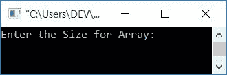
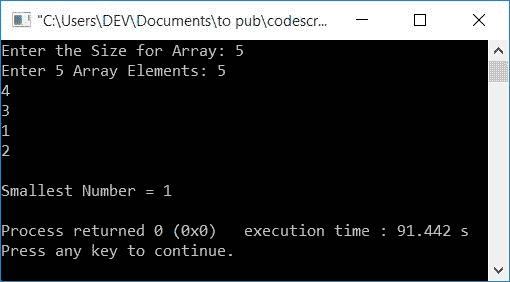
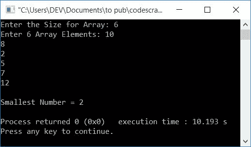

# C++ 程序：寻找数组中最小的数

> 原文：<https://codescracker.com/cpp/program/cpp-program-find-smallest-element-in-array.htm>

在本文中，您将学习并获得在 C++中查找并打印数组中最小元素(数字)的代码。用户必须在运行时输入数组的大小和元素。以下是用于创建程序的方法列表:

*   在没有函数和指针的数组中寻找最小的数
*   使用指针
*   使用用户定义的函数

## 查找数组中最小的数字

在 C++ 编程中，要找到一个[数组中的最小元素或数字，你需要 让用户输入数组的大小和元素。现在找到并打印最小的一个，如下面给出的 程序所示:](/cpp/cpp-arrays.htm)

问题是，**用 C++写一个程序，找出并打印数组**中最小的数。以下是它的答案:

```
#include<iostream>
using namespace std;
int main()
{
    int arr[100], tot, i, s;
    cout<<"Enter the Size for Array: ";
    cin>>tot;
    cout<<"Enter "<<tot<<" Array Elements: ";
    for(i=0; i<tot; i++)
        cin>>arr[i];
    s = arr[0];
    for(i=1; i<tot; i++)
    {
        if(s>arr[i])
            s = arr[i];
    }
    cout<<"\nSmallest Number = "<<s;
    cout<<endl;
    return 0;
}
```

这个程序是在 *Code::Blocks* IDE 下构建和运行的。下面是它的运行示例:



现在提供任意数字，比如说 **5** 作为数组大小，然后输入 5 个数字作为 5 个数组元素。提供 所有这些东西后，按`ENTER`键从数组中找到并打印最小的数，如下图的 快照所示:



以下声明:

```
s = arr[0];
```

假设在第 **0 <sup>第</sup>T3】(第一个)索引处的数字是最小的数字。然后我们将剩余指标的所有数字 逐一与 **s** 的数字进行比较。如果发现 **s** 的值大于 任何索引处的任何数字，那么我们已经将该数字初始化为 **s** 的新值。**

上述程序的预演如下:

*   当用户输入数组的大小，比如说 **5** 时，它被存储在 **tot** 中。所以 **tot=6**
*   现在我们已经为执行 6 次的循环创建了一个*。也就是循环变量， **i** 从 0 开始到 5*
*   所以在第一次，第一个数字存储在 **arr[0]** 中，第二个数字存储在 **arr[1]** 中，依此类推
*   因此，如果用户输入 5 个数字作为 **5，4，3，1，2** ，那么它会以如下方式存储在 **arr[]** 中:
    *   arr[0]=5
    *   arr[1]=4
    *   arr[2]=3
    *   arr[3]=1
    *   arr[4]=2
*   现在用来假设第一个数是最小数的语句。也就是说， **arr[0]** 或 **5**被初始化为 **s**
*   现在使用循环的第二个*，我们比较了 **s** 的值和 **arr[]**的每一个元素*
*   即，在第一次执行循环的*时，1 被初始化为 **i** ，并且条件 I<tot 或 **1 < 5** 评估为真，因此程序流程进入循环内部，并且 条件**s>arr【I】T9】或**5>arr【1】或 **5 > 4 因此，如果**的主体和 **arr[i]** 或 **arr[1]** 或 **4** 的值被初始化为 **s**，则程序流 进入*****
***   现在程序流程转到更新循环的部分*，并增加 **i** 的值。所以 **i=2****   现在，循环的条件*再次被评估。每次进入循环体之前， 条件必须被评估为真**   这次，条件 **i < tot** 或 **2 < 5** 再次评估为真，因此程序流 再次进入循环*   这个过程一直持续到条件评估为假*   退出循环后，变量 **s** 保存来自存储在 **arr[]** 中 的给定数字列表的最小数字*   因此，只需将 **s** 的值打印为用户输入的数组中的最小数字**

 **### 使用指针查找数组中最小的数字

现在让我们用指针创建一个同样用途的程序。 **&** 称为操作员的**地址。 而 ***** 在**操作器处被称为**值。**

```
#include<iostream>
using namespace std;
int main()
{
    int arr[100], tot, i, s, *ptr;
    cout<<"Enter the Size for Array: ";
    cin>>tot;
    cout<<"Enter "<<tot<<" Array Elements: ";
    for(i=0; i<tot; i++)
        cin>>arr[i];
    ptr = &arr[0];
    s = *ptr;
    while(*ptr)
    {
        if(s>(*ptr))
            s = *ptr;
        ptr++;
    }
    cout<<"\nSmallest Number = "<<s;
    cout<<endl;
    return 0;
}
```

这个程序产生与前一个程序相同的输出。执行以下语句后:

```
ptr = &arr[0];
```

**arr[]** 中第 **0 <sup>个</sup>个**索引处的数字地址被初始化为 **ptr** 。 *** ptr**表示存在于地址的值，该值存储在 **ptr** 中。并且使用 **ptr++** 来 移位到同一数组的下一个索引的地址 **arr[]** 。

### 使用函数查找数组中最小的数字

这是最后一个寻找数组中最小元素的程序。这个程序是使用名为**find small()**的用户定义函数创建的。这个函数将一个数组及其大小作为参数。并返回数组中最小的 数(作为第一个参数传递)。

```
#include<iostream>
using namespace std;
int findSmallest(int [], int);
int main()
{
    int arr[100], tot, i, s;
    cout<<"Enter the Size for Array: ";
    cin>>tot;
    cout<<"Enter "<<tot<<" Array Elements: ";
    for(i=0; i<tot; i++)
        cin>>arr[i];
    s = findSmallest(arr, tot);
    cout<<"\nSmallest Number = "<<s;
    cout<<endl;
    return 0;
}
int findSmallest(int a[], int t)
{
    int s, i;
    s = a[0];
    for(i=1; i<t; i++)
    {
        if(s>a[i])
            s = a[i];
    }
    return s;
}
```

下面是用户输入的示例运行，数组大小为 **6** ，数组元素为 **10，8，2，5，7，12** :



#### 其他语言的相同程序

*   [C 数组中最小的数](/c/program/c-program-find-smallest-element-in-array.htm)
*   [Java 数组中最小的数字](/java/program/java-program-find-smallest-element-in-array.htm)

[C++在线测试](/exam/showtest.php?subid=3)

* * *

* * ***