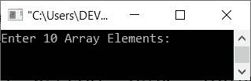
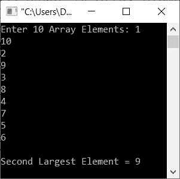
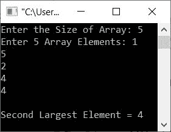

# C++ 程序：寻找数组中第二大元素

> 原文：<https://codescracker.com/cpp/program/cpp-find-second-largest-element.htm>

这篇文章提供了用 C++ 编写的程序来查找和打印用户输入的数组的第二大元素。使用的**和**循环的**创建程序。**

## 使用 for 循环查找第二大元素

问题是，*写一个 C++ 程序来查找并打印给定数组中的第二大元素。*下面给出的节目是它的 回答:

```
#include<iostream>

using namespace std;
int main()
{
   int i, arr[10], large, slarge;
   cout<<"Enter 10 Array Elements: ";
   for(i=0; i<10; i++)
      cin>>arr[i];
   large = arr[0];
   for(i=0; i<10; i++)
   {
      if(large<arr[i])
         large = arr[i];
   }
   slarge = arr[0];
   for(i=0; i<10; i++)
   {
      if(slarge<arr[i])
      {
         if(arr[i]!=large)
            slarge = arr[i];
      }
   }
   cout<<"\nSecond Largest Element = "<<slarge;
   cout<<endl;
   return 0;
}
```

下面给出的快照显示了上述 C++ 程序在从给定数组中查找并打印第二大元素时产生的初始输出:



现在提供输入，比如说 **1，10，2，9，3，8，4，7，5，6** 作为十个元素，并按`ENTER`键从给定的数组中找到并打印第二大的元素 ，如下图所示:



在上述程序中，

*   我假设第一个元素是最大的元素。
*   也就是说，第一个元素或第 **0** <sup>第</sup>个索引处的元素被初始化为**大**。
*   现在使用 **large** 的值，我已经检查了数组的每个元素
*   在检查时，如果发现 **large** 的值小于任何元素，那么我已经将该元素初始化为 **large** 的 新值
*   这样，最大的元素被存储在 **large** 中
*   我再次假设第一个元素是第二大元素。也就是说， **slarge** 保存这次的值
*   现在，我再次做了同样的工作，将 **slarge** 的值与数组中的每个元素进行比较
*   但是这一次，如果发现 **slarge** 中的值更小，那么只有当该元素不等于 **large** 时，该元素才被初始化为 slarge 的新值
*   这样，第二大元素被找出并存储在 **slarge** 变量中
*   因此，在退出循环后，只需将 **slarge** 的值打印为数组的第二大元素

现在的问题是，*如果用户不想输入 10 个元素*怎么办？也就是说，如果用户想要输入一些 **n** 元素 ，并且基于这些 **n** 元素，他/她想要找到第二大的元素。所以我们必须修改程序。

因此，让我们修改上面的程序，并创建另一个程序，允许用户定义数组的大小以及给定大小的元素，如下面给出的程序所示:

```
#include<iostream>

using namespace std;
int main()
{
   int tot, i, arr[100], large, slarge;
   cout<<"Enter the Size of Array: ";
   cin>>tot;
   cout<<"Enter "<<tot<<" Array Elements: ";
   for(i=0; i<tot; i++)
      cin>>arr[i];
   large = arr[0];
   for(i=0; i<tot; i++)
   {
      if(large<arr[i])
         large = arr[i];
   }
   slarge = arr[0];
   for(i=0; i<tot; i++)
   {
      if(slarge<arr[i])
      {
         if(arr[i]!=large)
            slarge = arr[i];
      }
   }
   cout<<"\nSecond Largest Element = "<<slarge;
   cout<<endl;
   return 0;
}
```

下面是它的示例运行，其中用户输入 **5** 作为大小，而 **1，5，2，4，4** 作为五个元素:



## 使用 while 循环查找第二大元素

除了方法不同之外，这个程序与之前的程序几乎相似。这个程序是使用 **while** 循环创建的。其余的 事情和之前的程序完全一样。

```
#include<iostream>

using namespace std;
int main()
{
   int tot, i=0, arr[10], large, slarge;
   cout<<"Enter the Size of Array: ";
   cin>>tot;
   cout<<"Enter "<<tot<<" Array Elements: ";
   while(i<tot)
   {
      cin>>arr[i];
      i++;
   }
   large = arr[0];
   i=0;
   while(i<tot)
   {
      if(large<arr[i])
         large = arr[i];
      i++;
   }
   slarge = arr[0];
   i=0;
   while(i<tot)
   {
      if(slarge<arr[i])
      {
         if(arr[i]!=large)
            slarge = arr[i];
      }
      i++;
   }
   cout<<"\nSecond Largest Element = "<<slarge;
   cout<<endl;
   return 0;
}
```

这个程序做的工作和前一个程序完全一样。

[C++ 在线测试](/exam/showtest.php?subid=3)

* * *

* * *