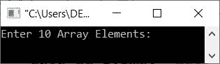
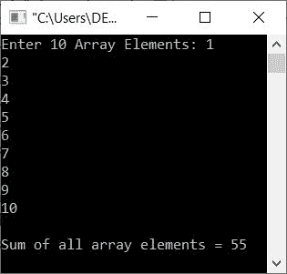
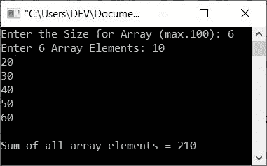

# C++ 程序：计算并打印数组元素和

> 原文：<https://codescracker.com/cpp/program/cpp-find-sum-of-all-elements-in-array.htm>

这篇文章提供了一个 C++ 程序来查找和打印数组中所有元素的总和。这里数组的元素必须由用户在运行时输入。

## 求数组中所有元素的和

问题是，*用 C++ 写一个程序，找出并打印给定数组中所有元素/数字的和。*以下节目 为其解答:

```
#include<iostream>

using namespace std;
int main()
{
   int arr[10], i, sum=0;
   cout<<"Enter 10 Array Elements: ";
   for(i=0; i<10; i++)
      cin>>arr[i];
   for(i=0; i<10; i++)
      sum = sum+arr[i];
   cout<<"\nSum of all array elements = "<<sum;
   cout<<endl;
   return 0;
}
```

下面是上面的 C++ 程序在查找用户输入的数组的所有元素的和时产生的初始输出:



现在逐个输入任意十个数字，按`ENTER`键查找并打印所有元素的总和，如下面给出的快照中的 所示:



因为上述程序存在局限性。也就是说，用户只允许输入 10 个元素。因此，让我们修改这个程序，创建另一个程序，允许用户定义数组及其元素的大小:

```
#include<iostream>

using namespace std;
int main()
{
   int tot, arr[100], i, sum=0;
   cout<<"Enter the Size for Array (max.100): ";
   cin>>tot;
   cout<<"Enter "<<tot<<" Array Elements: ";
   for(i=0; i<tot; i++)
   {
      cin>>arr[i];
      sum = sum+arr[i];
   }
   cout<<"\nSum of all array elements = "<<sum;
   cout<<endl;
   return 0;
}
```

下面是它的示例运行，使用用户输入， **6** 作为大小， **10，20，30，40，50，60** 作为六个数组元素:



[C++ 在线测试](/exam/showtest.php?subid=3)

* * *

* * *