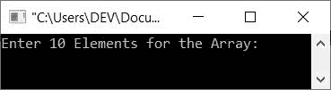
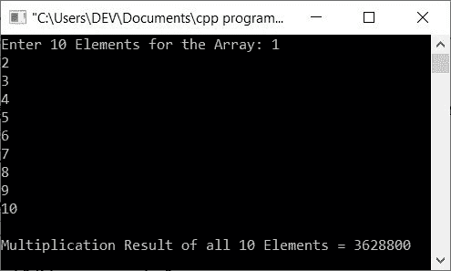
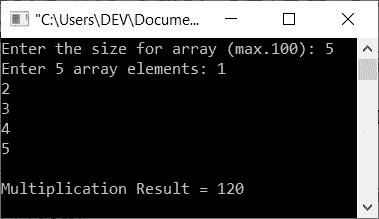
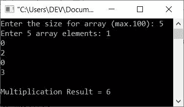

# C++ 程序：将数组中的所有元素(数字)相乘

> 原文：<https://codescracker.com/cpp/program/cpp-multiply-all-elements-in-array.htm>

这篇文章包括一些用 C++编写的程序，这些程序查找并打印给定数组中所有元素的乘法结果。以下是此处提供的程序列表:

*   将 10 个元素的数组中的所有元素相乘
*   将一个由 n 个元素组成的数组中的所有元素相乘
*   只乘以数组中的非零元素

## 将 10 个元素的数组中的所有元素相乘

问题是，*用 C++写一个程序，接收一个数组的 10 个元素，找到并打印所有给定的 10 个元素的 的乘法结果。*下面是它的回答:

```
#include<iostream>

using namespace std;
int main()
{
   int arr[10], i, mul=1;
   cout<<"Enter 10 Elements for the Array: ";
   for(i=0; i<10; i++)
      cin>>arr[i];
   for(i=0; i<10; i++)
      mul = mul*arr[i];
   cout<<"\nMultiplication Result of all 10 Elements = "<<mul;
   cout<<endl;
   return 0;
}
```

下面是上面的 C++程序在打印给定数组中所有元素的乘法结果时产生的初始输出:



现在提供任意 10 个元素，如 **1、2、3、4、5、6、7、8、9、10** ，按`ENTER`找到并打印所有这些元素的乘法 结果，如下图所示:



## 在 n 个元素的数组中寻找所有元素的乘法结果

这个程序允许用户定义数组的大小及其元素。也就是说，程序接收大小，然后要求输入所需大小的数组的所有元素，将它们相乘，然后打印乘法结果:

```
#include<iostream>

using namespace std;
int main()
{
   int n, arr[100], i, m=1;
   cout<<"Enter the size for array (max.100): ";
   cin>>n;
   cout<<"Enter "<<n<<" array elements: ";
   for(i=0; i<n; i++)
   {
      cin>>arr[i];
      m *= arr[i];
   }
   cout<<"\nMultiplication Result = "<<m;
   cout<<endl;
   return 0;
}
```

下面是它的示例运行，使用用户输入的 **5** 作为大小，或者使用 **n** 和 **1，2，3，4，5** 的值作为 数组的 5 个数字或元素:



## 仅查找非零数组元素的乘法

因为上面给出的两个程序的结果都是 0，如果数组中的任何一个元素是 0。因为任何数乘以 0 的结果都是 0。因此，让我们修改上面的程序，创建一个新程序，只查找和打印非零元素的乘法结果:

```
#include<iostream>

using namespace std;
int main()
{
   int n, arr[100], i, m=1, chk=0;
   cout<<"Enter the size for array (max.100): ";
   cin>>n;
   cout<<"Enter "<<n<<" array elements: ";
   for(i=0; i<n; i++)
   {
      cin>>arr[i];
      if(arr[i]!=0)
      {
         m *= arr[i];
         chk = 1;
      }
   }
   if(chk==1)
      cout<<"\nMultiplication Result = "<<m;
   else
      cout<<"\nNon-zero element not found!";
   cout<<endl;
   return 0;
}
```

下面是它的示例运行，使用用户输入的 **5** 作为大小，使用 **1，0，2，0，3** 作为五个数组元素:



[C++在线测试](/exam/showtest.php?subid=3)

* * *

* * *