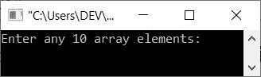
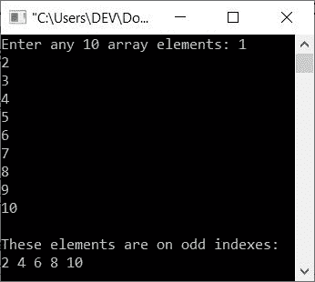
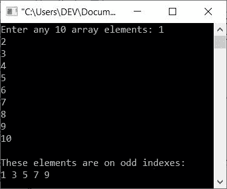
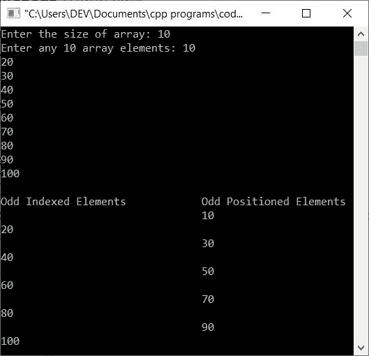

# C++ 程序：打印数组中奇数位置上可用元素

> 原文：<https://codescracker.com/cpp/program/cpp-print-element-at-odd-position.htm>

本文提供了一些用 C++ 编写的程序，这些程序可以查找并打印奇数位置上的所有元素。本文主要涵盖这两个程序:

*   查找并打印奇数索引上的元素
*   查找并打印奇数位置的元素

**注意-** 索引从 0 开始，因此第一个元素是在数组的第 0 <sup>个</sup>索引处可用的元素。

例如，如果一个数组 **arr[]** 保存 **1，2，3，4，5，6** 作为它的六个元素，那么奇数索引处的元素是 **arr[1]** ， **arr[3]** ， **arr[5]** 处的元素 ，即 **2，4，6** 。

## 打印奇数索引上的元素

问题是，*编写一个 C++ 程序，接收数组中的任意 10 个数字，并打印奇数索引中的所有数字。* 下面给出的程序就是这个问题的答案:

```
#include<iostream>

using namespace std;
int main()
{
   int arr[10], i;
   cout<<"Enter any 10 array elements: ";
   for(i=0; i<10; i++)
      cin>>arr[i];
   cout<<"\nThese elements are on odd indexes:\n";
   for(i=0; i<10; i++)
   {
      if(i%2!=0)
         cout<<arr[i]<<" ";
   }
   cout<<endl;
   return 0;
}
```

上面的 C++ 程序在打印数组中奇数索引元素时产生的初始输出显示在下面给出的快照中:



现在提供任意 10 个元素，如 **1、2、3、4、5、6、7、8、9、10** ，然后按`ENTER`键打印奇数索引上可用的所有数字 ，如下图所示:



## 在奇数位置打印元素

要创建这个程序，只需替换上面程序中的以下代码:

```
if(i%2!=0)
```

使用下面给出的代码:

```
if((i+1)%2!=0)
```

以下是该程序的完整版本:

```
#include<iostream>

using namespace std;
int main()
{
   int arr[10], i;
   cout<<"Enter any 10 array elements: ";
   for(i=0; i<10; i++)
      cin>>arr[i];
   cout<<"\nThese elements are on odd indexes:\n";
   for(i=0; i<10; i++)
   {
      if((i+1)%2!=0)
         cout<<arr[i]<<" ";
   }
   cout<<endl;
   return 0;
}
```

下面是它的示例运行，用户输入与之前程序的示例运行相同:



#### 允许用户定义数组的大小

这个程序是前面两个程序的组合版本，并且允许用户定义数组的大小:

```
#include<iostream>

using namespace std;
int main()
{
   int i, n;
   cout<<"Enter the size of array: ";
   cin>>n;
   int arr[n];
   cout<<"Enter any "<<n<<" array elements: ";
   for(i=0; i<n; i++)
      cin>>arr[i];
   cout<<"\nOdd Indexed Elements\t\tOdd Positioned Elements\n";
   for(i=0; i<n; i++)
   {
      if(i%2!=0)
         cout<<arr[i]<<endl;
      if((i+1)%2!=0)
         cout<<"\t\t\t\t"<<arr[i]<<endl;
   }
   cout<<endl;
   return 0;
}
```

下面是它的示例运行，使用用户输入的 **10** 作为大小，使用 **10，20，30，40，50，60，70，80，90，100** 作为十个元素:



[C++ 在线测试](/exam/showtest.php?subid=3)

* * *

* * *