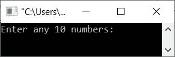
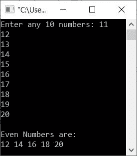
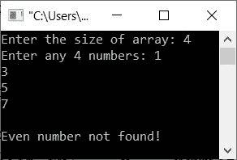
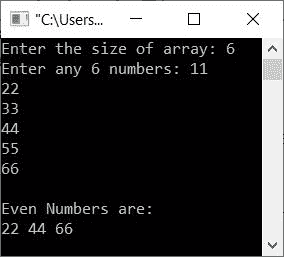
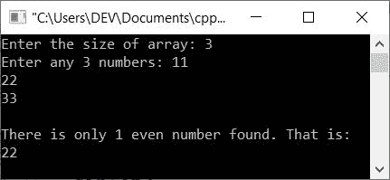

# C++ 程序：查找并打印数组中的偶数

> 原文：<https://codescracker.com/cpp/program/cpp-print-even-numbers-in-array.htm>

本文旨在介绍一些在 C++ 中查找并打印数组中偶数的程序。该数组必须由用户在运行时输入。本文涵盖的程序列表包括:

*   在 10 个元素的数组中打印偶数
*   在 N 个元素的数组中打印偶数
*   使用另一个数组打印 N 个柠檬数组中的偶数

## 在 10 个元素的数组中打印偶数

问题是，*编写一个 C++ 程序，打印用户给定数组中的偶数。*这个问题的答案是下面给出的程序 :

```
#include<iostream>

using namespace std;
int main()
{
   int arr[10], i;
   cout<<"Enter any 10 numbers: ";
   for(i=0; i<10; i++)
      cin>>arr[i];
   cout<<"\nEven Numbers are:\n";
   for(i=0; i<10; i++)
   {
      if(arr[i]%2==0)
         cout<<arr[i]<<" ";
   }
   cout<<endl;
   return 0;
}
```

上面的 C++ 程序在打印给定数组中所有可用的偶数时产生的初始输出显示在下面给出的快照中:



现在提供任意 10 个数字，如 **11、12、13、14、15、16、17、18、19、20** ，按`ENTER`键从这 10 个数字中查找并打印所有的 偶数，如下图所示:



使用与上面提供的完全相同的用户输入对上面的程序进行预演，如下所示:

*   当用户输入 10 个元素/数字时，这些数字的索引存储将是 **arr[0]=11** ， **arr[1]=12** ， **arr[2]= 13**，...， **arr[9]=20**
*   现在开始执行循环的第二个
***   也就是说， **i=0** 并且条件 **i < 10** 或 **0 < 10** 评估为真*   因此，程序流进入循环，如果得到评估，则**的条件***   也就是说，条件 **arr[i]%2==0** 或 **arr[0]%2==0** 或 **11%2==0** 或 **1==0** 评估为假，因此 程序流程不会进入**的主体(如果***   现在， **i** 的值使用 **i++** (循环的第三条语句)递增。所以现在 **i=1***   用新的 **i** 值再次评估循环的**条件***   这一次，条件 **i < 10** 或 **1 < 10** 评估为真*   因此，程序流再次进入循环*   并且条件 **arr[i]%2==0** 或 **arr[1]%2==0** 或 **12%2==0** 或 **0==0** 评估为真*   因此这一次，程序流进入 **if** 的主体*   并且 **arr[i]** 或 **arr[1]** 的值，即 **12** 打印在输出上*   再次，第二次， **i** 的值增加。现在 **i=2***   并且条件 **i < 10** 或 **2 < 10** 再次评估为真*   因此程序再次进入循环。*   这个过程一直持续到条件评估为假*   这样，一个接一个，所有的偶数都被打印出来**

 **## 在 N 个数字的数组中打印偶数

现在让我们修改上面的程序，创建一个新的程序，允许用户定义数组的大小。如果没有找到偶数，这个程序还会打印一条消息。

```
#include<iostream>

using namespace std;
int main()
{
   int n, i, temp=0;
   cout<<"Enter the size of array: ";
   cin>>n;
   int arr[n];
   cout<<"Enter any "<<n<<" numbers: ";
   for(i=0; i<n; i++)
      cin>>arr[i];
   for(i=0; i<n; i++)
   {
      if(arr[i]%2==0)
      {
         if(temp==0)
            cout<<"\nEven Numbers are:\n";
         cout<<arr[i]<<" ";
         temp=1;
      }
   }
   if(temp==0)
      cout<<"\nEven number not found!";
   cout<<endl;
   return 0;
}
```

下面的快照显示了上述程序的示例运行，其中用户输入的 **4** 为大小， **1、3、5、7** 为四个数字:



下面是另一个运行示例，用户输入的大小为 **6** ，数组的六个数字为 **11、22、33、44、55、66** :



## 使用第二个(另一个)数组打印偶数

这个程序使用另一个数组来存储用户给定数组中的所有偶数。将给定数组中的所有偶数逐个存储到第二个(另一个)数组中。只需打印第二个数组的元素，如下面给出的程序所示:

```
#include<iostream>

using namespace std;
int main()
{
   int n, i, j=0;
   cout<<"Enter the size of array: ";
   cin>>n;
   int arr[n], eve[n];
   cout<<"Enter any "<<n<<" numbers: ";
   for(i=0; i<n; i++)
   {
      cin>>arr[i];
      if(arr[i]%2==0)
      {
         eve[j] = arr[i];
         j++;
      }
   }
   if(j==0)
      cout<<"\nEven number not found!";
   else if(j==1)
      cout<<"\nThere is only 1 even number found. That is:\n"<<eve[0];
   else
   {
      cout<<"\nList of Even Numbers:\n";
      for(i=0; i<j; i++)
         cout<<eve[i]<<" ";
   }
   cout<<endl;
   return 0;
}
```

下面是它的示例运行，用户输入的 **3** 为大小， **11，22，33** 为三个数字:



[C++ 在线测试](/exam/showtest.php?subid=3)

* * *

* * ***