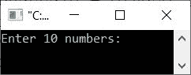
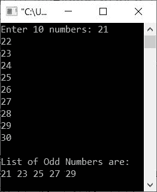
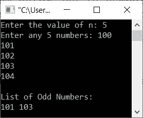
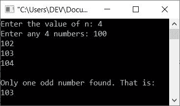

# C++程序，查找并打印数组中的奇数

> 原文：<https://codescracker.com/cpp/program/cpp-print-odd-numbers-in-array.htm>

这篇文章提供了一些用 C++编写的程序，可以查找并打印用户输入的数组中的所有奇数。此处涵盖的计划列表包括:

*   在 10 个元素的数组中打印奇数
*   在 n 个元素的数组中打印奇数
*   使用第二个或另一个数组打印奇数

## 在 10 个元素的数组中打印奇数

问题是，*编写一个 C++程序，在运行时从用户那里接收 10 个元素(数字)并打印所有奇数。*下面给出的 节目就是它的答案:

```
#include<iostream>

using namespace std;
int main()
{
   int arr[10], i;
   cout<<"Enter 10 numbers: ";
   for(i=0; i<10; i++)
      cin>>arr[i];
   cout<<"\nList of Odd Numbers are:\n";
   for(i=0; i<10; i++)
   {
      if(arr[i]%2!=0)
         cout<<arr[i]<<" ";
   }
   cout<<endl;
   return 0;
}
```

下面给出的快照显示了上述 C++程序在打印给定数组中所有可用的奇数时产生的初始输出:



现在输入任意 10 个数字，如 **21、22、23、24、25、26、27、28、29、30** ，按`ENTER`键从这 10 个数字中查找并打印出所有的 奇数，如下图所示:



## 在 n 个元素的数组中打印奇数

这个程序允许用户输入 n 的值或者定义数组的大小以及所需大小的元素。

```
#include<iostream>

using namespace std;
int main()
{
   int n, i;
   cout<<"Enter the value of n: ";
   cin>>n;
   int arr[n];
   cout<<"Enter any "<<n<<" numbers: ";
   for(i=0; i<n; i++)
      cin>>arr[i];
   cout<<"\nList of Odd Numbers:\n";
   for(i=0; i<n; i++)
   {
      if(arr[i]%2!=0)
         cout<<arr[i]<<" ";
   }
   cout<<endl;
   return 0;
}
```

下面是它的示例运行，使用用户输入的 **5** 作为大小，使用 **100、101、102、103、104** 作为数组的五个元素或数字:



## 使用另一个数组查找并打印奇数

这个程序使用两个数组，一个存储原始数组，第二个只存储原始数组中的奇数。

```
#include<iostream>

using namespace std;
int main()
{
   int n, i, j=0;
   cout<<"Enter the value of n: ";
   cin>>n;
   int arr[n], odd[n];
   cout<<"Enter any "<<n<<" numbers: ";
   for(i=0; i<n; i++)
   {
      cin>>arr[i];
      if(arr[i]%2!=0)
      {
         odd[j] = arr[i];
         j++;
      }
   }
   if(j==0)
      cout<<"\nOdd number not found in the array!";
   else if(j==1)
      cout<<"\nOnly one odd number found. That is:\n"<<odd[0];
   else
   {
      cout<<"\nList of Odd numbers:\n";
      for(i=0; i<j; i++)
         cout<<odd[i]<<" ";
   }
   cout<<endl;
   return 0;
}
```

以下是它的示例运行，其中用户输入 **4** 作为大小， **100、102、103、104** 作为四个元素或数字:



[C++在线测试](/exam/showtest.php?subid=3)

* * *

* * *