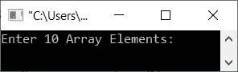
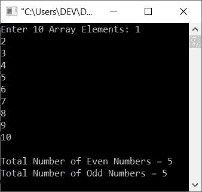
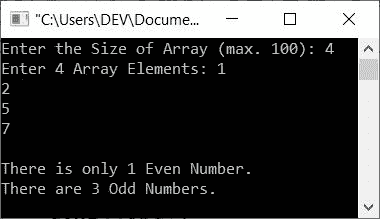

# C++ 程序：计算数组中偶数和奇数

> 原文：<https://codescracker.com/cpp/program/cpp-count-even-odd-elements-in-array.htm>

本文为您提供了一些 C++ 程序，用于计算数组中可用的偶数和奇数个数。该数组必须由用户在运行时输入。

## 在 10 个数字的数组中计算偶数/奇数

问题是，*用 C++ 写一个程序，接收一个 10 个数字的数组，并计算给定数组中可用的偶数/奇数。* 下面给出的程序就是这个问题的答案:

```
#include<iostream>

using namespace std;
int main()
{
   int arr[10], eve=0, odd=0, i;
   cout<<"Enter 10 Array Elements: ";
   for(i=0; i<10; i++)
      cin>>arr[i];
   for(i=0; i<10; i++)
   {
      if(arr[i]%2==0)
         eve++;
      else
         odd++;
   }
   cout<<"\nTotal Number of Even Numbers = "<<eve;
   cout<<"\nTotal Number of Odd Numbers = "<<odd;
   cout<<endl;
   return 0;
}
```

下面给出的快照显示了上面的 C++ 程序在计算给定数组中偶数和奇数的总数时产生的初始输出:



现在提供输入，比如说 **1，2，3，4，5，6，7，8，9，10** 作为十个数组元素，按`ENTER`键查找并打印 奇数和偶数的个数，如下图所示:



上述程序的预演如下:

*   如果用户输入与上述示例运行中给出的相同的 10 个元素，那么所有这些数字将按照如下方式逐一存储在数组中: **arr[0]=1** ， **arr[1]=2** ，...， **arr[9]=10**
*   由于所有 10 个数字都被用户接收到，因此开始执行循环的第二个**，负责 计数偶数/奇数**
*   也就是说，首先 **i=0** 被执行，状态 0 被初始化为 **i** 。初始化部分只执行一次
*   初始化后，条件 **i < 10** 或 **0 < 10** 评估为真
*   因此程序流进入循环内部
*   在循环内部，如果得到评估，则**的条件**
*   也就是说，条件 **arr[i]%2==0** 或 **arr[0]%2==0** 或 **1%2==0** 评估为假
*   因此程序流不会进入 **if** 的体内，而是进入 **else** 的体内并执行语句 `odd++;`
*   由于**奇数**的初始值为 0，因此现在**奇数=1**
*   现在程序流程进入循环的更新部分，即增量部分。
*   因此， **i** 的值增加，现在 **i=1**
*   再次，条件 **i < 10** 或 **1 < 10** 评估为真
*   因此，程序流再次进入循环
*   如果对求值，再次显示**的条件**
*   但是这一次，条件 **arr[i]%2==0** 或 **arr[1]%2==0** 或 **2%2==0** 或 **0==0** 评估为真
*   因此，程序流进入其主体(如果是的主体，则为**)内部，这一次 **eve** 变量的值增加。所以现在 **eve=1****
*   再次， **i** 的值增加。所以现在 **i=2**
*   并且条件 **i < 10** 或 **2 < 10** 再次评估为真
*   因此，程序流再次进入循环，该过程继续，直到条件评估为假
*   这样，两个变量(一个用于偶数计数，另一个用于奇数计数)保存结果。
*   因此，只需打印这两个变量的值作为结果，如上面给出的运行示例所示

## 计算 N 个数数组中的偶数/奇数

这是以前程序的修改版本，因为这个程序允许用户定义数组的大小及其元素。

```
#include<iostream>

using namespace std;
int main()
{
   int tot, arr[100], i, eve=0, odd=0;
   cout<<"Enter the Size of Array (max. 100): ";
   cin>>tot;
   cout<<"Enter "<<tot<<" Array Elements: ";
   for(i=0; i<tot; i++)
      cin>>arr[i];
   for(i=0; i<tot; i++)
   {
      if(arr[i]%2==0)
         eve++;
      else
         odd++;
   }
   cout<<endl;
   if(eve>1)
      cout<<"There are "<<eve<<" Even Numbers.";
   else
   {
      if(eve==1)
         cout<<"There is only 1 Even Number.";
      else
         cout<<"There is no any Even Number.";
   }
   cout<<endl;
   if(odd>1)
      cout<<"There are "<<odd<<" Odd Numbers.";
   else
   {
      if(odd==1)
         cout<<"There is only 1 Odd Number.";
      else
         cout<<"There is no any Odd Number.";
   }
   cout<<endl;
   return 0;
}
```

下面是它的示例运行，使用用户输入， **4** 作为大小， **1，2，5，7** 作为四个数组元素:



[C++ 在线测试](/exam/showtest.php?subid=3)

* * *

* * *