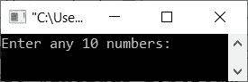

# C++ 程序：求偶数和奇数之和

> 原文：<https://codescracker.com/cpp/program/cpp-sum-of-odd-even-numbers.htm>

这篇文章提供了一些用 C++编写的程序，可以从用户输入的随机数列表中找到并打印出所有偶数和奇数的和。该程序通过以下两种方式创建:

*   使用**进行**循环
*   使用 **while** 循环

## 使用 for 循环求偶数和奇数的和

问题是，*编写一个 C++程序，从用户那里接收 10 个数字，并打印所有偶数和所有奇数的和。* 下面给出的程序是它的答案:

```
#include<iostream>

using namespace std;
int main()
{
   int arr[10], i, eve=0, odd=0;
   cout<<"Enter any 10 numbers: ";
   for(i=0; i<10; i++)
      cin>>arr[i];
   for(i=0; i<10; i++)
   {
      if(arr[i]%2==0)
         eve = eve+arr[i];
      else
         odd = odd+arr[i];
   }
   cout<<"\nSum of Even Numbers = "<<eve;
   cout<<"\nSum of Odd Numbers = "<<odd;
   cout<<endl;
   return 0;
}
```

此快照显示了上述 C++程序在从给定数组中查找偶数和奇数之和时产生的初始输出:



现在提供输入，比如说 **0，1，2，3，4，5，6，7，8，9** 作为数组的 10 个数字，然后按`ENTER`键 从所有这些给定的 10 个数字中查找并打印偶数和奇数的和，如下图所示:


#### 先前程序的修改版本

这是以前程序的修改版本，允许用户定义数组的大小及其元素或数字。此外，这个程序还包括一些消息，当在给定的数字列表中没有找到偶数或奇数时，将打印这些消息。

```
#include<iostream>

using namespace std;
int main()
{
   int n, i, eve=0, odd=0;
   cout<<"Enter the size of array: ";
   cin>>n;
   int arr[n];
   cout<<"Enter any "<<n<<" numbers: ";
   for(i=0; i<n; i++)
   {
      cin>>arr[i];
      if(arr[i]%2==0)
         eve += arr[i];
      else
         odd += arr[i];
   }
   if(eve==0)
      cout<<"\nEven number not found!";
   else
      cout<<"\nSum of Even Numbers = "<<eve;
   if(odd==0)
      cout<<"\nOdd number not found!";
   else
      cout<<"\nSum of Odd Numbers = "<<odd;
   cout<<endl;
   return 0;
}
```

下面是它的示例运行，用户输入 **4** 作为大小， **1，3，5，7** 作为四个数字:


在上面的程序中，语句:

```
eve += arr[i];
```

与相同

```
eve = eve + arr[i];
```

## 使用 while 循环求偶数和奇数的和

这是本文的最后一个程序，使用 **while** 循环创建。由于**而**循环不包含初始化 和更新语句。因此，我们需要在循环之前进行初始化，并在循环体中更新语句，如下面给出的程序中的 所示:

```
#include<iostream>

using namespace std;
int main()
{
   int n, i=0, eve=0, odd=0;
   cout<<"Enter the size of array: ";
   cin>>n;
   int arr[n];
   cout<<"Enter any "<<n<<" numbers: ";
   while(i<n)
   {
      cin>>arr[i];
      if(arr[i]%2==0)
         eve += arr[i];
      else
         odd += arr[i];
      i++;
   }
   if(eve==0)
      cout<<"\nEven number not found!";
   else
      cout<<"\nSum of Even Numbers = "<<eve;
   if(odd==0)
      cout<<"\nOdd number not found!";
   else
      cout<<"\nSum of Odd Numbers = "<<odd;
   cout<<endl;
   return 0;
}
```

这个程序产生与前一个程序相同的输出。

[C++在线测试](/exam/showtest.php?subid=3)

* * *

* * *