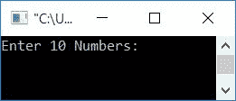
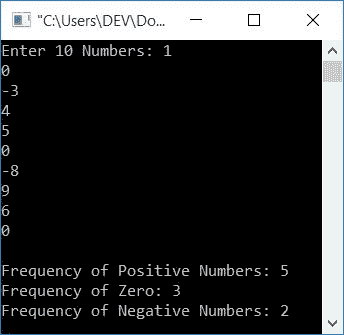
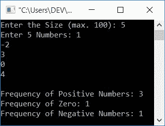

# C++ 程序：统计正数、零和负数

> 原文：<https://codescracker.com/cpp/program/cpp-program-count-positive-negative-zero.htm>

在本文中，您将学习并获得 C++ 中正数、零和负数的计数代码。该程序通过以下方式创建:

*   计数正数、零和负数，由用户输出 10 个给定的数字
*   允许用户定义阵列的大小
*   使用*计数正数、零和负数，同时循环*

## 在 C++ 中计算正数、负数和零

下面给出的程序从用户在 C++ 编程中(运行时)输入的一组给定数字中统计正数、零和负数的出现次数(频率)。

问题是，用 C++ 写一个程序，计算并打印正数、零和负数出现频率。 下面给出这个问题的答案:

```
#include<iostream>
using namespace std;
int main()
{
    intpos=0, neg=0, zer=0, i, arr[10];
    cout<<"Enter 10 Numbers: ";
    for(i=0; i<10; i++)
        cin>>arr[i];
    for(i=0; i<10; i++)
    {
        if(arr[i]>0)
            pos++;
        else if(arr[i]==0)
            zer++;
        else
            neg++;
    }
    cout<<"\nFrequency of Positive Numbers: "<<pos;
    cout<<"\nFrequency of Zero: "<<zer;
    cout<<"\nFrequency of Negative Numbers: "<<neg;
    cout<<endl;
    return 0;
}
```

这个程序是在*代码::块*下构建和运行的。下面是它的运行示例:



现在提供任意 10 个数字，如 **1，0，-3，4，5，0，-8，9，6，0** ，按`ENTER`键查看正数、零和负数的 出现次数或频率，如下图所示:



在上面的程序中，当用户输入 10 个数字(例如:1，0，-3，4，5，0，-8，9，6，0)时，所有的 10 个数字都被初始化为 **arr[]** ，初始化方式如下:

*   arr[0]=1
*   arr[1]=0
*   arr[2]=-3
*   arr[3]=4
*   以此类推，直到
*   arr[9]=0

现在，用这 10 个值对上面的程序进行预演，如下所示:

*   初始值， **pos=0** ， **neg=0** ， **zer=0**
*   因为循环的第一个*被执行，10 个数字被用户接收*
*   所以是时候执行循环的第二个*了*
*   它初始化部分首先执行，而且只执行一次。所以 **i=0**
*   现在条件， **i < 10** 或 **0 < 10** 评估为真，因此程序流程进入循环内部
*   **if** 的条件，即 **arr[i] > 0** 或 **arr[0] > 0** 或 **1 > 0** 评估为 真，因此如果的主体和 **pos** 的值增加，程序流程进入**内部。因为 **位置**以前的值是 0，所以现在**位置=1****
*   因为**的条件如果**评估为真，因此**否则如果**和**否则**块将 不被执行
*   因此程序流程返回，增加 **i** 的值(现在 **i=1** ，并再次评估循环的*的条件*
*   也就是说，条件 **i < 10** 或 **1 < 10** 再次评估为真，因此程序流 再次进入循环
*   并且如果评估**的条件，即条件 **arr[i] > 0** 或 **arr[1] > 0** 或 **0>0**评估为假，则程序流程评估**的条件否则如果**，即 条件 **arr[i]==0** 或**arr[1]= = 0**因为 **zer** 以前的值是 0，所以现在 **zer=1********
*   现在程序流程再次返回，增加 **i** 的值(现在 **i=2** ，并再次评估循环的*的 条件。*
*   该过程继续，直到循环的条件*评估为假*
*   继续循环的*的模拟运行，下面是每次评估后的值(我们将得到):*
    *   位置=1
    *   零=1
    *   负=1
    *   pos=2
    *   pos=3
    *   零=2
    *   负=2
    *   pos=4
    *   pos=5
    *   零=3
*   退出*循环*后，打印正数、零和 负数对应的各变量的值
*   也就是说，变量 **pos** (对应于正数的出现)将其值保存为 **5** 。 所以列表中总共有 5 个正数
*   类似地，因此列表中总共有 3 个零和 2 个负数

### 允许用户定义数组的大小

这个程序允许用户定义数组的大小。即他/她想要输入多少个数字，然后找到并打印正数、零和负数的出现。

```
#include<iostream>
using namespace std;
int main()
{
    intpos=0, neg=0, zer=0, i, arr[100], tot;
    cout<<"Enter the Size (max. 100): ";
    cin>>tot;
    cout<<"Enter "<<tot<<" Numbers: ";
    for(i=0; i<tot; i++)
    {
        cin>>arr[i];
        if(arr[i]>0)
            pos++;
        else if(arr[i]==0)
            zer++;
        else
            neg++;
    }
    cout<<"\nFrequency of Positive Numbers: "<<pos;
    cout<<"\nFrequency of Zero: "<<zer;
    cout<<"\nFrequency of Negative Numbers: "<<neg;
    cout<<endl;
    return 0;
}
```

下面是它的样本运行，用户输入， **5** 为大小， **1，-2，3，0，4** 为 5 个数:



**注-** 在接收数字时，上述程序计数正数、零和负数。 也就是说，上面的程序在循环中只用一个*就完成了接收和计数的工作*

### 使用`while`循环

这个程序使用 **`while`循环**来接收输入(数字列表),并对出现的 正数、零和负数进行计数。

```
#include<iostream>
using namespace std;
int main()
{
    intpos=0, neg=0, zer=0, i=0, arr[100], tot;
    cout<<"Enter the Size (max. 100): ";
    cin>>tot;
    cout<<"Enter "<<tot<<" Numbers: ";
    while(i<tot)
    {
        cin>>arr[i];
        if(arr[i]>0)
            pos++;
        else if(arr[i]==0)
            zer++;
        else
            neg++;
        i++;
    }
    cout<<"\nFrequency of Positive Numbers: "<<pos;
    cout<<"\nFrequency of Zero: "<<zer;
    cout<<"\nFrequency of Negative Numbers: "<<neg;
    cout<<endl;
    return 0;
}
```

这个程序产生与前一个程序相同的输出。

#### 其他语言的相同程序

*   [C 计数正数、零和负数](/c/program/c-program-count-positive-negative-zero.htm)
*   [Java 计数正数、零和负数](/java/program/java-program-count-positive-negative-zero.htm)

[C++ 在线测试](/exam/showtest.php?subid=3)

* * *

* * *