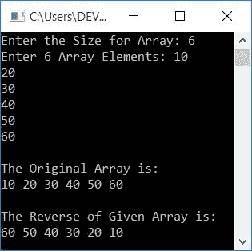

# C++ 程序：反转数组

> 原文：<https://codescracker.com/cpp/program/cpp-program-reverse-array.htm>

在本文中，您将学习并获得在 C++ 程序运行时反转用户输入的数组的代码。以下是数组反转的程序列表:

*   打印数组的反转，而不实际反转它
*   反转一个数组然后打印
*   使用指针反转数组
*   使用用户定义的函数反转数组

## 打印数组的反面

这个程序只是打印一个数组的反转，而不是真正的反转它。问题是，**用 C++ 写一个程序，打印一个数组**的逆。以下是它的答案:

```
#include<iostream>
using namespace std;
int main()
{
    int arr[10], i;
    cout<<"Enter 10 Array Elements: ";
    for(i=0; i<10; i++)
        cin>>arr[i];
    cout<<"\nThe Original Array is:\n";
    for(i=0; i<10; i++)
        cout<<arr[i]<<" ";
    cout<<"\n\nThe Reverse of Given Array is:\n";
    for(i=(10-1); i>=0; i--)
        cout<<arr[i]<<" ";
    cout<<endl;
    return 0;
}
```

这个程序是在 *Code::Blocks* IDE 下构建和运行的。下面是它的运行示例:


现在提供 10 个数字作为一个数组的 10 个元素，一个接一个地打印它的反码，如下面给出的示例输出所示:


当用户输入任意 10 个数字时，比如 1，2，3，...，10 ，然后这些数字通过以下方式存储在 的 **arr[]** 中:

*   arr[0]=1
*   arr[1]=2
*   arr[2]=3
*   依此类推，直到
*   arr[9]=10

我们已经打印了从最后一个索引到第一个索引的数组，也就是它的第 **9 <sup>第</sup>T3】到第 **0 <sup>第</sup>** 索引来显示数组的反转作为输出。**

## 反转数组

这个程序在打印前反转一个数组。当数组反转时，当你打印同一个数组时，它以相反的顺序显示它的元素。这个程序还允许用户定义数组的大小。

在 [C++](/cpp/index.htm) 编程中，要反转一个[数组](/cpp/cpp-arrays.htm)，你必须 让用户输入数组的大小和元素(给定大小)。现在要反转，做这些事情:

*   将第一个索引处的元素移到最后，将最后一个索引处的元素移到第一个
*   将第二个索引处的元素移动到倒数第二个，并将倒数第二个索引处的元素移动到第二个
*   等等

让我们先来看看这个程序，稍后会给出解释:

```
#include<iostream>
using namespace std;
int main()
{
    int arr[100], tot, i, j, temp;
    cout<<"Enter the Size for Array: ";
    cin>>tot;
    cout<<"Enter "<<tot<<" Array Elements: ";
    for(i=0; i<tot; i++)
        cin>>arr[i];
    cout<<"\nThe Original Array is:\n";
    for(i=0; i<tot; i++)
        cout<<arr[i]<<" ";
    j = tot-1;
    for(i=0; i<j; i++, j--)
    {
        temp = arr[i];
        arr[i] = arr[j];
        arr[j] = temp;
    }
    cout<<"\n\nThe Reverse of Given Array is:\n";
    for(i=0; i<tot; i++)
        cout<<arr[i]<<" ";
    cout<<endl;
    return 0;
}
```

下面是它的运行示例，用户输入如下:

*   5 英寸大小
*   1，2，3，4，5 作为五个数组元素

准确提供这些输入后，按`ENTER`键反转数组并打印原始 及其反转，如下图所示:


使用相同的用户输入(如前面的输出中所提供的)对上述 C++ 程序进行模拟运行，如下所示:

*   初始值， **tot=5** 。因为我已经讲述了数组元素的存储。于是 **arr[0]=1** 、 T4】arr[1]= 2、 **arr[2]=3** 、 **arr[3]=4** 、 **arr[4]=5**
*   现在使用循环的*打印原始数组*
*   打印原始数组后， **tot-1** 或 **5-1** 或 **4** 被初始化为 **j** 。所以 **j = 4**
*   现在 **0** 被初始化为 **i** 并且条件 **i < j** 或 **0 < 4** 评估为 真，因此程序流程进入循环内部
*   并且 **arr[i]** 或 **arr[0]** 或 **1** 被初始化为 **temp** 。然后 **arr[j]** 或 **arr[4]**或 **5** 被初始化为 **arr[i]** 或 **arr[0]** 。最后**温度**或**1**T27】被初始化为 **arr[j]** 或 **arr[4]**
*   一个普通的交换操作用三行代码完成。现在 **arr[0]=5** 和 **arr[4]=1** 。 如您所见，最后一个索引(第 4 个<sup>索引</sup>索引)的元素被移动到第一个索引(第 0 个<sup>索引</sup>索引) 并且第一个索引(第 0 个<sup>索引</sup>索引)的元素被移动到最后一个索引(第 4 个<sup>索引</sup>索引)
*   现在程序流程转到更新循环的部分*，并且 **i** 的值递增， 而 **j** 的值递减。所以 **i=1** 和 **j=3***
*   然后条件再次得到评估。因为条件 **i < j** 或**1<3**T6】再次评估为真，因此程序流程再次进入循环
*   这个过程一直持续到条件评估为假
*   这样，数组就反转了。因此，使用另一个循环的*来打印数组，以显示给定数组的反向*

## 使用指针反转数组

现在让我们用指针反转一个数组。我们已经用指针创建了三个程序，来反转用户给定的数组。这个程序在任何地方都使用指针，从打印到数组的反转:

```
#include<iostream>
using namespace std;
int main()
{
    int arr[100], tot, i, arrTemp[100], *ptr;
    cout<<"Enter the Size for Array: ";
    cin>>tot;
    cout<<"Enter "<<tot<<" Array Elements: ";
    for(i=0; i<tot; i++)
        cin>>arr[i];
    ptr = &arr[0];
    cout<<"\nThe Original Array is:\n";
    for(i=0; i<tot; i++)
    {
        cout<<*ptr<<" ";
        ptr++;
    }
    ptr--;
    for(i=0; i<tot; i++)
    {
        arrTemp[i] = *ptr;
        ptr--;
    }
    ptr = &arrTemp[0];
    for(i=0; i<tot; i++)
    {
        arr[i] = *ptr;
        ptr++;
    }
    ptr = &arr[0];
    cout<<"\n\nThe Reverse of Given Array is:\n";
    for(i=0; i<tot; i++)
    {
        cout<<*ptr<<" ";
        ptr++;
    }
    cout<<endl;
    return 0;
}
```

以下是用户输入的示例运行，大小为 **6** ，六个元素为 **10，20，30，40，50，60** :



**注-*******在操作器处称为**值。而 **&** 被称为** 操作符的**地址。**

**注-****ptr++**初始化下一个索引的地址。举个例子，如果 **ptr** 保存一个数组 **arr[]** 的 **0**索引的地址，那么在执行 **ptr++** 之后，现在 **ptr** 保存同一个数组 **arr[]** 的**1<sup>ST</sup>T19】索引的地址 。**

这是另一个使用指针反转数组的程序。在这个程序中，指针仅用于反转数组。原始和反转数组的打印以正常方式进行:

```
#include<iostream>
using namespace std;
int main()
{
    int arr[100], tot, i, arrTemp[100], *ptr;
    cout<<"Enter the Size for Array: ";
    cin>>tot;
    cout<<"Enter "<<tot<<" Array Elements: ";
    for(i=0; i<tot; i++)
        cin>>arr[i];
    cout<<"\nThe Original Array is:\n";
    for(i=0; i<tot; i++)
        cout<<arr[i]<<" ";
    ptr = &arr[tot-1];
    for(i=0; i<tot; i++)
    {
        arrTemp[i] = *ptr;
        ptr--;
    }
    ptr = &arrTemp[0];
    for(i=0; i<tot; i++)
    {
        arr[i] = *ptr;
        ptr++;
    }
    cout<<"\n\nThe Reverse of Given Array is:\n";
    for(i=0; i<tot; i++)
        cout<<arr[i]<<" ";
    cout<<endl;
    return 0;
}
```

这个程序产生与前一个程序相同的输出。这是最后一个用指针反转数组的程序。这个程序是基于交换操作创建的。这个程序不像以前的程序那样使用任何其他数组:

```
#include<iostream>
using namespace std;
int main()
{
    int arr[100], tot, i, j, temp, *ptrOne, *ptrTwo;
    cout<<"Enter the Size for Array: ";
    cin>>tot;
    cout<<"Enter "<<tot<<" Array Elements: ";
    for(i=0; i<tot; i++)
        cin>>arr[i];
    cout<<"\nThe Original Array is:\n";
    for(i=0; i<tot; i++)
        cout<<arr[i]<<" ";
    ptrOne = &arr[0];
    ptrTwo = &arr[tot-1];
    j = tot-1;
    for(i=0; i<j; i++, j--)
    {
        temp = *ptrOne;
        *ptrOne = *ptrTwo;
        *ptrTwo = temp;
        ptrOne++;
        ptrTwo--;
    }
    cout<<"\n\nThe Reverse of Given Array is:\n";
    for(i=0; i<tot; i++)
        cout<<arr[i]<<" ";
    cout<<endl;
    return 0;
}
```

## 使用函数反转数组

这是本文的最后一个程序。这个程序是使用用户自定义函数 **revArray()** 来反转用户输入的数组而创建的。该函数有两个参数。第一个参数是数组，而第二个参数 是它的大小

```
#include<iostream>
using namespace std;
void revArray(int [], int);
int main()
{
    int arr[100], tot, i, j, temp;
    cout<<"Enter the Size for Array: ";
    cin>>tot;
    cout<<"Enter "<<tot<<" Array Elements: ";
    for(i=0; i<tot; i++)
        cin>>arr[i];
    cout<<"\nThe Original Array is:\n";
    for(i=0; i<tot; i++)
        cout<<arr[i]<<" ";
    revArray(arr, tot);
    cout<<"\n\nThe Reverse of Given Array is:\n";
    for(i=0; i<tot; i++)
        cout<<arr[i]<<" ";
    cout<<endl;
    return 0;
}
void revArray(int a[], int t)
{
    int i, j, temp;
    j = t-1;
    for(i=0; i<j; i++, j--)
    {
        temp = a[i];
        a[i] = a[j];
        a[j] = temp;
    }
}
```

这个程序做的工作和前一个程序完全一样。

#### 其他语言的相同程序

*   [C 反转阵列](/c/program/c-program-reverse-array.htm)
*   [Java 反向数组](/java/program/java-program-reverse-array.htm)

[C++ 在线测试](/exam/showtest.php?subid=3)

* * *

* * *