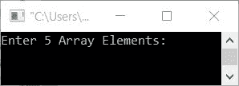
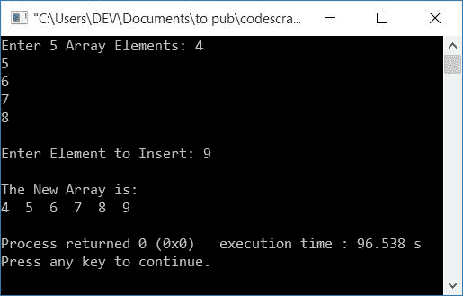
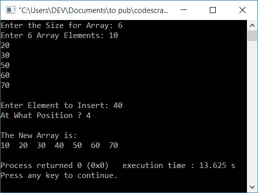

# 在数组中插入元素的 C++程序

> 原文：<https://codescracker.com/cpp/program/cpp-program-insert-element-in-array.htm>

在本文中，您将学习并获得用 C++语言将元素插入数组的代码。下面是本文中可用的程序列表:

*   在数组末尾插入元素
*   在特定位置插入数组元素

## 将元素添加到数组的末尾

这个程序提示用户为一个数组输入 5 个数字或元素，然后是要插入到给定数组末尾的元素。

问题是:用 C++写一个程序，在数组末尾插入一个元素。以下是它的答案:

```
#include<iostream>
using namespace std;
int main()
{
    int arr[6], i, elem;
    cout<<"Enter 5 Array Elements: ";
    for(i=0; i<5; i++)
        cin>>arr[i];
    cout<<"\nEnter Element to Insert: ";
    cin>>elem;
    arr[i] = elem;
    cout<<"\nThe New Array is:\n";
    for(i=0; i<6; i++)
        cout<<arr[i]<<"  ";
    cout<<endl;
    return 0;
}
```

这个程序是在 Code::Blocks IDE 下构建和运行的。下面是它的初始输出:



现在提供五个输入作为数组的五个数字或元素，比如 4、5、6、7 和 8，然后输入一个数字或元素，比如 9，插入到数组中。以下是在提供这些输入后，上述程序产生的示例输出:



这个程序使用 for 循环一个接一个地接收 5 个数组元素。也就是说，如果用户输入 5 个数组元素，分别是 4、5、6、7 和 8，那么这些元素将以如下方式存储在 arr[]中:

*   arr[0]=4
*   arr[1]=5
*   arr[2]=6
*   arr[3]=7
*   arr[4]=8

收到数组的所有 5 个元素后，I 的值现在是 5。所以只需接收另一个输入，即要插入的元素，并将其初始化为 arr[i]或 arr[5]。最后，打印新数组。

## 在特定位置插入数组元素

在 C++编程中，要在数组中插入元素，必须要求用户输入数组的大小和元素。然后要求输入要插入的元素以及插入的位置，如下面给出的程序所示:

在所需位置插入元素后，不要忘记在屏幕上显示新的数组。

```
#include<iostream>
using namespace std;
int main()
{
    int arr[50], i, elem, pos, tot;
    cout<<"Enter the Size for Array: ";
    cin>>tot;
    cout<<"Enter "<<tot<<" Array Elements: ";
    for(i=0; i<tot; i++)
        cin>>arr[i];
    cout<<"\nEnter Element to Insert: ";
    cin>>elem;
    cout<<"At What Position ? ";
    cin>>pos;
    for(i=tot; i>=pos; i--)
        arr[i] = arr[i-1];
    arr[i] = elem;
    tot++;
    cout<<"\nThe New Array is:\n";
    for(i=0; i<tot; i++)
        cout<<arr[i]<<"  ";
    cout<<endl;
    return 0;
}
```

以下是用户输入的运行示例:

*   6 作为数组大小
*   10、20、30、50、60 和 70 作为 6 个数组元素
*   40 作为要插入的元素
*   4 作为插入元素的位置。

在提供这些输入之后，这里是显示所有已经在输出屏幕上完成的操作的快照:



在上面的程序中，在 pos 值(用户想要插入新元素的位置)的帮助下，我们已经将所有元素从这个位置向前移动了一个索引。完成此任务后，此位置的前一个元素将移动到下一个位置。因此，我们可以在这个位置初始化新元素。

在插入新元素后，不要忘记增加 tot(数组的大小)的值。现在打印新数组，该数组包含在所需或特定位置新插入的元素，如上面给出的输出所示。

例如，下面代码块的模拟运行

```
for(i=tot; i>=pos; i--)
    arr[i] = arr[i-1];
arr[i] = elem;
```

使用与前面的示例运行中相同的用户输入，如下所示:

*   以下是程序流到达该代码块之前的值:
    *   tot = 6
    *   arr[0] = 10，arr[1] = 20，arr[2] = 30，arr[3] = 50，arr[4] = 60，arr[5] = 70。
    *   elem = 40
    *   pos = 4
*   现在，这一小块代码的执行从 for 循环开始。
*   也就是说，它的初始化部分首先执行，但只执行一次。因此，tot 的值被初始化为 I。因此，i=6
*   现在，条件 i>=pos 或 6>=4 评估为真，因此程序流进入循环。
*   在循环内部，arr[i-1]或 arr[6-1]或 arr[5]或 70 被初始化为 arr[i]或 arr[6]。所以 arr[6]=70。可以看到，最后一个索引(第五个索引)的数字被转移到第四个索引(第六个索引)。
*   现在，程序流转到 for 循环的更新部分，该部分减少 I 的值(因此 i = 5)并再次计算条件。
*   也就是说，条件 i>=pos 或 5>=4 再次评估为真，因此程序流返回到循环。
*   这个过程继续，直到 for 循环的条件评估为假。在其条件被评估为假之前，这里是 **arr[]** : 的新值
    *   arr[6] = 70
    *   arr[5] = 60
    *   arr[4] = 50
*   现在，出现在第四个位置(第三个索引)的元素或数字 50 被移动到第五个位置(第四个索引)。因为索引从 0 开始，我们认为第四个索引处的元素是第五个位置的元素。
*   因此，第四个位置(第三个索引)可以自由地初始化任何新元素。
*   所以只需在上面初始化新元素。因此，elem 的值 40 被初始化为 arr[i]或 arr[3]。

#### 其他语言的相同程序

*   [C 在数组中插入元素](/c/program/c-program-insert-element-in-array.htm)
*   [Java 在数组中插入元素](/java/program/java-program-insert-element-in-array.htm)

[C++在线测试](/exam/showtest.php?subid=3)

* * *

* * *